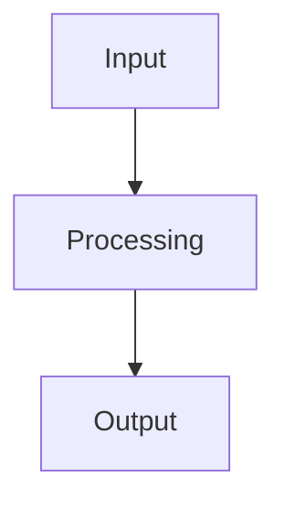
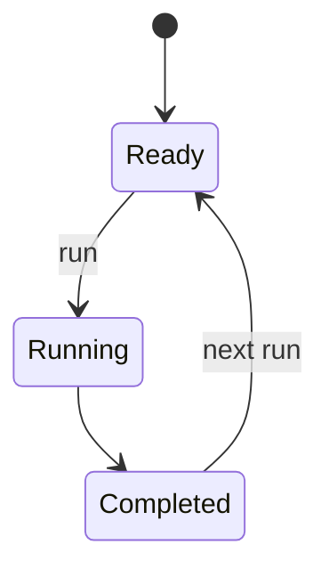

# scikitplot.corpus User-Guide Mermaid Diagram Guideline

## Purpose

This guideline defines a maintainable diagram schema for the `scikitplot.corpus`
user guide. The diagrams are documentation fragments written as reStructuredText
files containing fenced Mermaid. User-guide pages include the fragments through
Sphinx's `.. include::` directive.

The set is grounded in the supplied `scikitplot.corpus` source snapshot and the
public API/examples pages. It covers the public facade, orchestration, source and
URL routing, downloaders, readers, archives, chunkers, multilingual processing,
normalization, enrichment, embeddings, similarity, storage, export, adapters,
metadata, registry, custom hooks, pipeline guard, schema/types, compatibility,
errors, security boundaries, and platform capability planning.

## Core documentation decision

Do **not** combine logical and physical architecture in the first diagram.

- The first **At a glance** diagram must be logical and user-centered:
  `source → reader → chunk/filter → transform → embed → CorpusDocument → outputs`.
- The physical package map belongs in a separate maintainer-oriented section.
- Detailed pages include one focused diagram for one responsibility or lifecycle.

This keeps the landing page understandable while preserving a complete physical
map for contributors.

## Standard fragment template

````rst
:orphan:



````

For lifecycle diagrams:

````rst
:orphan:



````

## Inclusion pattern

```rst
Pipeline execution
------------------

Explain the contract and important options in prose before the diagram.

.. include:: diagrams/03_pipeline_execution_flow.rst

Explain edge cases, failure behavior, and platform limits after the diagram.
```

For builders where Mermaid is unavailable, keep prose authoritative and make the
diagram supplemental. A conditional include may be used where the project has a
builder-specific policy:

```rst
.. only:: html

   .. include:: diagrams/03_pipeline_execution_flow.rst
```

## Orientation rules

1. Prefer `flowchart TB` for almost all user-guide diagrams.
2. Use `flowchart LR` only when the graph is genuinely short and remains narrow,
   usually no more than five compact nodes.
3. Add `direction TB` to `stateDiagram-v2`.
4. Split a wide diagram instead of shrinking text or adding horizontal scrolling.
5. Keep the primary path centered and vertical; put alternatives on short side
   branches.

## Diagram granularity

A diagram should answer one question:

- What happens to my input?
- How is a reader selected?
- Which chunker is used?
- What state can this object be in?
- Where can an error be handled?
- Which backend is available on this platform?

Recommended limits:

- 6–12 primary nodes per diagram.
- No more than 3 subgraphs.
- Labels generally below 32 visible characters per line.
- At most 2 levels of branching before splitting the diagram.
- One diagram immediately adjacent to the prose it supports.

## Logical versus physical diagrams

### Logical diagrams

Use logical diagrams for users and workflow explanations. Show operations and
data contracts, not filenames.

Examples:

- `CorpusPipeline` execution.
- `CorpusBuilder` workflow.
- URL classification and download.
- Reader selection.
- Chunking, normalization, enrichment, embedding, and search.

### Physical diagrams

Use physical diagrams for maintainers. Show package modules, registries, public
facades, optional dependencies, and runtime deployment boundaries.

Examples:

- `scikitplot.corpus` module map.
- Public facade and export aggregation.
- Compatibility layer.
- CPython versus browser capability profiles.

Never mix every class, module, and data transformation in one graph.

## Flowchart versus state diagram

Use `flowchart TB` when explaining:

- data movement;
- routing and dispatch;
- optional stages;
- backend selection;
- conversion and export;
- ownership handoff.

Use `stateDiagram-v2` when explaining:

- object lifecycle;
- repeated runs;
- retry and failure transitions;
- checkpoint/resume behavior;
- open/closed resources;
- transaction commit/rollback.

Do not use a state diagram merely to display a sequence of functions.

## Naming and file layout

Recommended layout:

```text
docs/source/user_guide/corpus/
├── index.rst
├── pipeline.rst
├── builder.rst
├── readers.rst
├── chunking.rst
├── persistence.rst
└── diagrams/
    ├── 00_corpus_at_a_glance_logical.rst
    ├── 01_corpus_physical_module_map.rst
    └── ...
```

File rules:

- Use a two-digit ordering prefix.
- Use lowercase snake_case.
- End flow diagrams with `_flow.rst` where natural.
- End lifecycle diagrams with `_state.rst` where natural.
- Add `_target` to diagrams that describe proposed architecture rather than the
  currently implemented system.
- Keep one Mermaid block per file.

## Content rules

- Prose remains the normative documentation; diagrams summarize it.
- Use exact public names when a public API is shown.
- Use responsibility labels rather than private helper names on user pages.
- Show optional stages explicitly with `Optional` labels or dashed relationships.
- Mark target architecture as `Recommended`, `Proposed`, or `Target` inside the
  diagram and in surrounding prose.
- Do not show a fallback as successful equivalence when semantics differ.
- Do not hide partial failure, skipped stages, retries, or cleanup transitions.
- Keep source-derived current behavior separate from future recommendations.

## Styling and theme safety

Prefer Mermaid's default theme so diagrams follow light/dark documentation
settings. Avoid hard-coded colors unless the documentation theme provides a tested
shared Mermaid theme.

Recommended:

- simple rectangles for operations;
- diamonds for decisions;
- dashed arrows for optional, advisory, or compatibility relationships;
- short edge labels;
- no emoji in node identifiers;
- no color-only meaning.

If classes are added, use semantic names such as `optional`, `warning`, and
`target`, and ensure contrast is tested in both light and dark modes.

## Accessibility

For every diagram:

- introduce its purpose in one sentence;
- restate the important path in prose;
- do not rely only on position, color, or line style;
- keep labels meaningful when read by a screen reader;
- avoid dense abbreviations;
- explain acronyms on first use;
- provide equivalent tables for complex platform or capability matrices.

## Security and correctness rules

- A diagram must not imply a security control exists unless source or tests support
  it.
- Proposed controls must use filenames containing `_target` and surrounding prose
  must identify them as planned architecture.
- Network, archive, parser, serialization, plugin, and browser boundaries should
  be visible where relevant.
- Resource limits should be shown as shared or cumulative when that is the intended
  contract.
- Do not document unsafe formats such as pickle as ordinary interchange formats;
  label them trusted-only.

## User-guide page schema

A clean corpus guide should use this order:

1. Purpose and supported source types.
2. At-a-glance logical workflow.
3. Minimal quick start.
4. Choosing `CorpusPipeline` versus `CorpusBuilder`.
5. Source and URL handling.
6. Reader selection and optional dependencies.
7. Chunking and multilingual behavior.
8. Normalization and enrichment.
9. Embeddings and search.
10. Storage, export, and adapters.
11. Customization and registry.
12. Reliability, checkpoints, and errors.
13. Security and resource limits.
14. Platform capability matrix.
15. Maintainer physical architecture.

The first user-facing page should normally include only the at-a-glance logical
flow. Detailed subsystem diagrams belong on their corresponding pages.

## Diagram maintenance contract

Update a diagram when any of the following changes:

- public stage ordering;
- reader dispatch or supported source classes;
- optional component behavior;
- lifecycle or retry semantics;
- storage transaction behavior;
- export trust requirements;
- registry or plugin contracts;
- browser/runtime capabilities;
- public data schema;
- error and partial-success semantics.

Every diagram-changing pull request should verify:

- the diagram matches current source and public signatures;
- Mermaid fences are balanced;
- node identifiers are unique;
- internal links and include paths resolve;
- target architecture is not presented as implemented behavior;
- light and dark HTML builds render;
- narrow viewport rendering is readable;
- non-HTML documentation retains complete prose.

## Validation checklist

- [ ] One Mermaid block per RST fragment.
- [ ] `:orphan:` is the first line.
- [ ] Vertical orientation is used by default.
- [ ] Logical and physical views are separate.
- [ ] Current and target architecture are separate.
- [ ] No unexplained private implementation details appear on beginner pages.
- [ ] Public names and stage ordering match source.
- [ ] Optional and failure paths are visible.
- [ ] Trusted-only serialization is labeled.
- [ ] Include paths are relative to the including page.
- [ ] No diagram is the sole source of a guarantee.
- [ ] HTML light/dark rendering is reviewed.
- [ ] Markdown/RST fences and headings are balanced.

## Included diagram set

The generated package contains 32 focused fragments:

- 2 overview diagrams;
- public facade and API flow;
- pipeline and builder flows plus lifecycle states;
- source, URL, downloader, reader, and archive flows;
- chunking and multilingual semantic flows;
- normalization, enrichment, embedding, and similarity flows;
- storage, SQLite state, export, adapter, and metadata flows;
- registry, custom hooks, guard, schema/types, and compatibility flows;
- error propagation;
- target security/resource architecture;
- platform capability flow.

Use `corpus_user_guide_schema.rst` as an integration skeleton and
`diagram_include_catalog.rst` as a copy-ready include reference.
