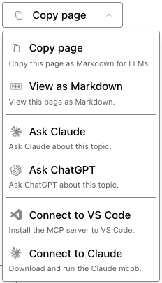

# Sphinx AI Assistant

A Sphinx extension that adds AI-powered features to documentation pages, making it easier to use your documentation with AI tools.

## Features

### Markdown Export
- **Copy as Markdown**: Convert any documentation page to Markdown format with a single click
- **View as Markdown**: Open the markdown version of the current page in a new browser tab
- Perfect for pasting into ChatGPT, Claude, or other AI tools
- Preserves code blocks, headings, links, and formatting
- Clean conversion that removes navigation, headers, and other non-content elements

### Integration with AI tools
- **Direct AI Chat Links**: Open ChatGPT or Claude with pre-filled documentation context
- **Smart Content Strategy**: Uses pre-generated markdown files for clean, unlimited-length context
- **Customizable AI Providers**: Built-in support for Claude, ChatGPT, and custom AI services
- **No Backend Required**: Pure static files, works on any hosting
- **MCP (Model Context Protocol) integration**: Connect VS Code and Claude to your MCP

### Export as PDF
- **"Export as PDF" button** added to the bottom of the dropdown menu (after MCP tools)
- Default behaviour: calls the browser's built-in `window.print()` → user saves as PDF
- Optional: set `ai_assistant_pdf_export_url` to a server-side endpoint
  (e.g. a WeasyPrint URL, GitBook-style `~gitbook/pdf?page=…`, or any static `.pdf` URL)
  and the button will open that URL in a new tab instead
- Icon mirrors the Font Awesome `file-pdf` style used by sphinx-book-theme and GitBook

### AI Assistant Panel
- **Floating chat panel** anchored to the bottom-right viewport corner
- Opens via the last dropdown entry ("AI Assistant" or your custom label)
- Slide-in / slide-out animation; fully keyboard-accessible (Enter submits, Escape closes)
- **Stub mode** (default, `ai_assistant_panel_api_enabled = False`): renders the full UI
  with a polite placeholder response — zero network calls, works on any static site
- **API mode** (`ai_assistant_panel_api_enabled = True`): POSTs the user's question and
  the page's Markdown to the Anthropic `/v1/messages` endpoint and streams a live answer
- Compatible with PyData Sphinx Theme, Furo, sphinx-book-theme, and Read the Docs
- Dark-mode aware via the same three-layer CSS variable chain as the rest of the widget

## Installation

### Using pip

```bash
pip install sphinx-ai-assistant
```

### Development Installation

```bash
git clone https://github.com/mlazag/sphinx-ai-assistant.git
cd sphinx-ai-assistant
pip install -e .
```

## Usage

### Basic Setup

1. Add the extension to your `conf.py`:

```python
extensions = [
    # ... your other extensions
    'sphinx_ai_assistant',
]
```

2. Build your documentation:

```bash
sphinx-build -b html docs/ docs/_build/html
```

That's it! The AI Assistant button will now appear on every page:
- Main button: Copy page as Markdown
- Dropdown:
  - Copy or view page as Markdown
  - Ask Claude and ChatGPT
  - Connect to MCP server in VS Code and Claude Desktop



### Configuration

For details, see [example_conf.py](example_conf.py)

You can customize the extension in your `conf.py`:

```python
# Enable or disable the extension (default: True)
ai_assistant_enabled = True

# Button position: 'sidebar' or 'title' (default: 'sidebar')
# 'sidebar': Places button in the right sidebar (above TOC in Furo)
# 'title': Places button near the page title
ai_assistant_position = 'sidebar'

# CSS selector for content to convert (default: 'article')
# For Furo theme, you might want: 'article'
# For other themes, adjust as needed
ai_assistant_content_selector = 'article'

# Enable/disable specific features (default: as shown)
# CRITICAL: Always supply ALL keys explicitly.  If any key is absent the JS
# widget falls back to its FEATURE_DEFAULTS where ai_panel = false — this
# silently hides the AI-panel button even if you expect it to appear.
ai_assistant_features = {
    'markdown_export': True,  # Copy to clipboard
    'view_markdown': True,    # View as Markdown in new tab
    'ai_chat': True,          # AI chat links
    'mcp_integration': False, # MCP tool connect buttons (opt-in)
    'theme_toggle': True,     # Dark/light/system color-scheme toggle
    'pdf_export': True,       # "Export as PDF" button (window.print or custom URL)
    'ai_panel': True,         # Floating AI assistant chat panel
}

# PDF export button
# ─ None / "" → browser print dialog (window.print)
# ─ Non-empty string → opened in a new tab as the PDF download URL
#   Examples:
#     ai_assistant_pdf_export_url = "/_pdf/{pagename}.pdf"
#     ai_assistant_pdf_export_url = "https://docs.example.com/~gitbook/pdf?page=…"
ai_assistant_pdf_export_url = None  # default: browser print dialog

# Show the URL/Print mode toggle below the PDF button (default True).
# Set False to hide the toggle and lock to the mode implied by pdf_export_url.
ai_assistant_pdf_url_mode_toggle = True

# AI assistant panel (floating chat drawer)
ai_assistant_panel_title = "AI Assistant"          # header label in the panel
ai_assistant_panel_placeholder = "Ask a question about this page…"
# False → stub mode (safe for any static build, no API calls)
# True  → live mode (POSTs to Anthropic /v1/messages; requires API access)
ai_assistant_panel_api_enabled = False

# Build-time markdown generation from topics
ai_assistant_generate_markdown = True

# Patterns to exclude from markdown generation
ai_assistant_markdown_exclude_patterns = [
    'genindex',
    'search',
    'py-modindex',
    '_sources',  # Exclude source files
]

# llms.txt generation
ai_assistant_generate_llms_txt = True
ai_assistant_base_url = 'https://docs.example.com'  # Or use html_baseurl

# AI provider configuration
ai_assistant_providers = {
    'claude': {
        'enabled': True,
        'label': 'Ask Claude',
        'description': 'Ask Claude about this topic.',
        'icon': 'anthropic-logo.svg',
        'url_template': 'https://claude.ai/new?q={prompt}',
        'prompt_template': 'Get familiar with the documentation content at {url} so that I can ask questions about it.',
    },
    'chatgpt': {
        'enabled': True,
        'label': 'Ask ChatGPT',
        'description': 'Ask ChatGPT about this topic.',
        'icon': 'chatgpt-logo.svg',
        'url_template': 'https://chatgpt.com/?q={prompt}',
        'prompt_template': 'Get familiar with the documentation content at {url} so that I can ask questions about it.',
    },
    # Example: Custom AI provider
    'custom': {
        'enabled': True,
        'label': 'Ask Perplexity',
        'url_template': 'https://www.perplexity.ai/?q={prompt}',
        'prompt_template': 'Analyze this documentation: {url}',
    },
}
```

## How It Works

### Markdown Conversion

When you click "Copy content":

1. The extension identifies the main content area of the page
2. Removes non-content elements (navigation, headers, footers, etc.)
3. Converts the HTML to clean Markdown using [Turndown.js](https://github.com/mixmark-io/turndown)
4. Copies the result to your clipboard
5. Shows a confirmation notification

The converted Markdown includes:
- All text content
- Headings (with proper ATX-style formatting)
- Code blocks (with language syntax highlighting preserved)
- Links and images
- Lists and tables
- Block quotes

### AI Chat Integration

When you click "Ask Claude" or "Ask ChatGPT":

**With build-time markdown generation (recommended):**
1. Extension checks if `.md` file exists for current page
2. Opens AI chat with clean URL to markdown file
3. AI can fetch unlimited content directly from your server

**Without markdown generation (fallback):**
1. Converts page to markdown using JavaScript
2. Embeds markdown in URL query parameter
3. Truncates if needed (URL length limits)

## Examples

### Using with AI Tools

After copying a page as Markdown, you can paste it into:

**ChatGPT/Claude:**
```
Here's the documentation for [feature]:

[paste markdown here]

Can you help me understand how to use this?
```

**Cursor/VS Code:**
```
# Context from docs

[paste markdown here]

# Question
How do I implement this in my project?
```

## Development

### Project Structure

```
sphinx-ai-assistant/
├── sphinx_ai_assistant/
│   ├── __init__.py          # Main extension module
│   └── static/
│       ├── ai-assistant.js   # JavaScript functionality
│       ├── ai-assistant.css  # Styling
│       └── *.svg             # Icons
├── pyproject.toml            # Package configuration
└── README.md                 # This file
```

### Building Documentation

```bash
cd docs/
sphinx-build -b html . _build/html
```

Creates:
```
docs/_build/html/
├── index.html
├── index.md          # Generated markdown
├── tutorial.html
├── tutorial.md       # Generated markdown
└── llms.txt          # List of all markdown pages
```

## Theme Compatibility

Currently optimized for:
- **Furo** - Full support with sidebar integration
- **Alabaster** - Supported
- **Read the Docs** - Supported
- **Book Theme** - Supported

The extension should work with most themes but may require CSS adjustments.

## Troubleshooting

### Markdown files not generated

```bash
# Install dependencies
pip install beautifulsoup4 markdownify

# Check configuration
grep ai_assistant_generate_markdown conf.py

# Rebuild
sphinx-build -b html docs/ docs/_build/html
```

### AI chat has no content

1. Check if `.md` file exists:
   ```bash
   curl -I https://your-docs.com/page.md
   ```

2. Check browser console for errors

### Markdown features not working

This happens when `.md` file doesn't exist.

Solution: Generate `.md` files with `ai_assistant_generate_markdown = True`

## Performance

### Build Time
- Adds few seconds per 100 pages for markdown generation

### Runtime
- **With .md files:** Instant (just opens URL)
- **Without .md files:** 100-500ms for first conversion
- Cached for subsequent uses

### File Size
- Markdown files are 40-60% smaller than HTML
- Example: 45 KB HTML → 18 KB Markdown

## License

MIT License - see LICENSE file for details

## Questions or Issues?

- Check the [example_conf.py](example_conf.py)
- Open an [issue](https://github.com/mlazag/sphinx-ai-assistant/issues)
- Start a [discussion](https://github.com/mlazag/sphinx-ai-assistant/discussions)

## Acknowledgments

- Built with [Turndown.js](https://github.com/mixmark-io/turndown) for HTML to Markdown conversion
- Uses [BeautifulSoup4](https://www.crummy.com/software/BeautifulSoup/) and [markdownify](https://github.com/matthewwithanm/python-markdownify) for build-time conversion
- Designed to work seamlessly with the [Furo](https://github.com/pradyunsg/furo) Sphinx theme
- Inspired by the need to make documentation more AI-friendly
