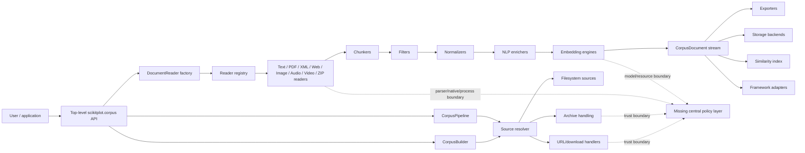
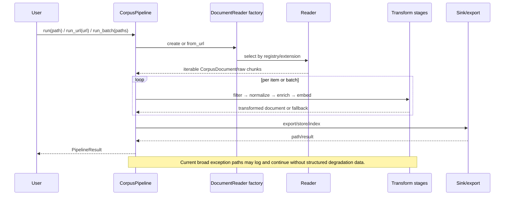
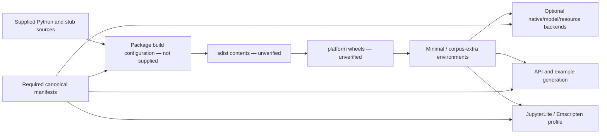
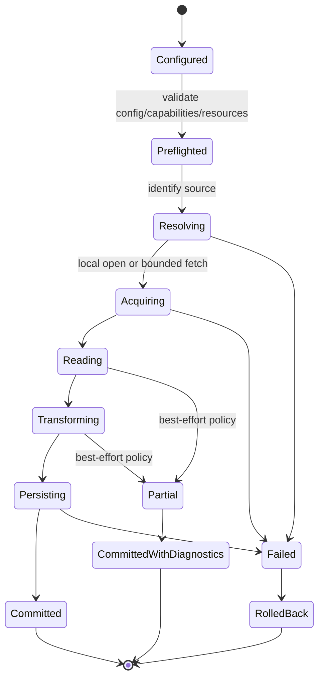
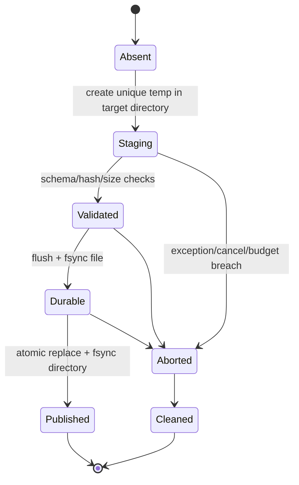
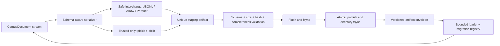
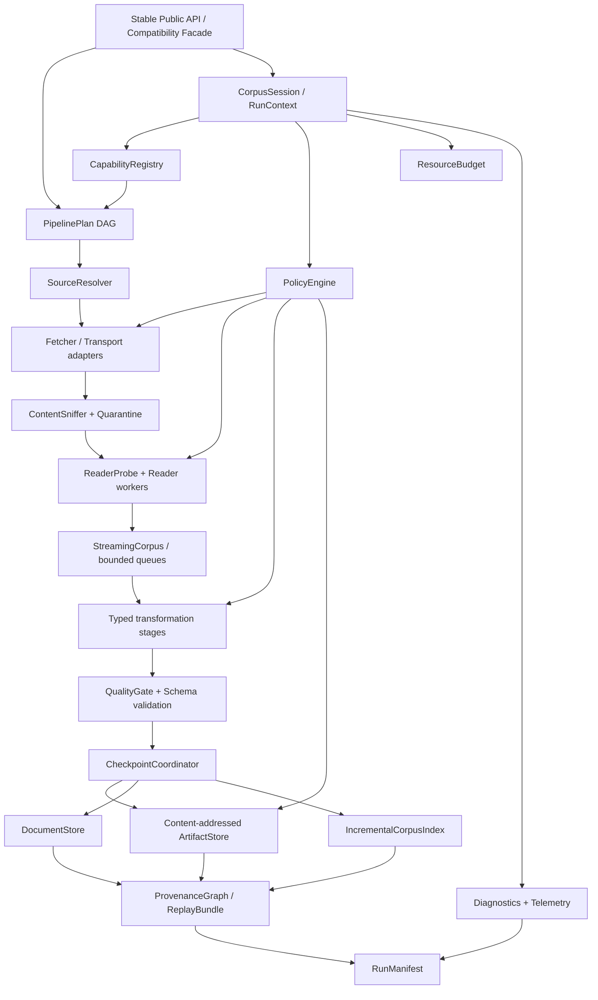

# scikitplot.corpus Deep Semantic Review Guide

> **Canonical filename:** `scikitplot_corpus_DEEP_SEMANTIC_REVIEW_GUIDE.md`
> **Status:** Initial independent audit handbook and living single source of truth
> **Review date:** 2026-07-23
> **Submodule:** `scikitplot.corpus`
> **Methodology reference:** `ANNOY_DEEP_SEMANTIC_REVIEW_GUIDE.md`, used only for review depth, evidence discipline, invariants-first reasoning, adversarial verification, prioritization, and governance. No Annoy-specific architecture, findings, terminology, or conclusions are transferred.

## Document control and snapshot identity

| Artifact | SHA-256 | Role |
| --- | --- | --- |
| `scikitplot.corpus.zip` | 7b86058adae3fbdee2f7a8133511f230856c75924383ffe386bea1f87b90a90f | Canonical supplied source snapshot |
| `ANNOY_DEEP_SEMANTIC_REVIEW_GUIDE.zip` | b3dc1287ed74d5d66e115b1d0f30cd21529b9a015b72691353b6bc296838be43 | Methodology reference only |
| `NEW_SUBMODULE_DEEP_SEMANTIC_REVIEW_PROMPT(2).md` | 1ad7f7ebbe0666e33c956e70fe9a7e5433caa1683d1771fd639098a88e086982 | Review charter and output contract |

| Snapshot fact | Value |
| --- | --- |
| Supplied files | 112 |
| Python files | 110 |
| Type stubs | 2 |
| Files under `tests/` directories | 50 |
| `test_*.py` modules | 37 |
| Total source lines | 74,822 |
| Total source bytes | 2,677,912 |
| Runtime used for reproduction | 3.13.5 (main, May  5 2026, 21:05:52) [GCC 14.2.0] |
| Runtime platform | linux |
| Native/Cython/build files in supplied snapshot | None supplied |

The absence of native or Cython files in this snapshot does **not** make the subsystem operationally pure-Python. Optional OCR, ASR, embedding, PDF, XML, database, machine-learning, and media backends cross native-library, subprocess, GPU, filesystem, network, and browser capability boundaries. Those indirect boundaries are in scope.

## Canonical-source rule

This file is the only canonical handbook. Future review work must update it in place. Do not create `expanded`, `revised`, `final`, date-suffixed, or platform-suffixed copies. Historical snapshots belong in version control, not in parallel handbook filenames.

## How to use this handbook

| Use case | Path through the handbook |
| --- | --- |
| Initial subsystem audit | Read Parts I–VII, execute the evidence commands, then triage the finding register. |
| Pull-request review | Use the contract matrices, threat model, PR worksheet, and changed-surface refresh rules. |
| Release readiness | Run the release gates and resolve every P0/P1 no-go condition. |
| Architecture evolution | Use the target architecture, component specifications, ADR queue, and phased roadmap. |
| Incident response | Capture a replay bundle, classify the violated invariant, add a regression corpus item, and update the finding register. |

## Table of contents

- [Part I — Review charter and evidence](#part-i--review-charter-and-evidence)
- [Part II — System inventory and architecture](#part-ii--system-inventory-and-architecture)
- [Part III — Semantic contracts](#part-iii--semantic-contracts)
- [Part IV — Trust boundaries, security, and resilience](#part-iv--trust-boundaries-security-and-resilience)
- [Part V — Verification, fuzzing, performance, and documentation](#part-v--verification-fuzzing-performance-and-documentation)
- [Part VI — Baseline findings and priorities](#part-vi--baseline-findings-and-priorities)
- [Part VII — Future architecture and evolution roadmap](#part-vii--future-architecture-and-evolution-roadmap)
- [Part VIII — Governance and reusable review worksheets](#part-viii--governance-and-reusable-review-worksheets)
- [Appendix A — Complete file inventory](#appendix-a--complete-file-inventory)
- [Appendix B — Runtime public-export manifest](#appendix-b--runtime-public-export-manifest)
- [Appendix C — Verification commands](#appendix-c--verification-commands)
- [Appendix D — Official references](#appendix-d--official-references)

# Part I — Review charter and evidence

## 1. Purpose

The purpose is not initially to patch code. It is to understand the whole subsystem, establish enforceable contracts, locate failure modes, distinguish verified defects from inference, prioritize P0–P3 work, define release gates, and provide a durable procedure for future changes.

The review must cover happy paths, single-item inputs, empty inputs, malformed inputs, degenerate inputs, large inputs, repeated operations, cancellation, partial initialization, retry, concurrent access, offline execution, browser execution, dependency absence, resource exhaustion, and adversarial data.

## 2. Scope

| In scope | Examples |
| --- | --- |
| Public API | Top-level exports, aliases, signatures, documentation, pickle identity, deprecation behavior |
| Ingestion | Local files, URLs, media, archives, XML/ALTO/TEI, OCR, ASR, web content |
| Transformation | Chunking, filtering, normalization, enrichment, metadata, embeddings |
| Persistence | Export formats, storage backends, checkpointing, caches, indexes |
| Integration | LangChain, LangGraph, MCP, Hugging Face, registry and custom hooks |
| Operational behavior | Offline mode, retries, cancellation, timeouts, logging, diagnostics, concurrency |
| Security and privacy | SSRF, path traversal, decompression bombs, XML, unsafe serialization, secrets, PII, plugins |
| Platforms | Linux, macOS, Windows, CPython, free-threaded Python, subinterpreters, Emscripten, xeus-python, JupyterLite |
| Evolution | New components, schema migration, streaming, provenance, policy, sandboxing, reproducibility |

## 3. Evidence and confidence model

| Label | Meaning | Permitted language |
| --- | --- | --- |
| VERIFIED FROM SOURCE | Directly supported by supplied code at named lines. | “The source does …” |
| VERIFIED BY REPRODUCTION | Observed by compilation, import, test, or focused runtime reproduction. | “The reproduction produced …” |
| OFFICIAL EXTERNAL SUPPORT | Supported by an official specification or primary project documentation. | “The official documentation states …” |
| STRONG INFERENCE | Multiple source facts imply a likely failure, but a focused adversarial test is still required. | “This can plausibly …; verify with …” |
| ARCHITECTURAL CONCERN | A design boundary is absent, duplicated, or too weak for the declared scope. | “The architecture does not currently express …” |
| OPEN QUESTION | The supplied evidence cannot resolve a contract or support decision. | “A decision is required …” |
| POSITIVE CONTROL | A protection or sound design choice that should be preserved and tested. | “Preserve …” |

### 3.1 Priority model

| Priority | Definition | Release effect |
| --- | --- | --- |
| P0 | Memory corruption, process termination, deadlock, silent corruption, critical SSRF/parser/archive exploit, or equivalent security-critical failure. | Absolute release blocker. |
| P1 | Release-blocking reliability, persistence, API, compatibility, security, or portability issue. | Block release unless explicitly waived by security/reliability owners with expiry. |
| P2 | Significant architecture, observability, maintainability, performance, testing, or documentation issue. | Must have owner and scheduled milestone. |
| P3 | Cleanup, ergonomics, optimization opportunity, or future enhancement. | Backlog with measurable value. |

### 3.2 Finding schema

```text
ID:
Title:
Classification:
Confidence:
Priority:
Contract:
Source files and symbols:
Evidence:
Expected invariant:
Failure mode:
Impact:
Reproduction or focused test:
Decision required:
Dependencies:
Owner:
Exit criteria:
```

## 4. Review principles

- [ ] Write the invariant before reviewing the implementation.
- [ ] Separate semantic guarantees from convenience behavior.
- [ ] Treat generated documentation and generated code as executable contracts, not proof of correctness.
- [ ] Default to offline-safe, bounded, deterministic behavior unless network or nondeterminism is explicitly requested.
- [ ] Make partial success visible and machine-readable; logging alone is not a result contract.
- [ ] Require failure atomicity for state transitions that claim batch, save, cache, checkpoint, or export semantics.
- [ ] Centralize trust-boundary policy; do not duplicate SSRF, archive, parser, or credential logic across readers.
- [ ] Measure memory, latency, throughput, import time, wheel size, and browser memory before optimizing.
- [ ] Every public guarantee must have an executable test.
- [ ] Every fallback must be explicit, observable, bounded, and semantically classified.

# Part II — System inventory and architecture

## 5. Inventory summary

| Category | Files |
| --- | --- |
| test | 50 |
| package/export configuration | 13 |
| chunker implementation | 10 |
| reader implementation | 10 |
| Python implementation | 5 |
| I/O and trust-boundary implementation | 3 |
| extension/integration implementation | 3 |
| base/public API implementation | 2 |
| embedding implementation | 2 |
| normalizer implementation | 2 |
| orchestration/public API | 2 |
| schema/type implementation | 2 |
| type stub | 2 |
| enricher implementation | 1 |
| export implementation | 1 |
| metadata implementation | 1 |
| search/index implementation | 1 |
| source implementation | 1 |
| storage implementation | 1 |

The complete per-file inventory, line count, byte count, authority classification, responsibility summary, and SHA-256 prefix appear in Appendix A.

## 6. Semantic architecture map



### 6.1 Current responsibility layers

| Layer | Primary files | Current responsibility | Review pressure |
| --- | --- | --- | --- |
| Facade | `__init__.py` | Wildcard re-export of 19 subpackages/modules. | Name collision, duplicate exports, import cost, deprecation identity. |
| Orchestration | `_pipeline.py`, `_corpus_builder.py` | Run single/batch/URL workflows and integrations. | Partial success, fallback visibility, state and retry semantics. |
| Core model | `_schema.py`, `_types.py`, `_base.py` | Documents, enums, protocols, readers, filters, guard. | Identity, legacy overlap, invariants, checkpoint semantics. |
| Input adapters | `_readers/*`, `_sources/*` | Interpret files, URLs, media, XML, archives. | Untrusted input, optional dependencies, resource caps. |
| Transformations | `_chunkers/*`, `_normalizers/*`, `_enrichers/*` | Text segmentation and enrichment. | Language fallbacks, hidden downloads, determinism. |
| Embeddings/search | `_embeddings/*`, `_similarity/*` | Vector generation, cache, retrieval. | Model identity, numeric validation, stale cache, fallback behavior. |
| Persistence | `_export/*`, `_storage/*`, `PipelineGuard` | Files, DB, checkpoint, cache. | Atomicity, schema evolution, locking, corruption handling. |
| Extension surface | `_registry.py`, `_custom_hooks.py`, `_adapters.py` | Plugins, arbitrary callables, external frameworks. | Trust, capabilities, isolation, version negotiation. |
| Network/archive | `_url_handler.py`, `_downloader/*`, `_archive_handler.py` | Resolution, download, extraction. | SSRF, redirects, DNS, secret logging, bombs, TOCTOU. |

### 6.2 User-facing call paths



### 6.3 Resource ownership map

| Resource | Current likely owner | Borrowers | Release/commit point | Required explicit contract |
| --- | --- | --- | --- | --- |
| HTTP response/session | URL handler or reader | streaming downloader/parser | response close / session close | Context management, per-hop validation, cancellation, byte cap. |
| Temporary download | downloader | reader/archive handler | atomic rename or cleanup | Unique same-directory temp, fsync, rollback, lock. |
| Archive extraction directory | archive handler/ZipReader | member readers | successful transaction or temp cleanup | Global depth/member/byte budget and quarantine. |
| SQLite connection | `SQLiteStorage` | storage methods | `close()` | Transaction mode, thread/process ownership, rollback. |
| JSONL in-memory index | `JSONLStorage` | query/get | successful durable rewrite | Memory/disk consistency under failure. |
| Embedding arrays/cache files | embedding engine/cache | pipeline/search/export | validated atomic cache publish | Content/model/config identity and lock. |
| Checkpoint file | `PipelineGuard` | resume logic | downstream commit boundary | Exactly-once/at-least-once semantics and corruption policy. |
| Native model/backend | reader/embedder/enricher | calls and callbacks | backend-specific close/finalizer | Device/process/thread/fork/finalization contract. |
| Custom plugin/callback | registry/user | pipeline stages | plugin lifecycle | Trust, capability, timeout, isolation, version. |

### 6.4 Class, protocol, and top-level function inventory

This skeletal symbol map is a navigation aid, not a public-API declaration. Public status is governed by the export manifest in Appendix B.

| File | Top-level classes/protocols | Top-level functions |
| --- | --- | --- |
| __init__.py | — | — |
| _adapters.py | LangChainCorpusRetriever, MCPCorpusServer | _doc_metadata, _get_text, to_langchain_documents, to_langgraph_state, to_mcp_resources, to_mcp_tool_result, to_huggingface_dataset, to_rag_tuples, to_jsonl, to_numpy_arrays, to_... |
| _archive_handler.py | — | _should_skip_path, is_archive, extract_archive, _is_within, _extract_zip, _extract_tar |
| _base.py | ChunkerBase, FilterBase, DefaultFilter, DocumentReader, _MultiSourceReader, DummyReader, PipelineGuard | _slice_raw_text, _is_url |
| _base.pyi | ChunkerBase, FilterBase, DefaultFilter, DocumentReader, _MultiSourceReader, DummyReader, PipelineGuard | _is_url |
| _chunkers/__init__.py | — | — |
| _chunkers/_chunker_bridge.py | ChunkedTextList, ChunkerBridge, SentenceChunkerBridge, ParagraphChunkerBridge, FixedWindowChunkerBridge, WordChunkerBridge, SemanticChunkerBridge | register_bridge, unregister_bridge, bridge_chunker |
| _chunkers/_custom_tokenizer.py | TokenizerProtocol, SentenceSplitterProtocol, StemmerProtocol, LemmatizerProtocol, FunctionTokenizer, FunctionSentenceSplitter, FunctionStemmer, FunctionLemmatizer, CustomTokeniz... | register_tokenizer, get_tokenizer, register_sentence_splitter, get_sentence_splitter, register_stemmer, get_stemmer, register_lemmatizer, get_lemmatizer, detect_script, is_cjk_c... |
| _chunkers/_fixed_window.py | WindowUnit, FixedWindowChunkerConfig, FixedWindowChunker | _tokenize_whitespace, _windows_chars, _windows_tokens |
| _chunkers/_language_data.py | — | iso_to_nltk, nltk_to_iso, coerce_language, resolve_stopwords |
| _chunkers/_multilang_mixin.py | MultilangConfig, MultilangMixin | _probe_regex |
| _chunkers/_paragraph.py | ParagraphChunkerConfig, ParagraphChunker | _split_paragraphs, _split_long_paragraph, _merge_short_paragraphs, _compute_char_offsets |
| _chunkers/_semantic.py | SemanticBackend, SemanticChunkerConfig, SemanticChunker | — |
| _chunkers/_sentence.py | SentenceBackend, SentenceChunkerConfig, SentenceChunker | _validate_text_input, _protect_abbreviations, _restore_abbreviations, _split_regex, _split_nltk, _split_spacy, _compute_char_offsets |
| _chunkers/_word.py | TokenizerBackend, StemmingBackend, LemmatizationBackend, StopwordSource, WordChunkerConfig, WordChunker | _tokenize_simple, _tokenize_nltk, _tokenize_spacy, _get_stemmer, _get_nltk_lemmatizer, _load_stopwords, _extract_ngrams, _to_gensim_bow, _strip_unicode_punct, _process_tokens, _... |
| _chunkers/_writing_system.py | SegmentationStrategy, WritingSystemAdapterConfig, GraphemeClusterStrategy, SpacePunctuationStrategy, ArabicMorphologicalStrategy, CJKCharacterStrategy, JapaneseStrategy, KoreanS... | — |
| _compat.py | — | — |
| _corpus_builder.py | BuilderConfig, BuildResult, CorpusBuilder | — |
| _custom_hooks.py | CustomChunker, CustomFilter, CustomNormalizer, CustomEnricherConfig, CustomNLPEnricher, PipelineHooks, HookableCorpusPipeline, _CompositeHookFilter, BuilderFactories, FactoryCor... | _replace_result_docs |
| _downloader/__init__.py | — | — |
| _downloader/_base.py | DownloadResult, BaseDownloader | _coerce_param |
| _downloader/_downloader.py | AnyDownloader, CustomDownloader | — |
| _downloader/_gdrive.py | GoogleDriveDownloader | _extract_gdrive_file_id, _build_download_url |
| _downloader/_github.py | GitHubDownloader | — |
| _downloader/_web.py | WebDownloader | — |
| _downloader/_youtube.py | YouTubeDownloader | _extract_video_id |
| _embeddings/__init__.py | — | — |
| _embeddings/_embedding.py | EmbeddingEngine | _make_cache_key, _cache_path, _save_to_cache, _load_from_cache, _make_sentence_transformers_fn, _make_openai_fn |
| _embeddings/_multimodal_embedding.py | MultimodalEmbeddingEngine, LLMTrainingExporter | _coerce_documents, _make_clip_fn, _make_open_clip_fn, _make_whisper_encoder_fn, _make_wav2vec_fn, _make_linear_projection |
| _enrichers/__init__.py | — | — |
| _enrichers/_nlp_enricher.py | EnricherConfig, NLPEnricher | — |
| _export/__init__.py | — | — |
| _export/_export.py | — | export_documents, _atomic_write_bytes, _atomic_write_text, _compute_csv_fieldnames, _export_csv, _export_jsonl, _export_json, _export_pickle, _export_joblib, _export_numpy, _exp... |
| _metadata/__init__.py | — | — |
| _metadata/_metadata.py | CollectionManifest, CorpusStats | compute_stats, provenance_from_filename |
| _normalizers/__init__.py | — | — |
| _normalizers/_normalizer.py | NormalizerBase, UnicodeNormalizer, WhitespaceNormalizer, HTMLStripNormalizer, LowercaseNormalizer, DedupLinesNormalizer, LanguageDetectionNormalizer, NormalizationPipeline, Graph... | — |
| _normalizers/_text_normalizer.py | NormalizerConfig, TextNormalizer | normalize_text |
| _pipeline.py | PipelineResult, CorpusPipeline | create_corpus |
| _readers/__init__.py | — | — |
| _readers/_alto.py | ALTOReader | _nat_sort_key, _sorted_xml_members, _safe_zip_member, _detect_alto_namespace, _ns, _parse_xml_bytes, _attr_float, _read_ocr_engine, _extract_block_chunks, _extract_page_chunks |
| _readers/_audio.py | AudioReader | _find_companion, _lrc_ts_to_seconds, _parse_lrc, _tc_to_seconds, _parse_srt, _parse_vtt, _parse_txt_companion, _parse_companion, _transcribe_whisper, _classify_audio, _get_audio... |
| _readers/_custom.py | CustomReader | normalize_extractor_output, _validate_chunk_dict |
| _readers/_image.py | ImageReader | _ocr_tesseract, _ocr_easyocr |
| _readers/_pdf.py | PDFReader | _extract_page_text_pdfminer, _extract_page_text_pypdf, _count_pdf_pages_pdfminer, _count_pdf_pages_pypdf |
| _readers/_text.py | TextReader, MarkdownReader, ReSTReader | _detect_encoding |
| _readers/_video.py | VideoReader | _load_faster, _load_openai, _tc_to_seconds, _parse_srt, _parse_vtt, _parse_sbv, _parse_sub, _find_subtitle, _parse_subtitle, _transcribe_whisper |
| _readers/_web.py | WebReader, YouTubeReader | _extract_youtube_id, _section_type_for_tag, validate_url_safety |
| _readers/_xml.py | XMLReader, TEIReader | _strip_namespace, _element_text_content, _element_raw_text_content, _parse_xml_lxml, _parse_xml_stdlib, _parse_xml, _clark_to_prefix, _xpath_elements, _detect_tei_namespace |
| _readers/_zip.py | ZipReader | _should_skip, _is_within |
| _registry/__init__.py | — | — |
| _registry/_registry.py | ComponentRegistry | _fqcn, _load_class_from_fqcn |
| _schema.py | Modality, ErrorPolicy, SectionType, ChunkingStrategy, ExportFormat, SourceType, MatchMode, CorpusDocument | documents_to_pandas, documents_to_polars |
| _schema.pyi | SectionType, ChunkingStrategy, ExportFormat, SourceType, MatchMode, Modality, ErrorPolicy, CorpusDocument | documents_to_pandas, documents_to_polars |
| _similarity/__init__.py | — | — |
| _similarity/_similarity.py | SearchResult, SearchConfig, _BM25Index, SimilarityIndex | _tokenize_simple, _get_text |
| _sources/__init__.py | — | — |
| _sources/_source.py | SourceKind, SourceEntry, CorpusSource | remove_glob_prefix |
| _storage/__init__.py | — | — |
| _storage/_storage.py | StorageQuery, QueryResult, StorageBase, InMemoryStorage, JSONLStorage, SQLiteStorage | _doc_to_dict, _dict_to_doc, _matches_query |
| _types.py | DocumentStatus, ContentType, ChunkStrategy, StorageBackend, NormalizerType, Chunk, ChunkResult, Document, ChunkerConfig, SourceConfig, NormalizerConfig, StorageConfig, PipelineS... | __getattr__ |
| _url_handler.py | URLKind | classify_url, probe_url_kind, _probe_content_type, _probe_with_requests, _probe_with_urllib, _classify_content_type, resolve_url, _resolve_gdrive, _resolve_github_blob, _is_priv... |

### 6.5 Build, generation, and deployment pipeline



Required review additions when repository-level files are supplied:

- [ ] Verify one canonical extras/dependency schema and eliminate duplicated package lists.
- [ ] Build a clean wheel from the sdist, not from a dirty repository checkout.
- [ ] Compare wheel/sdist contents with the complete public and runtime-resource manifest.
- [ ] Pin and attest generated documentation, model/resource revisions, and browser recipes.
- [ ] Produce SBOM, licenses, provenance and reproducible-build evidence.
- [ ] Verify minimal import, full corpus extra, offline, GPU and Emscripten profiles independently.

## 7. Lifecycle and state machines

### 7.1 Pipeline run state



The current implementation exposes a result object but does not fully represent `Preflighted`, `Partial`, `RolledBack`, or `CommittedWithDiagnostics`. These states should become first-class rather than implicit log messages.

### 7.2 Artifact publication state



# Part III — Semantic contracts

## 8. Public API and export surface

| Metric | Observed |
| --- | --- |
| Entries in top-level `__all__` | 243 |
| Unique names | 239 |
| Duplicate names | DummyReader, MultilangConfig, NormalizerConfig, PipelineResult |
| Private-looking exported names | _PROMOTED_RAW_KEYS, _SOURCE_EXT_MAP, _coerce_documents, _split_cjk_chars_legacy, _validate_text_input |
| Top-level `PipelineResult` runtime module | scikitplot.corpus._types |
| Top-level identity equals `_pipeline.PipelineResult` | False |
| Top-level identity equals `_types.LegacyPipelineResult` | True |

### 8.1 Required export invariants

- [ ] `__all__` contains unique names only.
- [ ] Every name resolves at runtime on every declared platform or is represented by an explicit capability proxy.
- [ ] A name has one canonical defining source and one canonical pickle-qualified identity.
- [ ] Aliases are declared in a machine-readable compatibility map.
- [ ] Deprecated aliases warn at the intended access boundary and have removal versions.
- [ ] Runtime exports, stubs, generated Markdown/HTML, examples, and package contents are mechanically compared.
- [ ] Private helper names are not exported unless explicitly supported and documented.
- [ ] Importing the facade does not trigger unrequested network, model loading, subprocess creation, or expensive native initialization.

### 8.2 Recommended facade redesign

Replace wildcard assembly with a declarative export manifest. Generate `__all__`, package stubs, API documentation groups, alias tests, and deprecation metadata from the same manifest. Fail CI on duplicate names or ambiguous canonical identities.
```python
@dataclass(frozen=True)
class PublicSymbol:
    public_name: str
    target: str                 # module:qualname
    stability: Literal["stable", "provisional", "deprecated"]
    platforms: frozenset[str]
    optional_extra: str | None
    alias_of: str | None
    deprecated_since: str | None
    remove_in: str | None
    pickle_identity: str
```

## 9. Core data model and identity

### 9.1 CorpusDocument invariants

- [ ] `doc_id` is globally collision-resistant for the intended corpus scale and changes whenever semantic content identity changes.
- [ ] `content_hash` covers the canonical content bytes/text, not a prefix.
- [ ] Source identity is canonicalized across relative paths, URLs, archives, and redirected URLs.
- [ ] Offsets are monotonic, bounded, and refer to a documented text representation.
- [ ] Enum fields are canonical members after construction.
- [ ] Frozen/mutable semantics match documentation and downstream expectations.
- [ ] Embedding dimensions and model identity are represented together.
- [ ] Provenance identifies source hash, reader, transformations, models, configuration, and environment.

### 9.2 Identity scheme v2

The current 16-hex SHA-1 prefix over only the first 64 text characters is insufficient for durable identity. Adopt a versioned identity envelope and retain legacy IDs only as migration aliases.
```text
identity_v2 = BLAKE3_or_SHA256(
    canonical_json({
        "schema": "scikitplot.corpus.doc-id/v2",
        "source_locator": canonical_source_locator,
        "source_content_hash": source_content_hash,
        "member_path": archive_member_path,
        "chunk_index": chunk_index,
        "content_hash": full_canonical_content_hash,
        "chunker_digest": chunker_config_digest,
    })
)
```

| Identity type | Purpose | Stability rule |
| --- | --- | --- |
| Source ID | Identity of acquired raw source bytes. | Changes when bytes change; independent of local cache path. |
| Document ID | Identity of logical transformed document/chunk. | Changes when content or chunking identity changes. |
| Content hash | Deduplication of canonical content. | Full content, versioned normalization. |
| Artifact ID | Cache/export identity. | Includes schema, model, backend, config, code revision, and input IDs. |
| Run ID | One execution attempt. | Unique, not content-addressed; links retries and diagnostics. |

## 10. Pipeline contracts

### 10.1 Stage contract

| Field | Required stage declaration |
| --- | --- |
| Inputs/outputs | Typed document/schema versions and required fields. |
| Purity | Pure, deterministic with seed, stateful, or external-side-effecting. |
| Cardinality | 1→1, 1→N, N→1, filtering, or reordering. |
| Failure policy | Fail-fast, quarantine, skip, retry, substitute, or degrade. |
| Resource budget | Time, bytes, memory, model/device, subprocess, network. |
| Idempotency | Idempotency key and repeated-application behavior. |
| Concurrency | Thread/process/async safety and maximum parallelism. |
| Provenance | Configuration digest and implementation/version identity. |
| Diagnostics | Structured codes, severity, source, stage, retryability. |

### 10.2 Single and edge-case matrix

| Case | Required behavior |
| --- | --- |
| Empty source list | Return a valid empty result or reject explicitly; never hang. |
| One source / one chunk | No batch-only assumptions; exact counts and stable IDs. |
| Zero-length text | Documented keep/drop policy; no divide-by-zero or invalid embedding call. |
| Whitespace-only / NUL / invalid Unicode | Deterministic validation or replacement policy with diagnostics. |
| One huge token/line/XML node | Streaming or bounded rejection; no unbounded copy. |
| Duplicate source / duplicate document | Explicit dedup scope and collision handling. |
| Mixed languages/scripts | Per-span/per-document policy; no accidental global fallback. |
| Missing optional dependency | Capability error before partial side effects. |
| Offline resource absent | No hidden network; actionable resource manifest. |
| Cancellation at every stage | Cleanup, rollback, and resumable manifest. |
| Retry after partial read/write | Restartable factory and idempotent sink semantics. |
| Concurrent same target | Lock or conflict error; no temp-file collision. |

### 10.3 Partial-success result model

```python
@dataclass(frozen=True)
class StageOutcome:
    stage: str
    status: Literal["ok", "skipped", "degraded", "failed", "cancelled"]
    input_count: int
    output_count: int
    diagnostics: tuple[Diagnostic, ...]
    metrics: Mapping[str, float | int | str]

@dataclass(frozen=True)
class RunManifest:
    run_id: str
    status: Literal["success", "partial", "failed", "cancelled"]
    source_results: tuple[SourceOutcome, ...]
    stage_outcomes: tuple[StageOutcome, ...]
    artifacts: tuple[ArtifactRef, ...]
    provenance: ProvenanceGraph
    policy_digest: str
```

## 11. Error and exception contracts

```text
OS / DNS / HTTP / parser / native backend / model / database
    ↓ normalized at the owning boundary
CorpusError(category, code, stage, source, retryable, details, cause)
    ↓ policy decision
fail | retry | quarantine | skip | substitute | partial-success
    ↓
RunManifest + structured diagnostics + safe log event
```

| Category | Examples | Default policy |
| --- | --- | --- |
| Configuration | Invalid enum, contradictory options, missing required field. | Fail before side effects. |
| Capability | Dependency/resource/platform unavailable. | Fail preflight or explicit declared fallback. |
| Input validation | Malformed URL, archive path, invalid document. | Reject/quarantine with bounded diagnostic. |
| Transient external | Timeout, rate limit, temporary lock. | Bounded retry with backoff and idempotency. |
| Permanent external | 404, unsupported format, authentication failure. | Fail source; no blind retry. |
| Resource budget | Byte/time/memory/member/depth limit. | Cancel source and rollback staging. |
| Integrity | Hash mismatch, corrupt checkpoint/cache/schema. | Reject; never silently reuse. |
| Security policy | Private IP, forbidden scheme, unsafe serialization. | Block and audit. |
| Internal invariant | Count mismatch, impossible state. | Fail run and preserve replay evidence. |

## 12. Persistence, cache, checkpoint, and compatibility

### 12.1 Failure guarantees

| Operation | Required guarantee |
| --- | --- |
| Single save | Strong guarantee unless explicitly documented otherwise. |
| Batch save | All-or-nothing transaction; no partial durable rows. |
| File export | Publish only complete validated artifact via atomic replacement. |
| Cache publish | Readers see old valid or new valid artifact, never partial. |
| Checkpoint append | Checksum/version per record; durable boundary tied to sink commit. |
| Schema migration | Transactional or copy-on-write with rollback and audit manifest. |
| Index update | Document store and vector index share commit generation or reconciliation log. |

### 12.2 Compatibility dimensions

| Dimension | Must be versioned independently |
| --- | --- |
| Python API | Names, signatures, defaults, exceptions, aliases. |
| Pickle identity | Module-qualified class names and trusted-load policy. |
| Storage schema | SQLite tables, JSONL records, Arrow/Parquet schema. |
| Artifact/cache format | Magic, version, hash, model/config identity. |
| Document identity | ID algorithm and migration aliases. |
| Random/deterministic output | Seeds, model versions, tokenizer versions, tie order. |
| Plugin protocol | Capabilities, lifecycle, data schema, semantic version. |
| Browser capability | Filesystem, networking, subprocess, threads, memory. |

### 12.3 Safe artifact envelope

```json
{
  "magic": "SPCORPUS",
  "format_version": 2,
  "schema_version": "2.0",
  "created_by": {"package": "scikit-plots", "version": "...", "commit": "..."},
  "inputs": [{"artifact_id": "...", "sha256": "..."}],
  "configuration_digest": "...",
  "model_manifests": [...],
  "payload_encoding": "arrow-ipc",
  "payload_size": 1234,
  "payload_sha256": "...",
  "complete": true
}
```

### 12.4 Persistence and serialization flow



### 12.5 Build, generation, and packaging review checklist

- [ ] One authoritative dependency/extras definition drives packaging, docs, CI and browser recipes.
- [ ] Generated stubs/API pages/manifests are reproducible and checked for drift.
- [ ] Clean sdist-to-wheel builds work without undeclared repository files.
- [ ] Package data, licenses, model/resource manifests and optional binaries are inventoried.
- [ ] Wheels, conda packages and Emscripten recipes declare equivalent capability metadata.
- [ ] Import-time optional dependency behavior is tested under minimal and intentionally broken environments.
- [ ] Release artifacts have checksums, SBOM, provenance and attestations.

# Part IV — Trust boundaries, security, and resilience

## 13. Threat model

| Asset/goal | Threats | Controls required |
| --- | --- | --- |
| Host/network | SSRF, redirect to private service, DNS rebinding, proxy abuse. | Central network policy, per-hop checks, peer-IP verification, port/scheme rules. |
| Filesystem | Traversal, symlink/reparse race, overwrite, unsafe temp, device files. | Directory-fd/openat-style safe operations where possible, lstat checks, staging. |
| Availability | Archive/XML bombs, huge media, model OOM, infinite streams. | Hierarchical budgets, streaming, decompression ratio, cancellation, sandbox limits. |
| Code execution | Pickle/joblib, custom hooks, plugins, parser/native vulnerabilities. | Trust flags, safe formats, isolated workers, allowlisted plugins, signed artifacts. |
| Confidentiality | URL query tokens, headers, document PII, model prompts. | Redaction, secret types, privacy policy, telemetry minimization. |
| Integrity | Stale cache, ID collision, partial write, corrupt checkpoint. | Content addressing, checksums, atomic publication, schema validation. |
| Supply chain | Unpinned models/resources/dependencies, mutable downloads. | Lockfiles, hashes, provenance, SBOM, attestations, verified resource manifests. |
| Semantic correctness | Silent fallback, skipped source, changed tokenizer/model. | Structured degradation, version manifests, quality gates, replay bundle. |

## 14. Network and URL acquisition

### 14.1 Required NetworkPolicy

```python
@dataclass(frozen=True)
class NetworkPolicy:
    mode: Literal["offline", "allowlist", "public-internet"] = "offline"
    allowed_schemes: frozenset[str] = frozenset({"https"})
    allowed_hosts: tuple[str, ...] = ()
    blocked_cidrs: tuple[str, ...] = DEFAULT_NON_PUBLIC_CIDRS
    allowed_ports: frozenset[int] = frozenset({443})
    max_redirects: int = 5
    connect_timeout_s: float = 5.0
    read_timeout_s: float = 30.0
    total_deadline_s: float = 60.0
    max_response_bytes: int = 100_000_000
    trust_environment_proxies: bool = False
    redact_query: bool = True
```

- [ ] Validate scheme, normalized host, port, userinfo, and all resolved IPv4/IPv6 addresses before every hop.
- [ ] Disable automatic redirects; resolve and validate each `Location` explicitly.
- [ ] Bind validation to the actual connected peer address to reduce DNS TOCTOU/rebinding exposure.
- [ ] Define proxy behavior; environment proxies are not silently trusted.
- [ ] Stream under compressed and decompressed byte budgets and a total deadline.
- [ ] Close responses deterministically on success, error, cancellation, and redirect.
- [ ] Redact query strings, credentials, headers, signed URLs, and tokens from logs/manifests.
- [ ] Return the canonical redirect chain and content hash as provenance.

## 15. Archive handling

### 15.1 Hierarchical ArchivePolicy

```python
@dataclass(frozen=True)
class ArchivePolicy:
    max_depth: int = 2
    max_members_total: int = 10_000
    max_member_bytes: int = 100_000_000
    max_uncompressed_bytes_total: int = 1_000_000_000
    max_compression_ratio: float = 100.0
    allow_symlinks: bool = False
    allow_encrypted: bool = False
    allowed_types: frozenset[str] = frozenset({"zip", "tar", "tar.gz"})
    on_member_error: Literal["fail", "quarantine", "skip"] = "fail"
```

- [ ] Use one budget object shared across nested archives; never reset counts at each recursion level.
- [ ] Stream members in bounded blocks and count actual decompressed bytes.
- [ ] Reject absolute paths, `..`, alternate separators, drive/UNC paths, NULs, devices, links, and path normalization escapes.
- [ ] Extract into a unique private staging directory and publish only after complete validation.
- [ ] Check file type by content/magic, not only extension.
- [ ] Keep a member manifest with compressed size, actual bytes, hash, media type, reader outcome, and diagnostic.
- [ ] Run high-risk decoders in a constrained worker process when practical.

## 16. XML, HTML, media, OCR, and parser boundaries

| Boundary | Required controls |
| --- | --- |
| XML/ALTO/TEI | Disable DTD/entities/network; enforce depth/node/attribute/text limits; choose hardened parser explicitly. |
| HTML | Bound response/decompression/DOM size; sanitize output; never execute embedded content. |
| PDF/images | Pixel/page/object limits; sandbox risky native parsers; timeout and memory limits. |
| Audio/video | Duration, sample, frame, stream and output limits; safe subprocess argv; kill process tree on cancel. |
| OCR/ASR models | Explicit model/resource install, version/hash, device and memory budget, no hidden download. |
| Custom tokenizer/plugin | Trust classification, timeout, isolation option, deterministic contract. |

## 17. Resource management and offline behavior

Installing a Python package and installing its model/corpus resources are distinct operations. Runtime processing should not silently turn a local operation into a network operation. Introduce a `ResourceManager` and make the policy explicit.
```python
resource_manager.preflight(
    requirements=[
        Resource("nltk:punkt_tab", version="...", sha256="..."),
        Resource("nltk:stopwords", version="...", sha256="..."),
        Resource("model:sentence-transformers/...", revision="commit"),
        Resource("binary:tesseract", version_range=">=5,<6"),
    ],
    mode="offline",  # check only; never download
)
```

| Mode | Behavior |
| --- | --- |
| offline | Never access network; fail preflight with exact missing-resource plan. |
| plan | Produce install commands/manifest but perform no changes. |
| managed-download | Download only approved resources with pinned revision/hash into controlled cache. |
| system | Use system resource; record path/version/hash/capability. |

## 18. Privacy, governance, and legal metadata

- [ ] Represent license, source terms, consent, retention, jurisdiction, and usage restrictions in provenance.
- [ ] Provide configurable PII detection/redaction before external embedding or LLM calls.
- [ ] Prevent raw document text, credentials, and signed URLs from entering default logs or traces.
- [ ] Allow field-level sensitivity labels and sink policies.
- [ ] Support deletion/tombstone propagation through storage, cache, index, and derived exports.
- [ ] Document whether remote model/API providers receive content and which policy permits it.

## 19. Concurrency, cancellation, fork, and finalization

| Concern | Required decision/test |
| --- | --- |
| Thread safety | Per-class declaration; lock inventory and total order; callbacks outside internal locks. |
| Process safety | File/DB lock strategy, WAL policy, cache publication, worker ownership. |
| Async | Cancellation propagates to HTTP, subprocesses, queues, model work, and staging cleanup. |
| Backpressure | Bounded queues; source pauses when downstream cannot keep up. |
| Free-threaded CPython | Do not rely on the GIL for container/object invariants; run dedicated CI. |
| Subinterpreters | No unsafe module-global mutable singleton assumptions; backend capability declaration. |
| Fork | Define pre/post-fork connection, thread, model, GPU, and lock behavior. |
| Finalization | Explicit close/context manager; finalizers are best-effort and exception-free. |

### 19.1 Current lock inventory

| Owner | Source | Primitive | Protected state | Review note |
| --- | --- | --- | --- | --- |
| Reader registry | `_registry/_registry.py:122` | `threading.Lock` | Register/lookup mutation | Registry call into plugin code while held must be prohibited. |
| In-memory storage | `_storage/_storage.py:279` | `threading.Lock` | Index/data mutation | No nested external callbacks; process safety not provided by thread lock. |
| JSONL storage | `_storage/_storage.py:393` | `threading.Lock` | Index and file operations | Disk publication and interprocess locking remain unresolved. |
| SQLite storage | `_storage/_storage.py:610` | `threading.Lock` | Shared connection operations | Transaction semantics and close-vs-operation need tests. |
| Embedding engine | `_embeddings/_embedding.py:498–499` | `threading.Lock` | Lazy model initialization | Backend calls after warm-up need per-backend declaration. |
| Tokenizer registry | `_chunkers/_custom_tokenizer.py:598` | `threading.RLock` | Reentrant registry mutation | Document why reentrancy is required; no cross-registry nesting. |
| Multimodal embedder | `_embeddings/_multimodal_embedding.py:792–799` | Three `threading.Lock`s | Text/image/audio lazy initialization | Define fixed acquisition order: text → image → audio; preferably never hold more than one. |

### 19.2 Proposed total lock order

When nested acquisition cannot be eliminated, use this global order and never acquire in reverse:

```text
1. Run/session state
2. Registry snapshot/mutation
3. Resource/model initialization
4. Storage transaction/connection
5. Artifact target lock
6. Per-file/per-record state
```

Callbacks, plugin code, logging handlers, network I/O, model inference and user progress callbacks must execute **without** internal locks held unless a narrowly documented backend constraint makes that impossible.

### 19.3 Operation compatibility matrix

| Operation pair | Compatibility | Required rule |
| --- | --- | --- |
| Read/transform same immutable document | Yes if component is stateless or backend declares read safety | Never mutate `CorpusDocument` in place. |
| Two saves on same storage instance | Serialized by current lock | Atomicity still must be proven. |
| Two processes on same JSONL/cache/export target | Not safely declared | Require interprocess lock/generation or reject conflict. |
| Close storage while operation active | Not declared | Close must wait/cancel or raise deterministic busy error. |
| Model initialization concurrent with inference | Initialization lock only | Publish fully initialized backend before readers; test failure rollback. |
| Registry mutation concurrent with lookup | Lock-dependent | Snapshot/copy-on-write registry preferred for read-heavy use. |
| Cancel during HTTP/parser/model/export | Not unified | Cancellation must propagate and rollback staging. |
| Fork after threads/models/SQLite opened | Not declared | Reinitialize or prohibit; never reuse unsafe handles silently. |

### 19.4 Worker exception, cancellation, and destruction policy

- Worker exceptions must be captured as structured diagnostics and re-raised or represented by the selected failure policy; no exception may terminate the process silently.
- Cancellation is cooperative but deadline-backed; it closes HTTP responses, terminates subprocess trees, releases model work where supported, rolls back transactions, and deletes staging artifacts.
- `close()` is idempotent. A close-vs-active-operation call either waits, cancels, or raises a typed busy error; it never frees a resource still borrowed by active work.
- Finalizers perform only best-effort leak prevention and never define correctness. Context managers and explicit lifecycle APIs define correctness.

## 20. Browser, Emscripten, xeus-python, and JupyterLite

| Capability | Browser expectation | Design response |
| --- | --- | --- |
| Filesystem | Virtual/persistent browser FS; quota and sync differ. | Abstract artifact store; expose quota and persistence capability. |
| Network | CORS, browser fetch, no raw sockets, origin restrictions. | Browser transport adapter; capability-aware URL support. |
| Subprocess | Unavailable. | Disable OCR/ASR/media paths requiring binaries or use remote/wasm backend explicitly. |
| Threads | May require pthread-enabled WASM and isolation headers; often unavailable. | Single-thread default; no assumed background workers. |
| Memory | 32-bit linear-memory constraints and growth invalidation. | Streaming, strict budgets, no huge contiguous copies. |
| Native wheels | Only packages built for Emscripten ecosystem. | Capability manifest and import-time graceful degradation. |
| Persistence | IndexedDB-backed or ephemeral depending deployment. | Explicit durability level and sync operation. |
| Downloads | Browser user gesture and blob semantics. | Browser exporter adapter, not direct OS path assumptions. |

Define build compatibility, import compatibility, API compatibility, semantic compatibility, and operational compatibility separately. A module importing in JupyterLite does not prove URL fetching, OCR, media decoding, persistence, or model execution is operationally supported.

# Part V — Verification, fuzzing, performance, and documentation

## 21. Baseline verification completed

| Check | Result | Scope/limitation |
| --- | --- | --- |
| `compileall` under Python 3.13.5 | PASS | All supplied `.py` files in isolated package copy. |
| Top-level corpus tests | 726 passed, 7 skipped | 24 warnings; does not cover all nested test suites. |
| Chunker tests excluding NLTK selection | 537 passed, 66 deselected, 4 xfailed | 7 warnings. |
| Targeted NLTK selection | 64 passed, 2 failed, 541 deselected | Failures reproduced when `stopwords` data was unavailable and download did not recover. |
| Full recursive suite | Not completed | Collection observed 2,778 tests; execution exceeded the available command window. Do not infer full-suite status. |
| Export identity reproduction | FAIL contract | Top-level `PipelineResult` resolved to legacy `_types` class. |
| SQLite batch rollback reproduction | FAIL contract | First row remained after second-row serialization error. |
| Document-ID adversarial pair | FAIL contract | Different texts sharing first 64 characters produced identical IDs. |

## 22. Layered test strategy

| Layer | Required tests |
| --- | --- |
| Unit | Every validator, state transition, identity function, policy decision, serializer. |
| Known-answer | Chunk boundaries, IDs, hashes, export schemas, retrieval ranking. |
| Property | Round-trip, idempotency, monotonic offsets, no path escape, bounded output. |
| Metamorphic | Whitespace/script variants, source ordering, batch vs single equivalence, retry equivalence. |
| Differential | XML parsers, tokenizers, storage backends, exact search vs ANN, export/load. |
| State-machine | PipelineGuard, storage, cache, artifact publication, plugin lifecycle. |
| Fault injection | I/O, short read/write, disk full, permission, timeout, DNS, malformed resource, OOM proxy. |
| Concurrency | Same target, same DB, cancel during write, close during operation, lock order. |
| Subprocess crash | Parser/model worker crash, signal, timeout, child leak. |
| Cross-platform | Windows path/reparse, macOS, Linux, Python versions, browser/WASM. |
| Security regression | SSRF redirects, archive bombs, XML bombs, unsafe pickle, log redaction. |
| Mutation | Target policy and validation branches; surviving mutants become missing tests. |

### 22.1 High-value property examples

```python
@given(arbitrary_text(), arbitrary_source_locator())
def test_document_id_changes_when_canonical_content_changes(text, source): ...

@given(archive_member_names())
def test_archive_member_never_escapes_staging_root(name): ...

@given(storage_batches_with_injected_failure())
def test_batch_save_is_all_or_nothing(case): ...

@given(pipeline_operation_sequences())
def test_state_machine_never_publishes_partial_artifact(ops): ...
```

## 23. Fuzzing roadmap

| Target | Input model | Core oracle |
| --- | --- | --- |
| URL classifier/resolver | Unicode URLs, redirects, DNS answers, ports, userinfo. | Never reach blocked address; bounded hops; safe diagnostic. |
| Archive extractor | ZIP/TAR bytes, nested members, metadata. | No escape, no unbounded extraction, transactional cleanup. |
| XML/ALTO/TEI | Arbitrary bytes and structured mutations. | Bounded parse, no external access, no crash. |
| Document/schema | Mappings, enum/value combinations, offsets, embeddings. | Validation deterministic; round-trip invariants. |
| Storage parsers | JSONL/SQLite rows/cache envelope. | Corrupt input rejected or quarantined; no silent invalid state. |
| Export/load | All supported safe formats and malformed variants. | Round-trip or explicit unsupported error. |
| Pipeline state machine | Operation sequences, retries, cancel, failure points. | No invalid state; no partial publication. |
| Chunkers | Unicode scripts, huge tokens, combining marks, empty text. | Offsets/content conserved according to contract. |
| Similarity | NaN/Inf/zero/mismatched vectors, ties, duplicates. | No undefined ranking; deterministic policy. |
| Plugin boundary | Malformed capability manifests, exceptions, hangs. | Isolation/timeout and stable error mapping. |

### 23.1 Fuzzing phases

- [ ] Phase 0: refactor pure parsers and policy functions away from network/filesystem side effects.
- [ ] Phase 1: local Hypothesis/Atheris targets with strict input caps and regression corpus retention.
- [ ] Phase 2: native backend harnesses under ASan/UBSan where optional packages expose C/C++ parsers.
- [ ] Phase 3: ClusterFuzzLite on pull requests for short targets and scheduled long campaigns.
- [ ] Phase 4: evaluate OSS-Fuzz suitability for reusable native/parser components.
- [ ] Phase 5: browser replay corpus in JupyterLite/xeus-python-compatible CI.

## 24. Performance and resource budgets

| Metric | Baseline method | Initial release budget rule |
| --- | --- | --- |
| Import time | Cold subprocess, minimal and full extras. | No >10% regression without approved cause; no model/network work on import. |
| Peak RSS | Representative small/medium/large sources. | Bounded by documented multiplier; archive members streamed. |
| Single-document latency | p50/p95/p99 by reader/stage. | Track per stage and backend. |
| Throughput | Docs/bytes/tokens per second. | No >10% regression on stable benchmark set. |
| Copy amplification | Input bytes vs peak transient bytes. | Large-source path targets near-streaming behavior. |
| Artifact size | JSONL/Parquet/cache/index. | Schema changes require size impact report. |
| Wheel/install size | Base and corpus extra. | Base stays light; optional resources not bundled silently. |
| Browser memory | WASM linear memory and browser heap. | Hard scenario caps and graceful budget error. |
| Model startup | Load time and model memory. | Shared/cached only under explicit lifecycle policy. |
| Compiler/build | sdist→wheel time and memory. | Reproducible clean build and declared budget. |

## 25. Algorithmic correctness

### 25.1 Chunking

- [ ] Concatenation/content-conservation property where separators are documented.
- [ ] Offsets map to the correct canonical text and are monotonic/non-overlapping unless overlap is configured.
- [ ] Empty/whitespace/one-token/one-sentence and huge-token cases.
- [ ] Language/script backend selection is deterministic and observable.
- [ ] Batch and single-item behavior are equivalent.

### 25.2 Embeddings and similarity

- [ ] Validate dimensions, dtype, finite values, zero norms, normalization, and model identity.
- [ ] Pin model revision and tokenizer/preprocessor revision.
- [ ] Define deterministic tie ordering and duplicate-document handling.
- [ ] Differential-test ANN/hybrid fallback against exact search on small datasets.
- [ ] Measure recall@k, MRR/nDCG, latency, memory, and fallback rate.
- [ ] Never silently substitute a semantically different backend without a degradation outcome.

## 26. Documentation parity

| Surface | Mechanical comparison |
| --- | --- |
| Runtime | `__all__`, identities, signatures, defaults, exceptions. |
| Stubs | Package-level and module-level `.pyi`; overloads and optional dependencies. |
| Markdown/HTML API | Symbol presence, canonical module, signature, deprecation, availability. |
| Examples | Executable in supported environments; resource/platform requirements declared. |
| Serialization | Trusted-load requirement and schema/version behavior. |
| Thread/platform | Safety and capability declarations visible per API. |
| Aliases | Canonical target and removal plan. |

A generated page being present is not sufficient. Freeze a machine-readable API snapshot in CI and compare runtime, typing, docs, and examples. The top-level docstring example currently accesses `result.source`, while the canonical pipeline result defines `input_path`; examples must be executed as doctests or smoke tests.

# Part VI — Baseline findings and priorities

## 27. Finding register summary

| ID | Priority | Classification | Title |
| --- | --- | --- | --- |
| CORPUS-API-001 | P1 | VERIFIED DEFECT → RESOLVED (PipelineResult identity + unique __all__); NormalizerConfig canonical binding OPEN | Top-level PipelineResult is shadowed by the legacy type and __all__ contains duplicates |
| CORPUS-ID-001 | P1 | VERIFIED DEFECT → RESOLVED (full-content ID v2; automatic old→new alias table is an optional follow-on) | Document IDs collide for different texts sharing the first 64 characters |
| CORPUS-STO-001 | P1 | VERIFIED DEFECT → RESOLVED | SQLiteStorage.save_batch claims one transaction but persists a prefix after failure |
| CORPUS-STO-002 | P1 | STRONG RISK → RESOLVED (divergence + temp names; cross-process flat-file coordination is an inherent limitation) | JSONL storage can diverge in-memory state from durable state and uses predictable shared temp names |
| CORPUS-NET-001 | P0 | STRONG RISK → RESOLVED (per-hop validation; DNS-rebinding/check-connect TOCTOU is CORPUS-NET-002) | Automatic redirect following bypasses per-hop SSRF validation |
| CORPUS-NET-002 | P0 | STRONG RISK → PARTIAL (fail-closed DNS + all-records validation done; peer-IP pinning transport adapter remaining) | DNS failure and check/connect separation create fail-open and rebinding exposure |
| CORPUS-NET-003 | P1 | ARCHITECTURAL DEBT → PARTIAL (SSRF policy + redirect transport single-sourced; full Fetcher/Transport extraction remaining) | Network logic is duplicated across URL handler, WebReader, and downloaders |
| CORPUS-ARC-001 | P0 | STRONG RISK → RESOLVED | Archive members are read fully into memory during extraction |
| CORPUS-ARC-002 | P0 | STRONG RISK → RESOLVED (shared depth cap + per-level actual-byte budget; a single cross-depth byte counter is an optional tightening) | Nested archive processing lacks a shared global depth/member/byte budget |
| CORPUS-ARC-003 | P1 | STRONG RISK → RESOLVED | Archive extraction is not transactionally published and is exposed to path replacement races |
| CORPUS-XML-001 | P1 | STRONG RISK → RESOLVED (entity/XXE/DTD hardened both backends; explicit node/depth budgets remain a follow-on) | XML/ALTO parsing does not express a hardened parser or explicit structural budgets |
| CORPUS-RES-001 | P1 | VERIFIED DEFECT → RESOLVED | NLTK-dependent paths perform implicit runtime downloads and fail unpredictably offline |
| CORPUS-PIPE-001 | P1 | ARCHITECTURAL DEBT | Best-effort paths hide degraded or omitted work in logs instead of the result contract |
| CORPUS-CHK-001 | P1 | STRONG RISK | PipelineGuard retry and checkpoint timing do not define a restartable commit protocol |
| CORPUS-CACHE-001 | P1 | VERIFIED DEFECT BY DESIGN → RESOLVED | Embedding cache identity omits text, transformation configuration, and model revision |
| CORPUS-TMP-001 | P1 | STRONG RISK → RESOLVED (shared atomic-publish primitive adopted across cache/export/storage/download/multimodal paths) | Predictable temporary filenames and missing interprocess publication protocol create races |
| CORPUS-DOC-001 | P2 | VERIFIED DEFECT | Public examples and documented result attributes are not mechanically executable |
| CORPUS-DOC-002 | P2 | VERIFIED DEFECT → RESOLVED | Unsafe-load example contradicts the trusted=False default |
| CORPUS-TYP-001 | P2 | ARCHITECTURAL DEBT | Typing surface covers only two modules while the public facade exposes 239 unique names |
| CORPUS-PLG-001 | P1 | ARCHITECTURAL CONCERN | Plugin and custom-hook boundary lacks a versioned capability and isolation contract |
| CORPUS-OBS-001 | P2 | ARCHITECTURAL DEBT | Logs are used where structured diagnostics and provenance are required |
| CORPUS-CON-001 | P1 | OPEN QUESTION | Thread/process/free-threaded safety is not declared consistently across stateful components |
| CORPUS-WASM-001 | P1 | ARCHITECTURAL DEBT | Browser/WASM support is not represented as a capability contract |
| CORPUS-ALG-001 | P2 | STRONG RISK → RESOLVED (numeric/score/determinism + quality gate + result provenance) | Similarity and semantic fallbacks need explicit numeric, determinism, and quality contracts |
| CORPUS-ALG-002 | P1 | VERIFIED DEFECT → RESOLVED | Builder auto-embed used ndarray truthiness and raised ValueError for real embedding models |
| CORPUS-MCP-001 | P1 | VERIFIED DEFECT + ARCHITECTURAL DEBT → RESOLVED | MCP retriever re-implemented vector search with a broken embed call, wrong angular→score formula, and a duplicated index |
| CORPUS-PRV-001 | P2 | ARCHITECTURAL CONCERN | Privacy, licensing, retention, and remote-processing policies are not first-class corpus metadata |
| CORPUS-PERF-001 | P2 | ARCHITECTURAL DEBT | Pipeline lacks one explicit streaming/backpressure and hierarchical resource-budget model |
| CORPUS-PKG-001 | P2 | ARCHITECTURAL DEBT → PARTIAL (read-only capability snapshot consolidates distributed discovery; run/build-manifest wiring remaining) | Optional dependency and resource provenance is not one reproducible capability graph |
| CORPUS-SCH-001 | P1 | ARCHITECTURAL CONCERN | Persistence and cache schemas need explicit versioning, migration, and corruption limits |
| CORPUS-SEC-001 | P1 | STRONG RISK → RESOLVED (integrity gate + post-load type validation; signed-artifact/key management remains an optional follow-on) | Pickle/joblib trust guard is positive, but loaded object type and artifact integrity remain unchecked |

Initial register: **29 findings** — P0: 4, P1: 17, P2: 8.

## 28. Detailed findings

### CORPUS-API-001 — Top-level PipelineResult is shadowed by the legacy type and __all__ contains duplicates

| Field | Value |
| --- | --- |
| Classification | VERIFIED DEFECT |
| Confidence | VERIFIED BY REPRODUCTION |
| Priority | P1 |
| Contract | A public name has one canonical identity; top-level PipelineResult must be the pipeline result documented for CorpusPipeline. |
| Source files and symbols | `__init__.py:130–176`; `_pipeline.py:75–160`; `_types.py` legacy alias/export. |
| Evidence | Runtime: 243 entries, 239 unique; duplicates DummyReader, MultilangConfig, NormalizerConfig, PipelineResult; top-level class module is `scikitplot.corpus._types`. |
| Expected invariant | Unique export manifest and canonical `_pipeline.PipelineResult` identity. |
| Failure mode | User imports receive deprecated semantic type; pickle/type checks/docs can disagree. |
| Impact | API incompatibility, silent behavioral mismatch, deprecation confusion. |
| Reproduction/focused test | Import isolated package and compare `scikitplot.corpus.PipelineResult is scikitplot.corpus._pipeline.PipelineResult`. |
| Decision required | Adopt declarative export manifest; choose canonical symbol and explicit legacy alias. |
| Dependencies | Deprecation policy, docs, stubs, compatibility tests. |
| Owner | Public API maintainer. |
| Status | RESOLVED for the two verified-defect halves (2026-07): canonical `PipelineResult` identity pinned via an explicit `from ._pipeline import PipelineResult` after the wildcard imports, and `__all__` made unique with an order-preserving `dict.fromkeys` dedup — both independent of import order. The inverted "`_schema` wins" facade comment was corrected. `LegacyPipelineResult` remains reachable. `DummyReader`/`MultilangConfig` were same-object re-exports (dedup suffices). REMAINING OPEN DECISION: `NormalizerConfig` names two distinct classes (`_types` abstract base vs `_normalizers._text_normalizer` concrete config); the canonical top-level binding is a maintainer policy choice and was intentionally left unchanged to avoid a silent behavioural change (documented inline in `__init__.py`). Tests: `corpus/tests/test__api_manifest.py`. |
| Exit criteria | No duplicate exports; identity parity test passes; migration note and alias tests exist. |

### CORPUS-ID-001 — Document IDs collide for different texts sharing the first 64 characters

| Field | Value |
| --- | --- |
| Classification | VERIFIED DEFECT |
| Confidence | VERIFIED BY REPRODUCTION |
| Priority | P1 |
| Contract | Distinct semantic document content must not silently share durable identity. |
| Source files and symbols | `_schema.py:1749–1809` (`CorpusDocument.make_doc_id`). |
| Evidence | Two texts `A*64 + X` and `A*64 + Y` produced the same ID `98446185821e5b48`. |
| Expected invariant | Versioned full-content identity with collision resistance appropriate to corpus scale. |
| Failure mode | Later document overwrites/deduplicates/caches/checkpoints as the earlier document. |
| Impact | Silent data loss or stale retrieval results. |
| Reproduction/focused test | Call `make_doc_id` with same source/index and text differing after character 64. |
| Decision required | Introduce ID v2 using full content hash and migration aliases. |
| Dependencies | Storage migration, checkpoint/cache/index invalidation. |
| Owner | Schema and persistence owners. |
| Exit criteria | Adversarial collision test passes; migration and compatibility policy documented. |
| Status | RESOLVED (2026-07). `CorpusDocument.make_doc_id` is now **id schema v2**: the preimage is `"{_DOC_ID_SCHEMA}:{source_type}:{input_path}:{chunk_index}:{full_content_hash}"` hashed with SHA-256, where `full_content_hash` comes from `make_content_hash(text=text)` over the *entire* text (was `text[:64]`). Distinct texts differing anywhere now get distinct ids; `text=None` raw-media chunks keep the sentinel content hash (unique per source/path/chunk). Width stays 16 hex (storage `doc_id` is `TEXT`; three `len==16` tests preserved). The `_DOC_ID_SCHEMA` tag versions the identity and the breaking change is documented (pre-v2 corpora must be re-indexed). Compatibility policy: **re-index required**; an automatic old→new alias table is an optional follow-on tied to storage migration. The test that previously *enshrined* the collision (`test_long_text_truncated_at_64`, asserting equality) was rewritten to assert distinctness, plus the finding's `A*64+X`/`A*64+Y` reproduction. Tests: `_schema/tests/test__schema_extended.py` (`TestMakeDocIdExtended`). |

### CORPUS-STO-001 — SQLiteStorage.save_batch claims one transaction but persists a prefix after failure

| Field | Value |
| --- | --- |
| Classification | VERIFIED DEFECT |
| Confidence | VERIFIED BY REPRODUCTION + OFFICIAL EXTERNAL SUPPORT |
| Priority | P1 |
| Contract | Batch save is all-or-nothing. |
| Source files and symbols | `_storage/_storage.py:617–628, 695–709`. |
| Evidence | Connection uses `isolation_level=None`; after second-row JSON serialization error, count was 1 and first row remained. |
| Expected invariant | An exception leaves the database exactly as before the batch. |
| Failure mode | Autocommit publishes each upsert before the later exception. |
| Impact | Partial corpus, document/FTS inconsistency risk, false success assumptions. |
| Reproduction/focused test | Save one serializable and one unserializable document in one batch. |
| Decision required | Use explicit transaction/autocommit=False and rollback tests; serialize/validate before mutation. |
| Dependencies | SQLite version matrix and FTS consistency. |
| Owner | Storage maintainer. |
| Exit criteria | Fault-injection tests prove zero partial rows and consistent FTS on every failure point. |
| Status | RESOLVED (2026-07). Two root-cause fixes. (1) **Validate/serialize before mutation:** `save`/`save_batch` build every row (including the `json.dumps` that previously failed mid-loop) *before* any write, so an unserializable doc raises before the transaction opens — nothing is persisted. (2) **Real explicit transaction:** the connection is `isolation_level=None` (autocommit), so the old `with self._conn:` opened no transaction; a new `_transaction()` context manager issues `BEGIN IMMEDIATE` / `COMMIT` / `ROLLBACK`, and both `save` and `save_batch` write the `corpus_documents` and `corpus_fts` rows inside it via `executemany`, so a failure at any point rolls back both tables together. SQL is centralised in `_UPSERT_DOC_SQL` / `_UPSERT_FTS_SQL`. Fault-injection tests: batch with one unserializable doc → zero rows + empty FTS; injected DB error on the FTS half after the docs half succeeded → full rollback of both; single `save` atomicity; docs/FTS count parity. Tests: `_storage/tests/test__storage.py::TestSQLiteAtomicity`. |

### CORPUS-STO-002 — JSONL storage can diverge in-memory state from durable state and uses predictable shared temp names

| Field | Value |
| --- | --- |
| Classification | STRONG RISK |
| Confidence | VERIFIED FROM SOURCE |
| Priority | P1 |
| Contract | Memory and disk represent one committed generation. |
| Source files and symbols | `_storage/_storage.py` JSONL save/rewrite paths around lines 297–540. |
| Evidence | Index mutation occurs around write/rewrite paths; broad exceptions and fixed temporary path patterns are present. |
| Expected invariant | Failed writes leave both memory and disk at the previous generation. |
| Failure mode | Query sees a document not durably stored, or concurrent writers replace each other. |
| Impact | Silent inconsistency and data loss. |
| Reproduction/focused test | Inject open/write/fsync/replace failure after in-memory mutation; run two writers. |
| Decision required | Use copy-on-write generation, unique temp, lock, checksum, fsync, atomic replace. |
| Dependencies | ArtifactStore abstraction. |
| Owner | Storage maintainer. |
| Exit criteria | State-machine and concurrent-writer tests pass. |
| Status | RESOLVED (2026-07). Two parts. **Temp names:** `_rewrite` publishes through the shared `_atomic.atomic_write_path` (unique `mkstemp` staging + fsync + atomic replace), so concurrent writers no longer share a predictable `.tmp.jsonl` name (also CORPUS-TMP-001). **Divergence:** `save`/`save_batch` now write durably *before* committing to memory. Updates and batches use copy-on-write — build the next-generation index, publish it atomically, and only then swap `self._index` — so a failed write leaves both memory and disk at the previous generation. The append fast-path writes+`fsync`s the line before updating memory, so a query can never return a document that is not on disk (a partial trailing line is tolerated by `_load`). Fault-injection tests cover each failure point (update-rewrite failure, batch-rewrite failure, append-fsync failure, and unserializable-batch), asserting no memory-ahead-of-disk and that the previous generation survives; concurrent-writer temp safety is covered by the `_atomic` contention test. Cross-process coordination of a shared flat JSONL file remains inherently limited (use `SQLiteStorage` for multi-writer durability). Tests: `_storage/tests/test__storage.py::TestJSONLDivergence`. |

### CORPUS-NET-001 — Automatic redirect following bypasses per-hop SSRF validation

| Field | Value |
| --- | --- |
| Classification | STRONG RISK |
| Confidence | VERIFIED FROM SOURCE + OFFICIAL EXTERNAL SUPPORT |
| Priority | P0 |
| Contract | No request may connect to a blocked/private address at any redirect hop. |
| Source files and symbols | `_url_handler.py:647, 663, 1523`; `_readers/_web.py:537`; downloader request paths. |
| Evidence | Requests calls enable automatic redirects; validation is not bound to each hop before connection. |
| Expected invariant | Every normalized redirect target and resolved/connected peer is policy-approved before data exchange. |
| Failure mode | Public URL redirects to metadata/internal service before final-URL check. |
| Impact | Credential/data exposure or internal network access. |
| Reproduction/focused test | Controlled redirect server targeting loopback, RFC1918, link-local, IPv6 local, and mixed DNS answers. |
| Decision required | Central transport with redirects disabled and explicit hop validation. |
| Dependencies | NetworkPolicy, proxy policy, safe test infrastructure. |
| Owner | Security + I/O maintainers. |
| Exit criteria | SSRF adversarial suite proves no blocked connection; audit events contain redacted chain. |
| Status | RESOLVED (2026-07). Added the central transport `_url_handler._get_with_validated_redirects`: automatic redirect following is **disabled** (`allow_redirects=False`) and the initial URL plus every redirect `Location` are SSRF-validated *before* the connection to that hop is opened. `validate` accepts `True` (use `_validate_url_security`), a callable (custom policy, e.g. the web reader's `allow_private_networks`), or `False` (explicit opt-out). All six redirect-following sites now route through it: `_url_handler.py` (HEAD/GET probes and `download_url` — which previously checked only the *final* URL *after* following redirects), `_downloader/_gdrive.py` (×2), `_downloader/_github.py`, and `_readers/_web.py`. A grep confirms no `allow_redirects=True` remains. Adversarial suite (fake redirect chain): a public URL redirecting to cloud-metadata / loopback / RFC-1918 / IPv6-local is blocked *before any connection to the blocked host*, `allow_redirects=False` is asserted on every hop, `max_redirects` is enforced, relative redirects resolve correctly, and the opt-out/callable paths work. REMAINING (separate finding CORPUS-NET-002): the validate-then-connect gap allows DNS-rebinding TOCTOU, and `_is_private_ip` fails open on DNS error — both are out of scope here. Tests: `corpus/tests/test__url_handler_redirects.py`. |

### CORPUS-NET-002 — DNS failure and check/connect separation create fail-open and rebinding exposure

| Field | Value |
| --- | --- |
| Classification | STRONG RISK |
| Confidence | VERIFIED FROM SOURCE |
| Priority | P0 |
| Contract | Unresolved or unverifiable destinations are denied under secure policy. |
| Source files and symbols | `_url_handler.py` private-IP/DNS validation; `_readers/_web.py` duplicate validation. |
| Evidence | Resolution/check occurs separately from the actual connection and some resolution failures proceed. |
| Expected invariant | Policy decision covers all A/AAAA records and the actual peer; failure is closed. |
| Failure mode | DNS answer changes between validation and connect, or resolution error bypasses filtering. |
| Impact | SSRF/security-boundary bypass. |
| Reproduction/focused test | Custom resolver alternates public/private answers; inject resolution failure. |
| Decision required | Peer-IP verification/IP pinning strategy and fail-closed modes. |
| Dependencies | Transport adapter and platform-specific networking. |
| Owner | Security + networking owners. |
| Exit criteria | TOCTOU/rebinding tests pass on IPv4/IPv6 and proxy modes. |
| Status | PARTIAL (2026-07). The **fail-open** half is fully resolved: added `_resolve_and_validate(hostname, *, allow_private=False)`, a single resolution primitive that resolves once, validates **every** A/AAAA record (`_is_blocked_ip` covers private/loopback/link-local/reserved/multicast/unspecified, IPv4 and IPv6), and **fails closed** — an unresolvable host or an empty answer is denied (previously `_is_private_ip` returned "not private" on `getaddrinfo` error, silently bypassing the filter). `_validate_url_security` now routes through it and gained an `allow_private` flag; IP literals are classified without DNS. Tests (faked resolver): DNS error denies, empty answer denies, mixed public+private answer blocks, IPv6-local blocks, `allow_private` still fails closed on DNS error, blocked IP literals. REMAINING (the finding's "Decision required: IP pinning strategy" / "Dependencies: transport adapter"): eliminating the validate-then-connect TOCTOU requires pinning the connection to the validated peer IP with correct TLS SNI/cert handling — a transport-adapter change that needs live-network testing and is deliberately not shipped untested here. `_resolve_and_validate` returns the validated IPs to enable that pinning. The complementary NET-001 per-hop validation plus fail-closed narrows the rebinding window substantially. Tests: `corpus/tests/test__url_handler_ssrf.py`. |

### CORPUS-NET-003 — Network logic is duplicated across URL handler, WebReader, and downloaders

| Field | Value |
| --- | --- |
| Classification | ARCHITECTURAL DEBT |
| Confidence | VERIFIED FROM SOURCE |
| Priority | P1 |
| Contract | One policy implementation governs all outbound corpus traffic. |
| Source files and symbols | `_url_handler.py`, `_readers/_web.py`, `_downloader/*`. |
| Evidence | Independent requests/urllib paths, redirect behavior, validation, logging, and response ownership. |
| Expected invariant | Identical URL receives identical security, timeout, size, proxy, and diagnostic policy. |
| Failure mode | One path gains a fix while another remains vulnerable or semantically different. |
| Impact | Security drift, hard-to-test behavior, secret/log leakage. |
| Reproduction/focused test | Build path matrix for same URL through every public entry point. |
| Decision required | Introduce Fetcher/Transport and remove direct HTTP from readers/downloaders. |
| Dependencies | NetworkPolicy and capability adapter. |
| Owner | Architecture + I/O maintainers. |
| Exit criteria | No direct network calls outside transport package; conformance suite passes. |
| Status | PARTIAL (2026-07). The security-critical duplication is removed: `_readers/_web.py::validate_url_safety` was a full private copy of the SSRF logic that only checked loopback/private/link-local + the metadata literal and was **fail-open on DNS error**. It now delegates to the single shared gate `_url_handler._validate_url_security`, so WebReader/YouTubeReader inherit fail-closed DNS resolution, full IPv4/IPv6 private/loopback/link-local/reserved/multicast coverage, and http/https scheme enforcement — closing the finding's "one path gets a fix while another stays vulnerable" failure mode (this reader was still carrying the CORPUS-NET-002 fail-open bug). Its now-unused `socket`/`ipaddress` imports were removed. Combined with NET-001, redirect-following is also single-sourced through `_get_with_validated_redirects`, used by every request path. REMAINING (the finding's "Decision required: Introduce Fetcher/Transport"): a single transport object owning session setup, timeout, size-cap, proxy, response ownership, and diagnostics, so there are no direct `requests`/`session.get` calls outside it — a larger refactor deferred to that dedicated effort. Tests: `_readers/tests/test__web.py::TestWebReaderSsrfConsolidation`. |

### CORPUS-ARC-001 — Archive members are read fully into memory during extraction

| Field | Value |
| --- | --- |
| Classification | STRONG RISK |
| Confidence | VERIFIED FROM SOURCE |
| Priority | P0 |
| Contract | Untrusted compressed input is processed under actual-byte and memory budgets. |
| Source files and symbols | `_archive_handler.py:364`; `_readers/_zip.py:442`. |
| Evidence | `dst.write(src.read())` allocates the full decompressed member before write. |
| Expected invariant | Bounded block streaming with actual decompressed byte accounting. |
| Failure mode | Large or deceptive member exhausts process/browser memory. |
| Impact | Process termination, service denial, browser crash. |
| Reproduction/focused test | Highly compressible large member with small compressed size under declared metadata caps. |
| Decision required | Streaming extractor and ResourceBudget. |
| Dependencies | ArchivePolicy, sandbox limits. |
| Owner | Archive maintainer + security. |
| Exit criteria | Peak-memory budget test and bomb corpus pass. |
| Status | RESOLVED (2026-07). Added `_archive_handler.stream_copy_bounded`, which copies each decompressed member in 1 MiB blocks and enforces the budget on the **actual** number of decompressed bytes (not the spoofable declared `file_size`/`size`), bounding peak memory to one block. All three full-read sites now stream through it: `_archive_handler._extract_zip`, `_archive_handler._extract_tar`, and `_readers/_zip.py` member extraction — a grep confirms no `dst.write(src.read())` / `dst.write(fileobj.read())` remains. A cheap declared-size pre-check still fails fast on honestly-huge members. Tests: a 100 MB member against a 5 MB budget stops after ~one block (never materialised), a real 30 MB highly-compressible zip bomb against a 10 MB budget raises without writing 30 MB, cumulative budget across members is enforced, and legit archives still extract byte-for-byte. Tests: `corpus/tests/test__archive_budget.py`. |

### CORPUS-ARC-002 — Nested archive processing lacks a shared global depth/member/byte budget

| Field | Value |
| --- | --- |
| Classification | STRONG RISK |
| Confidence | VERIFIED FROM SOURCE |
| Priority | P0 |
| Contract | Recursive expansion consumes one hierarchical budget. |
| Source files and symbols | `_readers/_zip.py` member dispatch and per-reader limits. |
| Evidence | Nested archive readers can be selected while each reader initializes its own counters. |
| Expected invariant | Depth, members, bytes, ratio, and time are cumulative across the expansion tree. |
| Failure mode | Nested archives reset limits and amplify work recursively. |
| Impact | Resource exhaustion, recursion failure, denial of service. |
| Reproduction/focused test | Archive-of-archives where each level is individually below limits but aggregate exceeds them. |
| Decision required | Pass shared ArchiveContext/Budget through nested dispatch; default depth cap. |
| Dependencies | Reader factory context propagation. |
| Owner | Reader/archive maintainers. |
| Exit criteria | Nested-bomb tests terminate with typed budget error and full cleanup. |
| Status | RESOLVED (2026-07). Two parts now hold. **Per-level budget** (CORPUS-ARC-001): each extraction enforces an actual-decompressed-byte budget cumulative across members. **Shared depth cap** (new): nested archives re-dispatch synchronously (`ZipReader` extracts an inner `.zip` and `yield from sub_reader.get_raw_chunks()`), so a `contextvars` context `(depth, max_depth)` is threaded through the chain — the top reader's `max_depth` (default `DEFAULT_MAX_ARCHIVE_DEPTH=8`) sets a *shared* cap honored by every nested level (per-reader failed, because sub-readers from `_create_one` inherit defaults). Exceeding it raises a typed `ArchiveNestingError(ValueError)` that the per-member handler re-raises (aborting the whole archive instead of skipping a member), with the context always reset in `finally`. A zip-quine / deep chain is thus bounded to `max_depth` levels, cumulative bytes/members are finite (`≤ max_depth × per-level budget`), and a nested bomb terminates with a typed error plus per-reader temp cleanup — the exit criteria. Tests: at-cap refusal, real 4-deep nesting vs `max_depth=2` raising, shallow nesting allowed, context restored. REMAINING (optional tightening): a single cumulative byte/member counter shared across depth. Tests: `_readers/tests/test__zip_depth.py`. |

### CORPUS-ARC-003 — Archive extraction is not transactionally published and is exposed to path replacement races

| Field | Value |
| --- | --- |
| Classification | STRONG RISK |
| Confidence | VERIFIED FROM SOURCE |
| Priority | P1 |
| Contract | A failed or hostile extraction cannot leave a partially trusted destination. |
| Source files and symbols | `_archive_handler.py` extraction destination and write flow. |
| Evidence | Writes occur directly into destination; rollback/publish generation is not explicit. |
| Expected invariant | Private staging plus safe path operations and atomic publish. |
| Failure mode | Partial files remain, existing paths are replaced, or symlink/reparse target changes after validation. |
| Impact | Data corruption or filesystem escape. |
| Reproduction/focused test | Inject failure mid-extraction and race destination path replacement. |
| Decision required | Transactional staging and safe filesystem abstraction. |
| Dependencies | Cross-platform path security design. |
| Owner | Archive/security owners. |
| Exit criteria | Failure leaves no published partial state; race tests pass on Windows and POSIX. |
| Status | RESOLVED (2026-07). `extract_archive` is now transactional: it extracts into a **private** staging directory created with `tempfile.mkdtemp` on the same filesystem as the destination, then publishes via `_publish_extracted` — a single atomic `os.replace(staging, output_path)` directory rename when the destination is new (all-or-nothing, atomic on POSIX and Windows), or per-file atomic `os.replace` moves when merging into an existing destination. On any failure the staging tree is `shutil.rmtree`'d and nothing is published. The private, freshly-created staging dir also removes the pre-existing-symlink swap vector (no attacker-controlled entries to race between the resolve/`_is_within` check and the write; tar symlinks are still skipped and the ZipSlip `_is_within` guard is retained, now against staging). Tests: a caught bomb leaves the destination non-existent with no staging leftover; success publishes atomically with no leftover and paths under `output_path`; re-extraction preserves prior files; `../` traversal is still blocked (no escape); and an injected `os.replace` failure leaves an existing destination's files intact with no leftover. Tests: `corpus/tests/test__archive_budget.py::TestTransactionalPublish`. |

### CORPUS-XML-001 — XML/ALTO parsing does not express a hardened parser or explicit structural budgets

| Field | Value |
| --- | --- |
| Classification | STRONG RISK |
| Confidence | VERIFIED FROM SOURCE + OFFICIAL EXTERNAL SUPPORT |
| Priority | P1 |
| Contract | Untrusted XML cannot trigger external access or unbounded expansion/resource use. |
| Source files and symbols | `_readers/_xml.py:189, 208`; `_readers/_alto.py:246, 252`. |
| Evidence | Bare `etree.fromstring(content)` and `ET.fromstring(content)` calls; no explicit depth/node/text limits. |
| Expected invariant | Parser construction disables risky features and enforces resource limits. |
| Failure mode | Parser/version-dependent entity or complexity attacks; large tree memory exhaustion. |
| Impact | Denial of service, possible file/network exposure depending backend/configuration. |
| Reproduction/focused test | Billion-laughs/quadratic/large-token/deep-tree/external-entity corpus under each backend. |
| Decision required | Hardened parser factory, defused or constrained backend, sandbox for risky formats. |
| Dependencies | Parser capability/version matrix. |
| Owner | Reader/security owners. |
| Exit criteria | Security corpus passes with bounded diagnostics and no external access. |
| Status | RESOLVED (2026-07). Added the shared hardened-parser factory `_readers/_xml_safety.py` used by every XML/ALTO parse site. **lxml** (`hardened_lxml_parser`): `resolve_entities=False` (no billion-laughs expansion), `no_network=True` (no external fetch), `load_dtd=False`/`dtd_validation=False` (no external DTD), `huge_tree=False` (keep libxml2 size limits). **stdlib** (`parse_stdlib_secure`): parses via `xml.parsers.expat` + `TreeBuilder` (the C-accelerated `ElementTree.XMLParser` doesn't expose expat handlers on 3.12) with `EntityDeclHandler`/`UnparsedEntityDeclHandler`/`ExternalEntityRefHandler` rejecting entity declarations and external refs — blocking billion-laughs and XXE while still accepting a benign entity-free `DOCTYPE`. All four bare `fromstring` sites (`_xml.py` ×2, `_alto.py` ×2) now route through the factory; a grep confirms no unhardened `fromstring(content)` remains. Security corpus (verified against both backends, with a baseline confirming the unhardened stdlib *does* expand the bomb): billion-laughs, XXE local-file, XXE cloud-metadata, and external-DTD are all blocked/unexpanded, and benign XML parses. REMAINING (follow-on): explicit node-count/tree-depth/text-length budgets with bounded diagnostics — the entity/XXE/network vectors are closed; a hard structural-size cap is an additional resource-limit layer. Tests: `_readers/tests/test__xml_safety.py`. |

### CORPUS-RES-001 — NLTK-dependent paths perform implicit runtime downloads and fail unpredictably offline

| Field | Value |
| --- | --- |
| Classification | VERIFIED DEFECT |
| Confidence | VERIFIED BY REPRODUCTION |
| Priority | P1 |
| Contract | Local processing does not access the network unless explicitly authorized. |
| Source files and symbols | `_chunkers/_sentence.py:480`; `_chunkers/_word.py:488, 643–710`; `_enrichers/_nlp_enricher.py:765, 1257–1258`. |
| Evidence | `nltk.download(...)` is called after lookup failures; targeted offline tests produced two failures after missing stopwords data. |
| Expected invariant | Preflight reports missing resources; offline mode never downloads. |
| Failure mode | Hang, network policy violation, nondeterministic CI, repeated LookupError. |
| Impact | Reliability, reproducibility, privacy and browser incompatibility. |
| Reproduction/focused test | Install NLTK without data, deny network, run stopword/punkt/wordnet paths. |
| Decision required | ResourceManager and explicit managed-download mode. |
| Dependencies | Resource manifests and documentation. |
| Owner | NLP/chunker maintainers. |
| Exit criteria | Offline suite proves zero network calls and actionable capability errors. |
| Status | RESOLVED (2026-07). Added the resource gate `scikitplot.corpus._resources` (`ensure_nltk_resource`, `nltk_resource_available`, `downloads_allowed`, `ResourceUnavailableError`). Managed downloads are **disabled by default**; a missing resource raises an actionable error (`python -m nltk.downloader <name>`), and downloads occur only when `allow_download=True` or `SCIKITPLOT_CORPUS_ALLOW_DOWNLOADS` is truthy. All six implicit `nltk.download` sites now route through the gate: `_enrichers/_nlp_enricher.py` (stopwords, wordnet+omw), `_chunkers/_sentence.py` (punkt_tab), `_chunkers/_word.py` (punkt_tab, wordnet+omw, stopwords). A grep confirms no implicit `nltk.download(` remains in those modules. `nltk_resource_available` provides preflight without downloading. Offline suite (fake `nltk`): default policy performs zero downloads and raises `ResourceUnavailableError`; explicit/env authorization performs a managed download; preflight never downloads. This changes the default for environments lacking NLTK data — they now get an actionable error instead of a silent network fetch (pre-install the data or set the env var). Tests: `corpus/tests/test__resources.py`. |

### CORPUS-PIPE-001 — Best-effort paths hide degraded or omitted work in logs instead of the result contract

| Field | Value |
| --- | --- |
| Classification | ARCHITECTURAL DEBT |
| Confidence | VERIFIED FROM SOURCE |
| Priority | P1 |
| Contract | Every failed/skipped/degraded source and stage is visible in the returned run result. |
| Source files and symbols | `_pipeline.py:726–793`; broad catches in pipeline/builder; ZIP member catches. |
| Evidence | Failed URLs are omitted from list when `stop_on_error=False`; normalizer/enricher/member errors may log and continue. |
| Expected invariant | Result status and diagnostics preserve complete input-to-output accounting. |
| Failure mode | Caller treats incomplete corpus as successful. |
| Impact | Silent semantic data loss and untrustworthy metrics. |
| Reproduction/focused test | Inject failure in one source/stage and assert manifest contains ordered failed outcome. |
| Decision required | RunManifest/StageOutcome and explicit failure policy. |
| Dependencies | Diagnostic taxonomy and compatibility design. |
| Owner | Pipeline owner. |
| Exit criteria | Input cardinality and all degradation outcomes are mechanically accounted for. |

### CORPUS-CHK-001 — PipelineGuard retry and checkpoint timing do not define a restartable commit protocol

| Field | Value |
| --- | --- |
| Classification | STRONG RISK |
| Confidence | VERIFIED FROM SOURCE |
| Priority | P1 |
| Contract | Retry restarts the failed source safely; checkpoint represents committed downstream work. |
| Source files and symbols | `_base.py:2875–3144` (`PipelineGuard`). |
| Evidence | Retry operates around an iterable; checkpoint append occurs in yield progression and is append-only JSONL without a transaction coordinator. |
| Expected invariant | Restartable source factory plus sink commit acknowledgement and versioned durable checkpoint. |
| Failure mode | Retry reuses exhausted generator; resume skips uncommitted documents or duplicates committed ones. |
| Impact | Data loss/duplication after interruption. |
| Reproduction/focused test | Generator fails after N items; consumer fails before/after next iteration; restart from checkpoint. |
| Decision required | Choose at-least-once/exactly-once semantics and implement CheckpointCoordinator. |
| Dependencies | Stable ID v2, sink transaction hooks. |
| Owner | Pipeline/persistence owners. |
| Exit criteria | State-machine tests prove selected delivery semantics across every failure point. |

### CORPUS-CACHE-001 — Embedding cache identity omits text, transformation configuration, and model revision

| Field | Value |
| --- | --- |
| Classification | VERIFIED DEFECT BY DESIGN |
| Confidence | VERIFIED FROM SOURCE |
| Priority | P1 |
| Contract | A cache hit is semantically equivalent to recomputation. |
| Source files and symbols | `_embeddings/_embedding.py:102–134, 619–662`; multimodal analogous key. |
| Evidence | Key is based on model name, path, mtime rounded to microseconds, and item count; full text/config/revision are absent. |
| Expected invariant | Content-addressed key covers canonical inputs, model revision, tokenizer/preprocessor, backend version, dtype/normalization and stage config. |
| Failure mode | Changed chunks with same path/mtime/count reuse stale vectors. |
| Impact | Silent retrieval corruption and non-reproducible results. |
| Reproduction/focused test | Change text while preserving mtime and count; assert cache incorrectly hits. |
| Decision required | ArtifactStore with model/config manifests and per-document content keys. |
| Dependencies | ID v2 and provenance graph. |
| Owner | Embedding owner. |
| Exit criteria | Adversarial stale-cache tests miss; cache envelope integrity validated. |
| Status | RESOLVED (2026-07). `_make_cache_key` is now content-addressed: a SHA-256 over the schema tag, `model_name` + `model_revision`, `backend`, `normalize`, `dtype`, and the full input text (length-prefixed to avoid field-boundary collisions). Source path/mtime are removed from identity, so changing text with the same path/mtime/count now MISSES (was a stale hit). `EmbeddingEngine` gained a `model_revision` field; `embed_with_cache` uses the content key (path is advisory only). `_save_to_cache` now writes to a unique `mkstemp` temp with `fsync` before atomic replace (cache-envelope integrity; also hardens the `_embedding.py` half of CORPUS-TMP-001). Tests: `_embeddings/tests/test__embedding.py` (`TestMakeCacheKey` rewritten to the content contract; `test_changed_text_is_not_a_stale_hit`, `test_missing_path_does_not_bypass_cache`, unique-temp cleanup). |

### CORPUS-TMP-001 — Predictable temporary filenames and missing interprocess publication protocol create races

| Field | Value |
| --- | --- |
| Classification | STRONG RISK |
| Confidence | VERIFIED FROM SOURCE |
| Priority | P1 |
| Contract | Concurrent writers never observe or overwrite each other’s staging files. |
| Source files and symbols | `_embeddings/_embedding.py:173`; `_export/_export.py:597`; downloader/export/cache paths. |
| Evidence | Fixed `.tmp.npy` and similar deterministic temporary names are used. |
| Expected invariant | Unique same-directory temp, exclusive create, lock/generation, fsync and atomic replace. |
| Failure mode | Writer deletes/replaces another writer’s temp or publishes mismatched data. |
| Impact | Corrupt cache/export and intermittent failures. |
| Reproduction/focused test | Two processes publish the same target with injected scheduling. |
| Decision required | Central ArtifactStore publication primitive. |
| Dependencies | Cross-platform locking/fsync strategy. |
| Owner | Persistence architecture owner. |
| Exit criteria | Concurrent publication stress test passes; no orphan collision. |
| Status | RESOLVED (2026-07). Introduced the central publication primitive `scikitplot.corpus._atomic` (`atomic_write_path` / `atomic_write_bytes`): unique `mkstemp` staging file beside the target, `fsync` of the file, `os.replace`, then a best-effort directory `fsync`, with staging-file cleanup on any error. Every predictable-temp / non-atomic writer now funnels through it: `_export/_export.py` (bytes helper, numpy, joblib/json, pandas csv/parquet, polars parquet); `_storage/_storage.py` (`_rewrite` jsonl); `_embeddings/_embedding.py` (`_save_to_cache`); `_embeddings/_multimodal_embedding.py` (cache + export npy/csv/json); and the streaming downloaders `_downloader/_gdrive.py` / `_github.py`, whose deterministic URL-addressed filename (`_make_temp_filename` = `skplt_{sha256(url)[:16]}{ext}`) previously let concurrent same-URL fetches corrupt one file — they now stage to a unique `.part` temp and publish atomically. Exit criterion met: a 20-process publish stress test and a 12-process concurrent same-URL download test each leave exactly one complete payload and zero orphan temps. Tests: `corpus/tests/test__atomic.py`. |

### CORPUS-DOC-001 — Public examples and documented result attributes are not mechanically executable

| Field | Value |
| --- | --- |
| Classification | VERIFIED DEFECT |
| Confidence | VERIFIED FROM SOURCE + OFFICIAL DOCUMENTATION |
| Priority | P2 |
| Contract | Published examples execute against the documented API. |
| Source files and symbols | `__init__.py:30–34` uses `result.source`; `_pipeline.py:129–160` exposes `input_path` and no `source`. |
| Evidence | Facade docstring and generated official page show an attribute absent from canonical PipelineResult. |
| Expected invariant | Examples are tested in CI under declared extras/platforms. |
| Failure mode | Copy/paste example raises AttributeError or resolves wrong legacy result type. |
| Impact | User confusion and false API guarantees. |
| Reproduction/focused test | Run package doctest/example smoke test. |
| Decision required | Correct example and establish executable docs matrix. |
| Dependencies | Resolve API-001 first. |
| Owner | Documentation + API owners. |
| Exit criteria | All core examples run; docs/runtime snapshot parity passes. |

### CORPUS-DOC-002 — Unsafe-load example contradicts the trusted=False default

| Field | Value |
| --- | --- |
| Classification | VERIFIED DEFECT |
| Confidence | VERIFIED FROM SOURCE |
| Priority | P2 |
| Contract | Security-sensitive examples show the required trust decision. |
| Source files and symbols | `_export/_export.py:929–990`; example at 976–980. |
| Evidence | Example calls `load_documents(Path("corpus.pkl"))`, while guard rejects pickle unless `trusted=True`. |
| Expected invariant | Examples either use safe format or explicitly explain `trusted=True`. |
| Failure mode | Example fails; users may bypass guard without understanding risk. |
| Impact | Documentation reliability and security education. |
| Reproduction/focused test | Execute example with a pickle export. |
| Decision required | Use safe round-trip format when available or explicit trusted source note. |
| Dependencies | Serialization roadmap. |
| Owner | Export/docs owners. |
| Exit criteria | Executable example and security warning test pass. |
| Status | RESOLVED (2026-07). The `load_documents` docstring previously showed `load_documents(Path("corpus.pkl"))` with no `trusted=` — which the default guard rejects, so the example contradicted the API and would fail. Rewritten to show the trust decision explicitly: first that the default **refuses** a pickle load (with the actual `ValueError` traceback), then the opt-in `trusted=True` with the new `expected_sha256` integrity pin (from CORPUS-SEC-001), and a note to prefer Parquet/JSON. The file-based lines are marked `# doctest: +SKIP` (illustrative). The security-warning behaviour is pinned by a test that asserts the guard raises with the exact "disabled by default" message the example shows, so the docstring stays accurate. Tests: `_export/tests/test__export_security.py::TestTrustGuardPreserved::test_untrusted_pickle_denied`. |

### CORPUS-TYP-001 — Typing surface covers only two modules while the public facade exposes 239 unique names

| Field | Value |
| --- | --- |
| Classification | ARCHITECTURAL DEBT |
| Confidence | VERIFIED FROM SOURCE |
| Priority | P2 |
| Contract | Supported public API has complete, parity-tested type declarations. |
| Source files and symbols | Only `_base.pyi` and `_schema.pyi` supplied; top-level API spans many modules. |
| Evidence | 2 stubs for 239 unique facade exports; no package `__init__.pyi` supplied. |
| Expected invariant | Generated/maintained package stub matches runtime signatures and aliases. |
| Failure mode | Type checker sees missing/incorrect APIs; drift goes undetected. |
| Impact | Developer ergonomics and compatibility defects. |
| Reproduction/focused test | Run pyright/mypy against export manifest and examples. |
| Decision required | Generate package stubs from declarative manifest plus hand-authored complex overloads. |
| Dependencies | API manifest. |
| Owner | Typing/API owners. |
| Exit criteria | Strict type-check examples and runtime/stub parity pass. |

### CORPUS-PLG-001 — Plugin and custom-hook boundary lacks a versioned capability and isolation contract

| Field | Value |
| --- | --- |
| Classification | ARCHITECTURAL CONCERN |
| Confidence | VERIFIED FROM SOURCE |
| Priority | P1 |
| Contract | Third-party code runs only with explicit trust, capabilities, lifecycle and failure policy. |
| Source files and symbols | `_registry.py`, `_custom_hooks.py`, adapter/plugin loading paths. |
| Evidence | Arbitrary callables/FQCN-style extensibility exists without one central security/capability manifest. |
| Expected invariant | Plugin protocol declares schema versions, resources, side effects, concurrency, determinism and trust. |
| Failure mode | Untrusted or incompatible plugin reads secrets, hangs, mutates state, or corrupts output. |
| Impact | Code execution and ecosystem fragility. |
| Reproduction/focused test | Malicious/hanging/plugin-version mismatch test in-process and isolated mode. |
| Decision required | PluginManager with signed/allowlisted metadata and worker isolation option. |
| Dependencies | PolicyEngine, SandboxExecutor. |
| Owner | Extension architecture + security. |
| Exit criteria | Conformance kit and isolation tests exist; unsafe mode is explicit. |

### CORPUS-OBS-001 — Logs are used where structured diagnostics and provenance are required

| Field | Value |
| --- | --- |
| Classification | ARCHITECTURAL DEBT |
| Confidence | VERIFIED FROM SOURCE |
| Priority | P2 |
| Contract | A run is auditable without scraping text logs. |
| Source files and symbols | Broad logger calls across pipeline, readers, storage, embedding and fallback paths. |
| Evidence | Result types do not carry a complete ordered diagnostic/provenance graph. |
| Expected invariant | Stable diagnostic codes and run manifest describe every source/stage/artifact. |
| Failure mode | Operators cannot distinguish successful fallback from silent loss or reproduce environment. |
| Impact | Debugging, compliance, quality and incident response gaps. |
| Reproduction/focused test | Run mixed-success batch and attempt to reconstruct outcomes solely from return value. |
| Decision required | Diagnostic + ProvenanceGraph + OpenTelemetry-safe events. |
| Dependencies | Result-model compatibility. |
| Owner | Observability/pipeline owners. |
| Exit criteria | Return value fully accounts for run; logs are supplementary. |

### CORPUS-CON-001 — Thread/process/free-threaded safety is not declared consistently across stateful components

| Field | Value |
| --- | --- |
| Classification | OPEN QUESTION |
| Confidence | ARCHITECTURAL CONCERN |
| Priority | P1 |
| Contract | Every stateful class declares supported concurrency and close/cancel behavior. |
| Source files and symbols | SQLite lock with `check_same_thread=False`; mutable caches/indexes/registries and model objects across modules. |
| Evidence | Local locks exist, but no subsystem lock order or platform-wide concurrency matrix is supplied. |
| Expected invariant | No data race, deadlock, close-vs-operation race, or unsafe fork reuse. |
| Failure mode | Concurrent use corrupts state, blocks forever, or misuses native backend. |
| Impact | Server reliability and future free-threaded Python support. |
| Reproduction/focused test | Race scheduling, close/cancel during operation, fork/subinterpreter/free-threaded CI. |
| Decision required | Class-level concurrency declarations and operation compatibility matrix. |
| Dependencies | Backend capability metadata. |
| Owner | Architecture + platform owners. |
| Exit criteria | Declared matrix backed by stress/TSan-equivalent/backend tests. |

### CORPUS-WASM-001 — Browser/WASM support is not represented as a capability contract

| Field | Value |
| --- | --- |
| Classification | ARCHITECTURAL DEBT |
| Confidence | VERIFIED FROM SOURCE + PLATFORM INFERENCE |
| Priority | P1 |
| Contract | Import/API/semantic/operational availability are separately declared. |
| Source files and symbols | Filesystem, requests, subprocess/media, model and SQLite assumptions across modules; no supplied browser adapter/manifest. |
| Evidence | Current API exposes operations that are not uniformly viable in Emscripten/JupyterLite. |
| Expected invariant | Unsupported capability fails preflight or selects an explicit equivalent browser backend. |
| Failure mode | Import succeeds but operation hangs/fails due to CORS, missing binary/thread, memory, or FS semantics. |
| Impact | Unreliable interactive docs and misleading support claims. |
| Reproduction/focused test | JupyterLite/xeus-python scenario matrix with minimal packages and offline mode. |
| Decision required | CapabilityRegistry and browser-specific transport/artifact adapters. |
| Dependencies | Emscripten-forge package matrix and deployment policy. |
| Owner | Browser/platform owner. |
| Exit criteria | Published capability matrix and automated browser smoke tests. |

### CORPUS-ALG-001 — Similarity and semantic fallbacks need explicit numeric, determinism, and quality contracts

| Field | Value |
| --- | --- |
| Classification | STRONG RISK |
| Confidence | VERIFIED FROM SOURCE |
| Priority | P2 |
| Contract | Search results are numerically valid, deterministic under declared conditions, and fallback-equivalent within measured quality. |
| Source files and symbols | `_similarity/_similarity.py`; semantic chunker broad fallback paths. |
| Evidence | Broad exception fallbacks and mutable index state are present; complete numeric/tie/model contract is not centralized. |
| Expected invariant | Finite vectors, dimension match, stable tie order, model/index generation match, observable fallback. |
| Failure mode | NaN ranking, dimension error, stale index, or silently different retrieval semantics. |
| Impact | Incorrect search without crash. |
| Reproduction/focused test | NaN/Inf/zero/dimension/tie/duplicate/index-mutation and exact-vs-ANN differential tests. |
| Decision required | SearchResult provenance, index generation, numeric validator, quality gates. |
| Dependencies | Artifact/model manifests. |
| Owner | Search/embedding owners. |
| Exit criteria | Correctness and quality benchmark suite passes. |
| Status | RESOLVED (2026-07). Numeric/score/determinism: all dense backends centralised in `_similarity/_backends.py` behind one contract returning cosine in `[-1, 1]`; query dimension/finiteness validated; build embeddings validated; deterministic index-ascending tie order; broad `except: pass` fallbacks removed. Quality: `test__quality_differential.py` (brute-force/FAISS exact = recall 1.0; Annoy recall gate + non-regression with `n_trees`). Provenance: `SearchResult` now carries `backend` and `index_generation` (both `compare=False`); `SimilarityIndex.index_generation` increments per build, enabling stale-index detection. Embedding-model identity remains out of scope here (travels with document embeddings; see CORPUS-CACHE-001). Tests: `_similarity/tests/test__backends.py` (`TestResultProvenance`), `test__quality_differential.py`. |

### CORPUS-PRV-001 — Privacy, licensing, retention, and remote-processing policies are not first-class corpus metadata

| Field | Value |
| --- | --- |
| Classification | ARCHITECTURAL CONCERN |
| Confidence | OPEN QUESTION |
| Priority | P2 |
| Contract | Derived data honors source rights, sensitivity, deletion and external-processing restrictions. |
| Source files and symbols | Schema/provenance surfaces do not establish a complete policy model in supplied snapshot. |
| Evidence | Broad web/media/LLM/model integrations imply data-governance decisions not represented centrally. |
| Expected invariant | Policy travels with source and derived artifacts; prohibited sinks are blocked. |
| Failure mode | PII or restricted content is embedded/sent/exported contrary to policy. |
| Impact | Privacy, legal and compliance exposure. |
| Reproduction/focused test | Policy-labeled document through remote embedder/export and deletion propagation. |
| Decision required | PrivacyPolicy, license metadata, redaction stage, tombstones. |
| Dependencies | ProvenanceGraph and sink capabilities. |
| Owner | Product/security/legal governance. |
| Exit criteria | Policy enforcement tests and documentation exist. |

### CORPUS-PERF-001 — Pipeline lacks one explicit streaming/backpressure and hierarchical resource-budget model

| Field | Value |
| --- | --- |
| Classification | ARCHITECTURAL DEBT |
| Confidence | VERIFIED FROM SOURCE |
| Priority | P2 |
| Contract | Large and unbounded sources remain within declared memory/time/queue budgets. |
| Source files and symbols | Materializing lists and whole-member reads across pipeline/readers/export/cache. |
| Evidence | Multiple paths collect full documents or payloads; no shared ResourceBudget object. |
| Expected invariant | Bounded queues and streaming interfaces propagate cancellation and pressure. |
| Failure mode | Memory amplification, latency spikes, process/browser OOM. |
| Impact | Large-corpus reliability and cost. |
| Reproduction/focused test | Large text/archive/media and slow-sink load tests with peak RSS tracing. |
| Decision required | StreamingCorpus and ResourceBudget context. |
| Dependencies | Stage contract and sink transaction protocol. |
| Owner | Performance/architecture owners. |
| Exit criteria | Scenario budgets and regression thresholds are enforced. |

### CORPUS-PKG-001 — Optional dependency and resource provenance is not one reproducible capability graph

| Field | Value |
| --- | --- |
| Classification | ARCHITECTURAL DEBT |
| Confidence | VERIFIED FROM SOURCE/DOCS |
| Priority | P2 |
| Contract | A run can be reproduced from pinned code, dependency, model, binary and resource identities. |
| Source files and symbols | Many optional imports/backends; docs recommend broad optional packages. |
| Evidence | Runtime capability discovery is distributed and resources may download dynamically. |
| Expected invariant | Capability snapshot records installed version/hash, provider, model revision and limitations. |
| Failure mode | Same config yields different output or fails after upstream mutable release. |
| Impact | Reproducibility, supply-chain and support burden. |
| Reproduction/focused test | Recreate run in clean environment from manifest; compare output hashes/quality. |
| Decision required | CapabilityRegistry, lock/manifest, SBOM and attestations. |
| Dependencies | ResourceManager and ProvenanceGraph. |
| Owner | Packaging/release owners. |
| Exit criteria | Clean locked environment reproduces declared run and build. |
| Status | PARTIAL (2026-07). Capability discovery was genuinely distributed — five `ANNBackend.is_available` probes, per-module `_HAS_*`/`_AVAILABLE` flags, and ~30 optional-import fallbacks — so there was no single place recording which optional components a run actually used. Added `_capabilities.capability_snapshot()`: a read-only, never-raising structure capturing the Python/platform identity, each registered ANN backend's availability + version, and the installed version (or `None`) of the optional distributions that affect corpus behaviour (plus caller-supplied extras), suitable for embedding in a run/build manifest. It acquires no locks and mutates nothing. Tests: shape/keys, `python` matches the interpreter, installed vs absent distributions, backend availability/version types, `extra_distributions`, and determinism. REMAINING: wiring the snapshot into result/build objects as an ordered provenance manifest with resource hashes (overlaps CORPUS-OBS-001) and a locked-environment reproduction test. Tests: `corpus/tests/test__capabilities.py`. |

### CORPUS-SCH-001 — Persistence and cache schemas need explicit versioning, migration, and corruption limits

| Field | Value |
| --- | --- |
| Classification | ARCHITECTURAL CONCERN |
| Confidence | VERIFIED FROM SOURCE |
| Priority | P1 |
| Contract | Old/new artifacts are recognized, migrated safely, or rejected deterministically. |
| Source files and symbols | Storage/export/cache/checkpoint formats across `_storage`, `_export`, `_embeddings`, `_base`. |
| Evidence | Formats do not share one universal envelope/version/checksum/resource-limit contract. |
| Expected invariant | Magic/version/schema/checksum/completeness and migration rules per artifact. |
| Failure mode | Old or partial data is accepted, silently skipped, or misinterpreted. |
| Impact | Data loss and upgrade instability. |
| Reproduction/focused test | Golden artifacts across versions plus truncation/trailing/corruption/migration fault tests. |
| Decision required | SchemaRegistry and ArtifactEnvelope v2. |
| Dependencies | ArtifactStore and release compatibility policy. |
| Owner | Persistence/release owners. |
| Exit criteria | Golden compatibility suite and rollback migration tests pass. |

### CORPUS-SEC-001 — Pickle/joblib trust guard is positive, but loaded object type and artifact integrity remain unchecked

| Field | Value |
| --- | --- |
| Classification | STRONG RISK |
| Confidence | VERIFIED FROM SOURCE |
| Priority | P1 |
| Contract | Unsafe serialization requires explicit trust and returns only validated expected object graphs. |
| Source files and symbols | `_export/_export.py:914–1005`. |
| Evidence | Guard blocks untrusted load by default; after opt-in, raw `pickle.load`/`joblib.load` result is returned without schema/type validation. |
| Expected invariant | Trusted opt-in is preserved; artifact hash/signature/provenance and post-load type/schema validation are available. |
| Failure mode | Trusted-but-corrupt/wrong artifact returns arbitrary shape or executes code. |
| Impact | Code execution is inherent; additional integrity/type mistakes compound risk. |
| Reproduction/focused test | Load signed/unsigned, wrong-type and tampered artifacts under trusted mode. |
| Decision required | Prefer safe formats; signed artifact option; validate result collection/types. |
| Dependencies | Artifact envelope and key management policy. |
| Owner | Security/export owners. |
| Exit criteria | Guard remains default; safe alternatives round-trip; integrity/type tests pass. |
| Status | RESOLVED (2026-07). The default trust guard (`_pickle_safety_guard`) is preserved unchanged — pickle/joblib loads still deny by default. Two layers added to `load_documents`: (1) **integrity** — a new `expected_sha256` parameter hashes the artifact and compares it *before* deserialization via `_verify_artifact_integrity`, so a tampered/wrong artifact is rejected before `pickle.load` can execute code (case-insensitive hex; `None` skips). (2) **post-load type validation** — `_validate_loaded_documents` enforces the documented `list[CorpusDocument]` contract on the deserialized result, so a trusted-but-wrong artifact raises `TypeError` instead of returning an arbitrary shape. Wired into both the PICKLE and JOBLIB branches. Tests: trust guard still default-denies, valid round-trip, wrong container/element → `TypeError`, correct/uppercase/wrong `expected_sha256`, and a proof that integrity runs *before* deserialization (wrong-type + wrong-hash → `ValueError`, not `TypeError`). REMAINING (optional, the finding's "signed artifact option"): cryptographic signatures + key management — the hash gate covers tamper detection when the caller has a trusted digest. Tests: `_export/tests/test__export_security.py`. |

## 29. Positive controls to preserve

**Python compatibility invariant (3.8 → 3.15+):** every module carries
`from __future__ import annotations`, so all type annotations are strings and
PEP 585 / PEP 604 syntax (`list[str]`, `str | None`) is safe in signatures. New
code must NOT use, in *evaluated* positions: subscripted builtin generics
(`cast(dict[...], x)`, `isinstance(x, tuple[...])`, module-level `X = list[int]`),
`X | Y` unions (`isinstance`, `except`, module-level aliases), or version-gated
APIs — `match`/`case`, `str.removeprefix`/`removesuffix` (3.9), `functools.cache`
(3.9), `graphlib`/`zoneinfo` (3.9), `hashlib(..., usedforsecurity=...)` (3.9),
dataclass `kw_only`/`slots=` (3.10). Audited across this campaign's changes on
2026-07 (removed the sole `usedforsecurity=False` in `make_doc_id`).

| Control | Evidence/intent | Required regression test |
| --- | --- | --- |
| Frozen canonical pipeline result | `_pipeline.PipelineResult` uses a frozen dataclass and tuple documents. | Mutation rejected; pickle/representation stable after API identity repair. |
| Unsafe pickle/joblib disabled by default | `trusted=False` guard explains arbitrary-code risk. | Untrusted load always fails before deserialization. |
| Pickle load integrity + type validation | `load_documents` verifies an optional `expected_sha256` before deserialization and validates the result is `list[CorpusDocument]`, so tampered or wrong-shape artifacts are rejected. | `_export/tests/test__export_security.py`. |
| Archive traversal checks exist | Archive code contains path validation and hidden-file choices. | Keep while adding streaming, symlink/race and global-budget controls. |
| SQLite parameterization and local lock | Queries use parameters and class lock. | Injection and concurrent-method tests; do not confuse with transaction correctness. |
| Document schema validation | Enums and field checks run in `CorpusDocument.__post_init__`. | Property tests for all invalid combinations and forward-compatible schema handling. |
| Large existing test investment | Hundreds of top-level and chunker tests pass in isolated run. | Preserve coverage while adding contract and trust-boundary tests. |
| Optional dependency error guidance | Several paths raise actionable install messages. | All capabilities follow one preflight taxonomy; no hidden download. |
| Deterministic content hash helper | Full SHA-256 content hash is available separately. | Use it in ID/cache/artifact contracts and preserve known-answer vectors. |
| Unified cosine score contract | Every ANN backend returns cosine in `[-1, 1]`, descending, index-ascending ties. | `test__backends.py::TestBruteForce` / `TestAnnoyBackend` exact-cosine agreement. |
| Centralised backend selection, Annoy default | `select_backend("auto")` order `annoy→faiss→voyager→bruteforce`; explicit-unavailable fails fast; brute-force is the numpy floor. | `test__backends.py::TestSelectBackend`. |
| Dual Annoy-impl compatibility | Works against `scikitplot.annoy.Index` and `scikitplot.annoy._annoy.Index`; dtype kwargs forwarded only where accepted. | `test__backends.py::TestAnnoyBackend` (highlevel/cython/auto-fallback/dtype). |
| Corpus-owned vector seam for MCP | `SimilarityIndex.query` satisfies the MCP `VectorIndex` protocol; MCP no longer re-implements vector search. | MCP integration test (`from_corpus_annoy` over corpus). |
| Graceful dense degradation | Non-finite embeddings disable the dense index (observable warning) while sparse keyword search continues. | `test__backends.py::TestSimilarityIndexSeam::test_degrades_to_sparse_on_non_finite_embeddings`. |
| Result provenance and index generation | `SearchResult.backend` / `.index_generation` attest how each result was produced (provenance excluded from equality); `SimilarityIndex.index_generation` bumps per build for stale-result detection. | `test__backends.py::TestResultProvenance`. |
| Unique export manifest and canonical identities | Facade `__all__` is de-duplicated (order-preserving) and canonical symbols (`PipelineResult`) are pinned by explicit rebind after the wildcard imports, independent of import order. | `corpus/tests/test__api_manifest.py`. |
| Content-addressed embedding cache | Cache key hashes the full input text + model/revision/backend/dtype/normalise; a cache hit is semantically equal to recompute. Writes use a unique temp + fsync + atomic replace. | `_embeddings/tests/test__embedding.py::TestMakeCacheKey` and the stale-hit / unique-temp tests. |
| Atomic file publication | One primitive (`_atomic.atomic_write_path` / `atomic_write_bytes`) stages to a unique temp, fsyncs, and atomically replaces; all cache/export/storage writers use it, so concurrent publishers never race on a predictable temp name. | `corpus/tests/test__atomic.py` (incl. 20-process contention). |
| Full-content document identity | `make_doc_id` (id schema v2) hashes the entire text via `make_content_hash`, not a 64-char prefix, so distinct texts never share durable identity. | `tests/test__schema_extended.py::TestMakeDocIdExtended` (shared-prefix + adversarial reproduction). |
| All-or-nothing SQLite writes | `save`/`save_batch` serialize before mutating and write documents+FTS inside an explicit `BEGIN IMMEDIATE` transaction; any failure rolls back both tables (autocommit `with conn:` did not transact). | `_storage/tests/test__storage.py::TestSQLiteAtomicity` (serialization + DB fault injection). |
| JSONL memory/disk single generation | `save`/`save_batch` write durably (copy-on-write + atomic replace, or append+fsync) *before* committing to `self._index`, so a failed write never leaves memory ahead of disk. | `_storage/tests/test__storage.py::TestJSONLDivergence` (per-failure-point injection). |
| Offline-safe optional resources | `_resources.ensure_nltk_resource` never downloads implicitly — missing data raises an actionable error by default; downloads require `allow_download=True` or `SCIKITPLOT_CORPUS_ALLOW_DOWNLOADS`. | `corpus/tests/test__resources.py` (fake-nltk offline suite). |
| Per-hop SSRF redirect validation | `_get_with_validated_redirects` disables auto-redirects and validates every hop before connecting, so a public URL can't be redirected to a private/metadata address. All downloader/reader request paths use it. | `corpus/tests/test__url_handler_redirects.py` (adversarial redirect chain). |
| Fail-closed SSRF resolution | `_resolve_and_validate` resolves once, validates all A/AAAA records (IPv4+IPv6), and denies unresolvable/empty answers, so a DNS error can never bypass the filter. | `corpus/tests/test__url_handler_ssrf.py` (faked resolver). |
| Single-sourced SSRF policy | Readers/downloaders no longer carry private SSRF copies — `validate_url_safety` delegates to the shared `_validate_url_security`, so a fix in one place protects every path. | `_readers/tests/test__web.py::TestWebReaderSsrfConsolidation`. |
| Hardened XML parsing | All XML/ALTO parse sites use `_xml_safety` — lxml with entities/network/DTD disabled and stdlib via an expat parser that rejects entity declarations and external refs, blocking billion-laughs and XXE. | `_readers/tests/test__xml_safety.py` (billion-laughs / XXE corpus, both backends). |
| Memory-bounded archive extraction | Members are streamed in fixed blocks via `_archive_handler.stream_copy_bounded`, enforcing an actual-decompressed-byte budget (never trusting declared size, never `src.read()` in full). | `corpus/tests/test__archive_budget.py` (memory bound + bomb corpus). |
| Transactional archive publish | `extract_archive` extracts into a private staging dir and publishes atomically (`os.replace`), cleaning up on failure — a failed/hostile extraction never leaves partial state in the destination. | `corpus/tests/test__archive_budget.py::TestTransactionalPublish`. |
| Nested-archive depth cap | A shared `(depth, max_depth)` context bounds archive-in-archive recursion; exceeding it raises a typed `ArchiveNestingError` that aborts the archive, so a zip-quine / deep chain terminates instead of recursing unbounded. | `_readers/tests/test__zip_depth.py`. |
| Read-only capability snapshot | `capability_snapshot()` records Python/platform, ANN-backend availability, and optional-distribution versions for reproducibility without acquiring locks or mutating state. | `corpus/tests/test__capabilities.py`. |

## 30. Resolution log — search-path hardening (2026-07)

Centralised the dense vector backend for semantic/hybrid search, made **Annoy
the default** backend (compatible with both shipped index classes), unified the
score contract to cosine in `[-1, 1]`, added a vector-level `query` seam, and
restructured the MCP retriever to consume corpus rather than re-implement vector
search. Files: `_similarity/_backends.py` (new), `_similarity/_similarity.py`,
`_corpus_builder.py`, `_similarity/tests/test__backends.py` (new),
`_similarity/tests/test__quality_differential.py` (new), `mcp/_corpus_annoy.py`,
`corpus/MAINTAINING.md`.

### CORPUS-ALG-002 — Builder auto-embed used ndarray truthiness

| Field | Value |
| --- | --- |
| Classification | VERIFIED DEFECT |
| Confidence | VERIFIED FROM SOURCE |
| Priority | P1 |
| Contract | Auto-embedding a query for SEMANTIC/HYBRID must not raise on valid embeddings. |
| Source files and symbols | `_corpus_builder.py:902`, `:1841`. |
| Evidence | `embs = engine.embed([...])` returns an ndarray of shape `(1, dim)`; `if embs` / `embs[0] if embs` calls `bool()` on a `(1, dim>1)` array, which raises `ValueError: truth value of an array … is ambiguous`. Semantic/hybrid search through the builder therefore raised for any real multi-dimensional model. |
| Failure mode | Unconditional `ValueError` on the query path. |
| Status | RESOLVED (2026-07). Both sites use `embs is not None and len(embs) > 0`. `_similarity.py:320` left unchanged — that `embs` is a Python list where `if embs` is correct. Regression covered in `test__backends.py`. |

### CORPUS-MCP-001 — MCP retriever re-implemented vector search with defects and duplication

| Field | Value |
| --- | --- |
| Classification | VERIFIED DEFECT + ARCHITECTURAL DEBT |
| Confidence | VERIFIED FROM SOURCE |
| Priority | P1 |
| Contract | The MCP retriever composes corpus + annoy without re-implementing embedding, vector search, or scoring. |
| Source files and symbols | `mcp/_corpus_annoy.py` (`from_corpus_annoy`, `_EngineWrap`, `_AnnWrap`). |
| Evidence | (1) `_EngineWrap.embed` called a non-existent `engine.encode` then `engine.embed(text)` with a bare `str` (contract requires `list[str]`), so no usable query vector was produced. (2) `_AnnWrap` used `1 - d/2` for angular distance, which is not the inverse of `d = sqrt(2(1-cos))` (orthogonal→`0.293` not `0`; opposite→`0` not `-1`). (3) The builder built a `SimilarityIndex` (`build_index=True`) that was discarded while a second ad-hoc Annoy index was rebuilt from `result.documents`; `SimilarityIndex` did not satisfy the declared `VectorIndex` protocol. |
| Failure mode | Broken query embedding, mis-scaled scores, wasted double-index, and protocol drift. |
| Status | RESOLVED (2026-07). `SimilarityIndex` gained `query(vector, k) -> [(doc_id, cosine)]` and `backend_name`. `from_corpus_annoy` builds one Annoy-backed `SimilarityIndex` via `index_kwargs` and consumes its `query` seam; the query embedder uses `engine.embed([text])[0]` with the same `embedding_model`. `_AnnWrap`/`_EngineWrap`/`_infer_dim` and the direct `scikitplot.annoy` import were removed; angular→cosine now uses `1 - d**2/2` inside the corpus backend. Tests: `test__backends.py` (formula/seam) + MCP integration (`from_corpus_annoy` over corpus). |

# Part VII — Future architecture and evolution roadmap

## 30. Target architecture: policy-driven, streaming, content-addressed corpus engine



## 31. Proposed new components

| Component | Responsibility | Why it matters |
| --- | --- | --- |
| CorpusSession / RunContext | Immutable run ID, deadline, cancellation, policy/config digests, capability snapshot, temp namespace and provenance root. | Eliminates hidden globals and gives every stage one operational context. |
| PolicyEngine | Composes NetworkPolicy, ArchivePolicy, ParsePolicy, ExecutionPolicy, PrivacyPolicy and SinkPolicy. | Centralizes trust decisions and makes them testable. |
| ResourceBudget | Hierarchical byte/memory/time/member/depth/queue/model/subprocess budget with child scopes. | Prevents each nested reader from resetting limits. |
| CapabilityRegistry | Reports build/import/API/semantic/operational capabilities with versions and reasons. | Supports minimal installs, browser, GPU and optional backends honestly. |
| ResourceManager | Preflight and managed installation of models, corpora, tokenizers and binaries with revisions/hashes. | Removes implicit runtime downloads. |
| SourceResolver | Canonicalizes local, URL, dataset, archive-member and virtual sources without fetching. | Separates identity/classification from side effects. |
| Fetcher / Transport | One redirect-safe, proxy-aware, bounded HTTP/browser/local transport interface. | Closes SSRF and duplicated-network drift. |
| ContentSniffer | Bounded magic/MIME probe, extension mismatch detection and quarantine routing. | Prevents extension-only reader selection. |
| ReaderProbe | Readers return confidence, requirements, cost and safety profile before selection. | Enables transparent capability negotiation. |
| SandboxExecutor | Runs high-risk parser/media/plugin work in constrained worker processes with timeout and resource limits. | Contains crashes/hangs/native vulnerabilities. |
| StreamingCorpus | Async/sync iterator with bounded queues, backpressure, cancellation and batch windows. | Handles very large or unbounded sources. |
| PipelinePlan DAG | Typed stage graph with cardinality, purity, resource and fallback declarations. | Enables validation, parallelism and explainable execution. |
| Diagnostic / StageOutcome / RunManifest | Stable machine-readable results for success, partial, failure and cancellation. | Eliminates log-only semantics. |
| ProvenanceGraph | Lineage from source bytes through transformations/models to artifacts and indexes. | Supports reproducibility, audits and deletion propagation. |
| ArtifactStore | Content-addressed, checksummed, versioned, locked and atomically published artifacts. | Unifies cache, export, checkpoints and model outputs. |
| CheckpointCoordinator | Coordinates source cursor, sink commit and idempotency keys. | Defines at-least-once or exactly-once behavior. |
| SchemaRegistry | Versioned document/artifact schemas, migrations and compatibility checks. | Makes upgrades explicit and reversible. |
| PluginManager | Versioned capabilities, entry-point discovery, trust level, lifecycle and isolated mode. | Creates a safe ecosystem boundary. |
| QualityGate | Completeness, language, duplication, OCR confidence, embedding validity and drift rules. | Prevents technically successful but low-quality corpora. |
| IncrementalCorpusIndex | Generations, tombstones, model migrations, reconciliation and snapshot reads. | Supports evolving corpora without full rebuild. |
| PrivacyGuard | PII/license/consent/retention enforcement and redaction before external sinks. | Makes governance executable. |
| ReplayBundle | Minimal source hashes/samples, config, versions, diagnostics, seeds and operation trace. | Turns incidents into deterministic regression cases. |

## 32. Innovative future-proof capabilities

### 32.1 Adaptive capability negotiation

A pipeline plan should compile against the current environment. It can reject unsupported semantics or choose only explicitly equivalent alternatives. Example: in JupyterLite, select a pure-Python tokenizer and browser fetch adapter, disable subprocess OCR, lower memory budgets, and label the run as semantically different from the server profile.

### 32.2 Deterministic replay and semantic fingerprints

Compute a semantic fingerprint from source content, schema version, stage graph, every configuration, code revision, dependency/model/resource versions, random seeds and policy. Use it to reproduce runs, invalidate artifacts, compare environments and explain why outputs changed.

### 32.3 Incremental and event-driven corpora

Represent source additions, updates, removals and policy changes as events. Propagate tombstones and reprocessing only to affected documents, embeddings, indexes and exports. This enables continuous corpora while preserving auditable generations.

### 32.4 Quality-aware fallback

Fallback should be selected by declared equivalence class and quality budget, not merely exception handling. Record the chosen backend, reason, expected quality delta and measured fallback rate. A lower-quality fallback can require explicit user approval for production runs.

### 32.5 Quarantine and human review streams

Suspicious, malformed, low-confidence, policy-restricted or oversized sources should produce quarantine records rather than disappearing. A review workflow can approve, reject, redact or rerun with a controlled policy exception.

### 32.6 Privacy-preserving embedding

Support local-only profiles, field-level redaction, chunk-level consent labels, confidential-computing/remote-provider policies, and hash-based traceability without logging raw content. Remote calls must be explicit capabilities, never accidental fallback.

## 33. Phased modernization roadmap

| Phase | Objective | Exit deliverables |
| --- | --- | --- |
| Phase 0 — Freeze evidence and semantics | Lock snapshot, API manifest, golden artifacts, assumptions and current behavior. | Canonical guide, source hashes, export snapshot, baseline tests, ADR queue. |
| Phase 1 — Close P0 trust/resource risks | Redirect-safe transport; archive streaming/global budgets; XML hardening. | Security regression corpus and no-go gates green. |
| Phase 2 — Repair identity and atomicity | ID v2; SQLite/JSONL/cache/export transaction semantics; unique temps. | Migration plan, fault-injection/state-machine tests. |
| Phase 3 — Make outcomes explicit | RunManifest, diagnostics, strict/best-effort policies, full accounting. | No log-only skipped work; compatibility adapters. |
| Phase 4 — Establish capability/resource layer | Offline preflight, ResourceManager, CapabilityRegistry, platform matrix. | Minimal/full/browser profiles with CI. |
| Phase 5 — Consolidate architecture | Fetcher, ArtifactStore, SchemaRegistry, PluginManager, SandboxExecutor. | Direct trust-boundary code removed from readers/stages. |
| Phase 6 — Streaming and incremental operation | StreamingCorpus, backpressure, CheckpointCoordinator, incremental index. | Large-corpus budgets and interruption/restart guarantees. |
| Phase 7 — Optimize using measurements | Performance baselines, model lifecycle, copy reduction, browser size/memory. | Budget dashboard and approved regression thresholds. |
| Phase 8 — Continuous assurance | Fuzzing, mutation, supply-chain provenance, replay corpus, refresh governance. | Scheduled campaigns and release evidence bundle. |

## 34. Architecture decision record queue

| ADR | Decision |
| --- | --- |
| ADR-001 | Canonical public export manifest and legacy alias policy. |
| ADR-002 | Document/source/artifact identity v2 and migration. |
| ADR-003 | Strict versus best-effort pipeline result semantics. |
| ADR-004 | HTTP transport, SSRF policy, redirects, DNS and proxies. |
| ADR-005 | Archive and parser sandbox/resource policy. |
| ADR-006 | ArtifactStore durability, locking and atomic publication. |
| ADR-007 | Checkpoint delivery semantics and sink commit protocol. |
| ADR-008 | Plugin trust and isolation model. |
| ADR-009 | Browser/JupyterLite capability profile. |
| ADR-010 | Safe canonical interchange format and schema evolution. |
| ADR-011 | Privacy/license metadata and external processing policy. |
| ADR-012 | Determinism, model revision and semantic fingerprint. |

## 35. Absolute release no-go conditions

- [ ] Any reproducible P0 remains open.
- [ ] Any URL path can connect to blocked/private destinations through redirect, DNS, IPv6, proxy or alternate public entry point.
- [ ] Archive/XML/media adversarial corpus can exceed enforced resource budgets or escape staging.
- [ ] Batch storage/export/cache publication can leave partial committed state after injected failure.
- [ ] Top-level export identity is ambiguous or runtime/stub/docs manifest parity fails.
- [ ] Document identity collision can silently overwrite or deduplicate distinct content.
- [ ] Offline mode performs a network request or hidden resource download.
- [ ] A best-effort run can omit/degrade work without structured result accounting.
- [ ] Corrupt cache/checkpoint/storage artifact is accepted without integrity/schema decision.
- [ ] Browser/support claims are published without operational capability tests.
- [ ] Unsafe serialization is enabled without explicit trust acknowledgement.

# Part VIII — Governance and reusable review worksheets

## 36. Pull-request review worksheet

### 36.1 Change context

- [ ] Which public names, aliases, signatures, defaults, exceptions or pickle identities change?
- [ ] Which source/reader/stage/sink/trust boundary is affected?
- [ ] Which invariant and ADR governs the change?
- [ ] Which platforms/capability profiles are affected?
- [ ] Does the change alter identity, schema, cache, checkpoint, persistence or deterministic output?

### 36.2 Security and resilience

- [ ] Are all inputs bounded and validated before allocation/side effects?
- [ ] Can redirects, paths, archive members, XML, plugins or serialized bytes cross a trust boundary?
- [ ] Is failure atomic at every mutation/publish point?
- [ ] What happens on empty, one-item, malformed, huge, duplicate and cancelled input?
- [ ] Is retry safe and is the source restartable?
- [ ] Can logs/diagnostics expose secrets or raw sensitive content?

### 36.3 Concurrency and lifecycle

- [ ] Who owns every file handle, response, connection, model, process, lock, buffer and temp artifact?
- [ ] Can close/cancel/finalization race an active operation?
- [ ] Does callback/plugin code execute outside internal locks?
- [ ] Is thread/process/subinterpreter/free-threaded behavior declared and tested?

### 36.4 Verification

- [ ] Unit and known-answer tests added?
- [ ] Property/metamorphic/state-machine/fault-injection tests added where applicable?
- [ ] Security/fuzz regression corpus updated?
- [ ] Runtime/stub/docs/example parity updated?
- [ ] Performance/resource budget measured?
- [ ] Replay bundle or golden artifact added for fixed defect?

## 37. Release-gate checklist

- [ ] Source and dependency/model/resource snapshot is pinned and recorded.
- [ ] Full supported test matrix completed; skips/x fails reviewed and owned.
- [ ] P0 count is zero; P1 waivers are explicit, temporary, owned and expiring.
- [ ] API export/stub/docs/example parity passes.
- [ ] Security regression suite passes for network, archive, XML, unsafe serialization, filesystem and logs.
- [ ] Fault-injection proves storage/cache/export/checkpoint guarantees.
- [ ] Platform capability matrix is current, including JupyterLite/Emscripten where claimed.
- [ ] Performance and memory budgets pass or approved regressions are documented.
- [ ] SBOM/provenance/attestations and license/resource manifests are available.
- [ ] Migration, rollback and compatibility notes are complete.

## 38. Review governance

| Governance object | Required content |
| --- | --- |
| Review snapshot | Date, source commit/archive hash, environment, docs build/version, commands. |
| Evidence bundle | Reproduction scripts, outputs, test reports, golden artifacts, fuzz corpus. |
| Assumption ledger | Every unverified platform/backend/semantic assumption with owner and test. |
| Open-question ledger | Decision, options, risk, owner, due milestone. |
| ADR set | Accepted architecture decisions and superseded history. |
| Risk waiver | Finding ID, rationale, compensating control, owner, expiration, review trigger. |
| Refresh triggers | API/schema/persistence/security/dependency/platform/model/reader changes. |
| Definition of complete | All inventory reviewed, findings triaged, gates mapped to tests, owners assigned. |

### 38.1 Review-refresh triggers

- [ ] Any top-level export, alias, deprecation or result type changes.
- [ ] Any new reader, archive format, network source, parser, plugin or remote provider.
- [ ] Any storage/cache/checkpoint/export schema or identity change.
- [ ] Any new optional dependency, model/resource downloader or native binary.
- [ ] Any concurrency, async, free-threaded, subinterpreter or browser support claim.
- [ ] Any P0/P1 incident, fuzz crash, security advisory or corrupted corpus report.
- [ ] Any performance regression beyond the approved threshold.

## 39. Assumption and open-question ledger

| ID | Question/assumption | Required evidence | Owner |
| --- | --- | --- | --- |
| Q-001 | What compatibility promise applies to 0.5.dev0 public names? | Versioning/deprecation policy and release notes. | API owner |
| Q-002 | Are URLs/files always trusted, partially trusted, or untrusted by default? | Threat model/product decision. | Security/product |
| Q-003 | Which platforms are officially supported for corpus extras? | CI/wheel/browser support matrix. | Release/platform |
| Q-004 | What delivery semantics should checkpointed pipelines guarantee? | ADR and sink/source protocol tests. | Pipeline/storage |
| Q-005 | Which safe format is canonical for full CorpusDocument round-trip? | Schema/format benchmark and compatibility ADR. | Persistence |
| Q-006 | Are custom hooks/plugins trusted application code? | Plugin policy and deployment profiles. | Security/extension |
| Q-007 | May a production pipeline silently use lower-quality fallback? | Quality/fallback policy. | Product/ML |
| Q-008 | What data may be sent to remote embedding/LLM providers? | Privacy/license policy. | Privacy/legal |
| Q-009 | What JupyterLite operations are promised, not merely importable? | Browser scenario tests. | Browser owner |
| Q-010 | What corpus scale and collision probability must IDs support? | Scale model and retention horizon. | Schema/product |

## 40. Definition of review complete

- [ ] All 112 supplied files have an inventory classification and review disposition.
- [ ] Every unique public export has canonical identity, stability, docs, typing and platform metadata.
- [ ] All trust boundaries have policy owners and executable adversarial tests.
- [ ] All P0/P1 findings are fixed or explicitly time-limited under approved waiver.
- [ ] Lifecycle, ownership, concurrency, failure atomicity and partial-success semantics are documented.
- [ ] Persistence/identity/schema compatibility and migration are verified with golden artifacts.
- [ ] Performance/resource budgets and platform capability matrices are enforced.
- [ ] Future architecture ADRs are accepted or consciously deferred with owners.
- [ ] This canonical file and evidence bundle reflect the reviewed release candidate.

# Appendix A — Complete file inventory

Authority values distinguish supplied implementation, verification source, and partial type declarations. “Generated” status was not indicated by the supplied snapshot; no file is assumed generated without build evidence.

| Path | Category | Lines | Bytes | Authority | Ownership/lifecycle behavior | SHA-256 prefix | Responsibility |
| --- | --- | --- | --- | --- | --- | --- | --- |
| __init__.py | package/export configuration | 177 | 6080 | authoritative supplied implementation | Owns import/export bindings and module initialization side effects. | 4304a6701d24 | scikitplot.corpus ================= A production-grade document corpus ingestion, chunking, filtering, embedding, and ex |
| _adapters.py | extension/integration implementation | 1252 | 39036 | authoritative supplied implementation | Owns registry/plugin references; external code/resource ownership requires contract. | f2469d5d0a36 | Adapter layer: ``CorpusDocument`` → downstream consumer formats. Converts :class:`~scikitplot.corpus._schema.CorpusDocum |
| _archive_handler.py | I/O and trust-boundary implementation | 503 | 15381 | authoritative supplied implementation | Owns network/archive/download handles and staging artifacts across a trust boundary. | 3fa321dd9408 | scikitplot.corpus._archive_handler ==================================== Safe extraction of archive files (ZIP, TAR, TAR. |
| _base.py | base/public API implementation | 3144 | 122478 | authoritative supplied implementation | Defines value/protocol/lifecycle contracts; specific classes may own handles/locks. | 6ae23986ceb3 | scikitplot.corpus._base ======================= Abstract base classes for all scikitplot.corpus pipeline components. Thr |
| _base.pyi | type stub | 324 | 10094 | authoritative typing declaration (partial) | No runtime ownership; declares typing contract. | 65dc4b7fa999 | type stub |
| _chunkers/__init__.py | package/export configuration | 106 | 3511 | authoritative supplied implementation | Owns import/export bindings and module initialization side effects. | 3cf32d7bc99b | scikitplot.corpus._chunkers =========================== Text segmentation strategies for the corpus pipeline. All five c |
| _chunkers/_chunker_bridge.py | chunker implementation | 517 | 17163 | authoritative supplied implementation | Primarily transforms borrowed documents/text; may lazily own backend/resource state. | b06c41178911 | Adapter bridge: new standalone chunkers → ``ChunkerBase`` contract. The new chunkers (``SentenceChunker``, ``ParagraphCh |
| _chunkers/_custom_tokenizer.py | chunker implementation | 1875 | 61811 | authoritative supplied implementation | Primarily transforms borrowed documents/text; may lazily own backend/resource state. | 6b1c2505188d | Custom tokenizer / sentence-splitter protocol, registry, and script detection. This module is the single extension point |
| _chunkers/_fixed_window.py | chunker implementation | 495 | 16154 | authoritative supplied implementation | Primarily transforms borrowed documents/text; may lazily own backend/resource state. | afc27e3aff68 | scikitplot.corpus._chunkers._fixed_window ========================================= Sliding-window chunking with configu |
| _chunkers/_language_data.py | chunker implementation | 1397 | 32893 | authoritative supplied implementation | Primarily transforms borrowed documents/text; may lazily own backend/resource state. | 02f3d32c4fd4 | Language registry and built-in stopword data for 200+ world languages. This module is a zero-dependency lookup table use |
| _chunkers/_multilang_mixin.py | chunker implementation | 951 | 37225 | authoritative supplied implementation | Primarily transforms borrowed documents/text; may lazily own backend/resource state. | d8cbda7706af | scikitplot.corpus._chunkers._multilang_mixin ============================================ Shared multilang mixin for all |
| _chunkers/_paragraph.py | chunker implementation | 499 | 16407 | authoritative supplied implementation | Primarily transforms borrowed documents/text; may lazily own backend/resource state. | ef1ed31d33d1 | scikitplot.corpus._chunkers._paragraph ====================================== Paragraph-boundary segmentation via blank- |
| _chunkers/_semantic.py | chunker implementation | 774 | 28909 | authoritative supplied implementation | Primarily transforms borrowed documents/text; may lazily own backend/resource state. | aede58fad649 | scikitplot.corpus._chunkers._semantic ===================================== Layer 3 — :class:`SemanticChunker`: embedding |
| _chunkers/_sentence.py | chunker implementation | 945 | 32925 | authoritative supplied implementation | Primarily transforms borrowed documents/text; may lazily own backend/resource state. | 268bf4c8300a | scikitplot.corpus._chunkers._sentence ===================================== Sentence-boundary segmentation via spaCy, NL |
| _chunkers/_word.py | chunker implementation | 1607 | 52986 | authoritative supplied implementation | Primarily transforms borrowed documents/text; may lazily own backend/resource state. | 87aaad321e0e | Word-level text processor for corpus construction. Provides tokenisation, stemming, lemmatisation, stopword removal, n-g |
| _chunkers/_writing_system.py | chunker implementation | 1637 | 57160 | authoritative supplied implementation | Primarily transforms borrowed documents/text; may lazily own backend/resource state. | aa8ea0d7c83e | scikitplot.corpus._chunkers._writing_system ============================================ Layer 2 — Writing-system-aware  |
| _chunkers/tests/__init__.py | test | 0 | 0 | verification source | Owns test fixtures/mocks only; production resources borrowed through subject under test. | e3b0c44298fc | test |
| _chunkers/tests/test__chunker_bridge.py | test | 715 | 28791 | verification source | Owns test fixtures/mocks only; production resources borrowed through subject under test. | c5c0421b4189 | Tests for scikitplot.corpus._chunkers._chunker_bridge ====================================================== Coverage -- |
| _chunkers/tests/test__custom_tokenizer.py | test | 621 | 22732 | verification source | Owns test fixtures/mocks only; production resources borrowed through subject under test. | dfa1f661b559 | Tests for scikitplot.corpus._chunkers._custom_tokenizer. Covers: - TokenizerProtocol / SentenceSplitterProtocol / Stemme |
| _chunkers/tests/test__fixed_window.py | test | 333 | 11462 | verification source | Owns test fixtures/mocks only; production resources borrowed through subject under test. | b0da6dafa8ea | Tests for scikitplot.corpus._chunkers._fixed_window. |
| _chunkers/tests/test__language_data.py | test | 536 | 17971 | verification source | Owns test fixtures/mocks only; production resources borrowed through subject under test. | f7aa2f4c9b33 | Tests for scikitplot.corpus._chunkers._language_data. Covers: - ISO_TO_NLTK: correctness for major ISO codes, ancient la |
| _chunkers/tests/test__paragraph.py | test | 257 | 8669 | verification source | Owns test fixtures/mocks only; production resources borrowed through subject under test. | 865252934818 | Tests for scikitplot.corpus._chunkers._paragraph. |
| _chunkers/tests/test__sentence.py | test | 432 | 16238 | verification source | Owns test fixtures/mocks only; production resources borrowed through subject under test. | 5c41e510237f | Tests for scikitplot.corpus._chunkers._sentence. |
| _chunkers/tests/test__sentence_multilang.py | test | 554 | 20409 | verification source | Owns test fixtures/mocks only; production resources borrowed through subject under test. | c6fe2bc4be98 | Multi-language and CUSTOM backend tests for SentenceChunker. Covers: - SentenceBackend.CUSTOM: FunctionSentenceSplitter, |
| _chunkers/tests/test__word.py | test | 774 | 28767 | verification source | Owns test fixtures/mocks only; production resources borrowed through subject under test. | 7cbe2371899d | Tests for scikitplot.corpus._chunkers._word. |
| _chunkers/tests/test__word_advanced.py | test | 732 | 29101 | verification source | Owns test fixtures/mocks only; production resources borrowed through subject under test. | 7f47a88609cb | Advanced coverage tests for WordChunker and helpers. Covers: - _get_stemmer with list[str] and None language - _load_sto |
| _chunkers/tests/test__word_multilang.py | test | 618 | 22705 | verification source | Owns test fixtures/mocks only; production resources borrowed through subject under test. | e0043054e05b | Multi-language and CUSTOM backend tests for WordChunker. Covers: - TokenizerBackend.CUSTOM with FunctionTokenizer + raw  |
| _compat.py | Python implementation | 44 | 1252 | authoritative supplied implementation | Review per symbol; no generated/native ownership indicated in supplied snapshot. | 95da56578be3 | scikitplot.corpus._compat ========================= Python version compatibility shims for the corpus package. Single so |
| _corpus_builder.py | orchestration/public API | 1870 | 64493 | authoritative supplied implementation | Coordinates borrowed components and owns run-scoped result/accounting state. | e3ce4f04da5c | Unified corpus builder — single entry point for end-to-end pipelines. :class:`CorpusBuilder` orchestrates every submodul |
| _custom_hooks.py | extension/integration implementation | 1879 | 62438 | authoritative supplied implementation | Owns registry/plugin references; external code/resource ownership requires contract. | 0bc05166ba33 | scikitplot.corpus._custom_hooks ================================ Comprehensive user-customization entry point for every  |
| _downloader/__init__.py | package/export configuration | 60 | 1833 | authoritative supplied implementation | Owns import/export bindings and module initialization side effects. | d47cd77617b3 | scikitplot.corpus._downloader ============================== Composable, security-hardened URL downloaders for the corpu |
| _downloader/_base.py | base/public API implementation | 492 | 17495 | authoritative supplied implementation | Defines value/protocol/lifecycle contracts; specific classes may own handles/locks. | 2e7a0073f76b | scikitplot.corpus._downloader._base ===================================== Abstract base class and shared contracts for a |
| _downloader/_downloader.py | I/O and trust-boundary implementation | 523 | 18718 | authoritative supplied implementation | Owns network/archive/download handles and staging artifacts across a trust boundary. | 40a1a7a98440 | scikitplot.corpus._downloader._downloader ============================================ High-level dispatcher downloaders |
| _downloader/_gdrive.py | Python implementation | 337 | 11648 | authoritative supplied implementation | Review per symbol; no generated/native ownership indicated in supplied snapshot. | 7b4a976c82b1 | scikitplot.corpus._downloader._gdrive ======================================== Google Drive share-link downloader. :clas |
| _downloader/_github.py | Python implementation | 353 | 12397 | authoritative supplied implementation | Review per symbol; no generated/native ownership indicated in supplied snapshot. | 68052ef63ed4 | scikitplot.corpus._downloader._github ===================================== GitHub URL downloader with automatic blob →  |
| _downloader/_web.py | Python implementation | 201 | 6976 | authoritative supplied implementation | Review per symbol; no generated/native ownership indicated in supplied snapshot. | 597ee8c4c991 | scikitplot.corpus._downloader._web ================================== Generic HTTP/HTTPS file downloader. :class:`WebDow |
| _downloader/_youtube.py | Python implementation | 392 | 12999 | authoritative supplied implementation | Review per symbol; no generated/native ownership indicated in supplied snapshot. | bd2ce08c18bd | scikitplot.corpus._downloader._youtube ====================================== YouTube content downloader with mode-based |
| _downloader/tests/__init__.py | test | 0 | 0 | verification source | Owns test fixtures/mocks only; production resources borrowed through subject under test. | e3b0c44298fc | test |
| _downloader/tests/test__downloader.py | test | 1358 | 55892 | verification source | Owns test fixtures/mocks only; production resources borrowed through subject under test. | 0b084e6343e5 | test |
| _embeddings/__init__.py | package/export configuration | 30 | 996 | authoritative supplied implementation | Owns import/export bindings and module initialization side effects. | 323e1717f251 | scikitplot.corpus._embeddings ============================== Multi-backend sentence embedding engine with file-based cac |
| _embeddings/_embedding.py | embedding implementation | 779 | 25644 | authoritative supplied implementation | Owns model/backend/cache lifecycle and output arrays; callers borrow results. | 1e7e0e4af6f3 | scikitplot.corpus._embedding ============================= Multi-backend text and multimodal embedding engine with file- |
| _embeddings/_multimodal_embedding.py | embedding implementation | 2083 | 77845 | authoritative supplied implementation | Owns model/backend/cache lifecycle and output arrays; callers borrow results. | 91f495453110 | scikitplot.corpus._embeddings._multimodal_embedding ==================================================== Multimodal embe |
| _embeddings/tests/__init__.py | test | 0 | 0 | verification source | Owns test fixtures/mocks only; production resources borrowed through subject under test. | e3b0c44298fc | test |
| _embeddings/tests/test__embedding.py | test | 961 | 37535 | verification source | Owns test fixtures/mocks only; production resources borrowed through subject under test. | 5e3a2dd196a4 | Tests for scikitplot.corpus._embeddings._embedding. Covers ------ - Module constants: DEFAULT_MODEL, DEFAULT_CACHE_DIR,  |
| _embeddings/tests/test__multimodal_embedding.py | test | 1548 | 62782 | verification source | Owns test fixtures/mocks only; production resources borrowed through subject under test. | a367ad406b5b | Tests for scikitplot.corpus._embeddings._multimodal_embedding. Covers ------ - Module constants: DEFAULT_IMAGE_MODEL, DE |
| _enrichers/__init__.py | package/export configuration | 11 | 221 | authoritative supplied implementation | Owns import/export bindings and module initialization side effects. | ea2ff56d4d25 | NLP enrichment components for the corpus pipeline. |
| _enrichers/_nlp_enricher.py | enricher implementation | 1433 | 49044 | authoritative supplied implementation | Primarily transforms borrowed documents/text; may lazily own backend/resource state. | 764b414ec8f3 | NLP enrichment component for ``CorpusDocument``. Populates NLP enrichment fields on :class:`~scikitplot.corpus._schema.C |
| _enrichers/tests/__init__.py | test | 0 | 0 | verification source | Owns test fixtures/mocks only; production resources borrowed through subject under test. | e3b0c44298fc | test |
| _enrichers/tests/test__nlp_enricher.py | test | 1396 | 54296 | verification source | Owns test fixtures/mocks only; production resources borrowed through subject under test. | ca29c567460f | Tests for scikitplot.corpus._enrichers._nlp_enricher (rewritten). Covers: - EnricherConfig validation: all params, types |
| _enrichers/tests/test__nlp_enricher_advanced.py | test | 647 | 26715 | verification source | Owns test fixtures/mocks only; production resources borrowed through subject under test. | cd7c7c354da5 | Advanced coverage tests for NLPEnricher. Covers: - Backward-compatibility shims (_tokenize, _stopwords, _lemmatize_token |
| _export/__init__.py | package/export configuration | 26 | 714 | authoritative supplied implementation | Owns import/export bindings and module initialization side effects. | b150e02cd856 | scikitplot.corpus._export ========================== Multi-format corpus export for :class:`~scikitplot.corpus._schema.C |
| _export/_export.py | export implementation | 1012 | 31379 | authoritative supplied implementation | Review per symbol; no generated/native ownership indicated in supplied snapshot. | 3f8e98e2678c | scikitplot.corpus._export ========================= Multi-format corpus export for :class:`~scikitplot.corpus._schema.Co |
| _export/tests/__init__.py | test | 0 | 0 | verification source | Owns test fixtures/mocks only; production resources borrowed through subject under test. | e3b0c44298fc | test |
| _export/tests/test__export.py | test | 634 | 25452 | verification source | Owns test fixtures/mocks only; production resources borrowed through subject under test. | 03db847ea840 | Tests for scikitplot.corpus._export._export ============================================ Coverage -------- * :func:`expo |
| _metadata/__init__.py | package/export configuration | 33 | 1017 | authoritative supplied implementation | Owns import/export bindings and module initialization side effects. | 49ea0fcae332 | scikitplot.corpus._metadata ============================ Corpus-level metadata management: collection descriptors, statistics |
| _metadata/_metadata.py | metadata implementation | 576 | 19452 | authoritative supplied implementation | Review per symbol; no generated/native ownership indicated in supplied snapshot. | d28658dbc948 | scikitplot.corpus._metadata._metadata ======================================== Corpus metadata types and statistics comp |
| _metadata/tests/__init__.py | test | 0 | 0 | verification source | Owns test fixtures/mocks only; production resources borrowed through subject under test. | e3b0c44298fc | test |
| _metadata/tests/test__metadata.py | test | 243 | 9001 | verification source | Owns test fixtures/mocks only; production resources borrowed through subject under test. | 080a055a7150 | tests/test__metadata.py ========================= Tests for scikitplot.corpus._metadata. |
| _normalizers/__init__.py | package/export configuration | 22 | 642 | authoritative supplied implementation | Owns import/export bindings and module initialization side effects. | a67f4d72c17e | scikitplot.corpus._normalizers ============================== Text normalisation pipeline for :class:`~scikitplot.corpus |
| _normalizers/_normalizer.py | normalizer implementation | 941 | 31473 | authoritative supplied implementation | Primarily transforms borrowed documents/text; may lazily own backend/resource state. | 6c8d4227e19f | scikitplot.corpus._normalizers._normalizer ========================================== Concrete normaliser implementation |
| _normalizers/_text_normalizer.py | normalizer implementation | 453 | 15701 | authoritative supplied implementation | Primarily transforms borrowed documents/text; may lazily own backend/resource state. | 2d9c7925af7b | Text normalisation for clean embedding and retrieval input. This module provides :class:`TextNormalizer`, a pipeline com |
| _normalizers/tests/__init__.py | test | 0 | 0 | verification source | Owns test fixtures/mocks only; production resources borrowed through subject under test. | e3b0c44298fc | test |
| _normalizers/tests/test__normalizer.py | test | 347 | 13186 | verification source | Owns test fixtures/mocks only; production resources borrowed through subject under test. | 3da586117660 | tests/test__normalizers.py ============================ Tests for scikitplot.corpus._normalizers. All langdetect calls a |
| _normalizers/tests/test__text_normalizer.py | test | 652 | 26202 | verification source | Owns test fixtures/mocks only; production resources borrowed through subject under test. | 7fb5b8062a37 | Tests for scikitplot.corpus._normalizers._text_normalizer ========================================================== Cov |
| _pipeline.py | orchestration/public API | 1251 | 47746 | authoritative supplied implementation | Coordinates borrowed components and owns run-scoped result/accounting state. | 81b02a0cfeb2 | scikitplot.corpus._pipeline ============================ High-level orchestration of the full corpus ingestion pipeline: |
| _readers/__init__.py | package/export configuration | 166 | 5528 | authoritative supplied implementation | Owns import/export bindings and module initialization side effects. | a12c5edadb37 | scikitplot.corpus._readers ========================== Format-specific document readers for the scikitplot corpus pipeline |
| _readers/_alto.py | reader implementation | 820 | 27039 | authoritative supplied implementation | Owns opened source/parser/temp resources during iteration; yields borrowed immutable documents. | 4e9b7e3b70b4 | scikitplot.corpus._readers.alto =============================== ALTO XML reader for the scikitplot corpus pipeline. Read |
| _readers/_audio.py | reader implementation | 1550 | 53188 | authoritative supplied implementation | Owns opened source/parser/temp resources during iteration; yields borrowed immutable documents. | d5a516fbd1f1 | scikitplot.corpus._readers.audio ================================ Text extraction from audio files via companion transcr |
| _readers/_custom.py | reader implementation | 901 | 35136 | authoritative supplied implementation | Owns opened source/parser/temp resources during iteration; yields borrowed immutable documents. | de8d2bba35fa | scikitplot.corpus._readers._custom ================================== Fully user-customizable document reader for the co |
| _readers/_image.py | reader implementation | 708 | 27135 | authoritative supplied implementation | Owns opened source/parser/temp resources during iteration; yields borrowed immutable documents. | bc6b983f7f21 | scikitplot.corpus._readers._image ================================= OCR-based text extraction from raster image files. S |
| _readers/_pdf.py | reader implementation | 610 | 22057 | authoritative supplied implementation | Owns opened source/parser/temp resources during iteration; yields borrowed immutable documents. | 2e24d730f937 | scikitplot.corpus._readers.pdf ============================== PDF document reader for the scikitplot corpus pipeline. Ex |
| _readers/_text.py | reader implementation | 435 | 14618 | authoritative supplied implementation | Owns opened source/parser/temp resources during iteration; yields borrowed immutable documents. | 7c8c16b63597 | scikitplot.corpus._readers.text =============================== Plain-text document reader for the scikitplot corpus pip |
| _readers/_video.py | reader implementation | 810 | 27267 | authoritative supplied implementation | Owns opened source/parser/temp resources during iteration; yields borrowed immutable documents. | b0cae62cd09b | scikitplot.corpus._readers._video ================================= Text extraction from video files via subtitle detect |
| _readers/_web.py | reader implementation | 1022 | 36322 | authoritative supplied implementation | Owns opened source/parser/temp resources during iteration; yields borrowed immutable documents. | bb227553b30b | scikitplot.corpus._readers._web =============================== Text extraction from web URLs and YouTube videos. Two re |
| _readers/_xml.py | reader implementation | 1112 | 38905 | authoritative supplied implementation | Owns opened source/parser/temp resources during iteration; yields borrowed immutable documents. | eb8a8a68feaa | scikitplot.corpus._readers.xml ============================== XML and TEI-XML document readers for the scikitplot corpus |
| _readers/_zip.py | reader implementation | 508 | 20811 | authoritative supplied implementation | Owns opened source/parser/temp resources during iteration; yields borrowed immutable documents. | e025bc48c85c | scikitplot.corpus._readers._zip =============================== Generic ZIP archive reader for the corpus pipeline. :cla |
| _readers/tests/__init__.py | test | 0 | 0 | verification source | Owns test fixtures/mocks only; production resources borrowed through subject under test. | e3b0c44298fc | test |
| _readers/tests/test__custom.py | test | 941 | 36825 | verification source | Owns test fixtures/mocks only; production resources borrowed through subject under test. | c9f10186ac43 | Tests for CustomReader, normalize_extractor_output, and the custom_extractor hooks added to PDFReader, ImageReader, Audi |
| _readers/tests/test__image.py | test | 981 | 40753 | verification source | Owns test fixtures/mocks only; production resources borrowed through subject under test. | c6bf033b9baa | Tests for scikitplot.corpus._readers._image =========================================== Coverage -------- * CRITICAL-I1  |
| _readers/tests/test__text_and_zip.py | test | 532 | 21794 | verification source | Owns test fixtures/mocks only; production resources borrowed through subject under test. | cc8ed163eeeb | Tests for scikitplot.corpus._readers._text and ._zip ===================================================== Coverage — _t |
| _readers/tests/test__video.py | test | 913 | 35223 | verification source | Owns test fixtures/mocks only; production resources borrowed through subject under test. | d9a4863ec2e3 | Tests for scikitplot.corpus._readers._video =========================================== Coverage -------- CRITICAL-V1 `` |
| _readers/tests/test__web.py | test | 597 | 23517 | verification source | Owns test fixtures/mocks only; production resources borrowed through subject under test. | c4fcd181c081 | Tests for scikitplot.corpus._readers._web ========================================= Coverage -------- CRITICAL-W1 ``time |
| _readers/tests/test__xml.py | test | 434 | 16097 | verification source | Owns test fixtures/mocks only; production resources borrowed through subject under test. | bdae27f9997c | Tests for corpus._readers._xml ================================ Coverage targets (31 % → 85 %+) ------------------------ |
| _readers/tests/test__xml_advanced.py | test | 207 | 7499 | verification source | Owns test fixtures/mocks only; production resources borrowed through subject under test. | 99b0e8bf60e3 | Advanced tests for XMLReader and _clark_to_prefix. Covers: - Clark notation {uri}tag auto-conversion to prefix:tag for l |
| _registry/__init__.py | package/export configuration | 33 | 970 | authoritative supplied implementation | Owns import/export bindings and module initialization side effects. | 24fb3180148f | scikitplot.corpus._registry ============================ Runtime component registry for the corpus pipeline. Provides :c |
| _registry/_registry.py | extension/integration implementation | 643 | 20999 | authoritative supplied implementation | Owns registry/plugin references; external code/resource ownership requires contract. | 63792e45a38b | scikitplot.corpus._registry._registry ========================================= Central component registry for the sciki |
| _registry/tests/__init__.py | test | 0 | 0 | verification source | Owns test fixtures/mocks only; production resources borrowed through subject under test. | e3b0c44298fc | test |
| _registry/tests/test__registry.py | test | 276 | 8455 | verification source | Owns test fixtures/mocks only; production resources borrowed through subject under test. | 4782d71e1b7c | tests/test__registry.py ========================= Tests for scikitplot.corpus._registry. All external imports (chunkers, |
| _schema.py | schema/type implementation | 2696 | 101137 | authoritative supplied implementation | Defines value/protocol/lifecycle contracts; specific classes may own handles/locks. | a31aa2954f8f | scikitplot.corpus._schema ========================= Canonical data contracts for the scikitplot corpus pipeline. This mo |
| _schema.pyi | type stub | 472 | 14666 | authoritative typing declaration (partial) | No runtime ownership; declares typing contract. | b31edeaa1c54 | type stub |
| _similarity/__init__.py | package/export configuration | 11 | 185 | authoritative supplied implementation | Owns import/export bindings and module initialization side effects. | 2463392f0f69 | package/export configuration |
| _similarity/_similarity.py | search/index implementation | 650 | 21380 | authoritative supplied implementation | Owns mutable index generation and document/vector references. | 50114fa1918e | Multi-mode similarity search over ``CorpusDocument`` collections. Supports four match modes defined in :class:`~scikitpl |
| _similarity/tests/__init__.py | test | 0 | 0 | verification source | Owns test fixtures/mocks only; production resources borrowed through subject under test. | e3b0c44298fc | test |
| _similarity/tests/test__similarity.py | test | 650 | 24534 | verification source | Owns test fixtures/mocks only; production resources borrowed through subject under test. | f7fbd71535f6 | Tests for corpus._similarity._similarity ========================================= Coverage targets ---------------- * : |
| _sources/__init__.py | package/export configuration | 41 | 1218 | authoritative supplied implementation | Owns import/export bindings and module initialization side effects. | f69835f066d7 | scikitplot.corpus._sources ========================== Higher-level source abstraction over files, directories, URL lists |
| _sources/_source.py | source implementation | 595 | 19241 | authoritative supplied implementation | Review per symbol; no generated/native ownership indicated in supplied snapshot. | a0dbd182c6fa | scikitplot.corpus._sources._source ==================================== Concrete implementation of :class:`CorpusSource` |
| _sources/tests/__init__.py | test | 0 | 0 | verification source | Owns test fixtures/mocks only; production resources borrowed through subject under test. | e3b0c44298fc | test |
| _sources/tests/test__source.py | test | 195 | 7107 | verification source | Owns test fixtures/mocks only; production resources borrowed through subject under test. | a571dbe43bee | tests/test__source.py ======================== Tests for scikitplot.corpus._sources._source. |
| _storage/__init__.py | package/export configuration | 33 | 876 | authoritative supplied implementation | Owns import/export bindings and module initialization side effects. | d2e8d1fcdd5b | scikitplot.corpus._storage =========================== Persistence layer for :class:`~scikitplot.corpus._schema.CorpusDo |
| _storage/_storage.py | storage implementation | 801 | 26080 | authoritative supplied implementation | Owns persistence handle/index/locks; must close, rollback, and publish atomically. | 0e5464099360 | scikitplot.corpus._storage._storage ===================================== Storage backend implementations for persisting |
| _storage/tests/__init__.py | test | 0 | 0 | verification source | Owns test fixtures/mocks only; production resources borrowed through subject under test. | e3b0c44298fc | test |
| _storage/tests/test__storage.py | test | 242 | 8068 | verification source | Owns test fixtures/mocks only; production resources borrowed through subject under test. | 476390591893 | tests/test__storage.py ======================== Tests for scikitplot.corpus._storage. All three backends are covered: In |
| _types.py | schema/type implementation | 2034 | 64158 | authoritative supplied implementation | Defines value/protocol/lifecycle contracts; specific classes may own handles/locks. | 43f08546425f | Core type contracts for the corpus submodule. This module is the single source of truth for every data structure, protoc |
| _url_handler.py | I/O and trust-boundary implementation | 1639 | 52556 | authoritative supplied implementation | Owns network/archive/download handles and staging artifacts across a trust boundary. | e92ac56dc28d | scikitplot.corpus._url_handler =============================== URL classification, resolution, and secure download for t |
| tests/__init__.py | test | 0 | 0 | verification source | Owns test fixtures/mocks only; production resources borrowed through subject under test. | e3b0c44298fc | test |
| tests/test__custom_hooks.py | test | 778 | 29264 | verification source | Owns test fixtures/mocks only; production resources borrowed through subject under test. | c6bbccafa098 | Tests for scikitplot.corpus._custom_hooks ========================================= Coverage targets (28 % → 85 %+) ---- |
| tests/test__pipeline.py | test | 446 | 17768 | verification source | Owns test fixtures/mocks only; production resources borrowed through subject under test. | a339625b273d | Tests for scikitplot.corpus._pipeline ====================================== Coverage -------- * :class:`PipelineResult` |
| tests/test__schema.py | test | 576 | 20610 | verification source | Owns test fixtures/mocks only; production resources borrowed through subject under test. | 174f490faf34 | Tests for scikitplot.corpus._schema ==================================== Coverage -------- * :class:`SourceType` — 35-me |
| tests/test__schema_extended.py | test | 870 | 35135 | verification source | Owns test fixtures/mocks only; production resources borrowed through subject under test. | 61e82bd64591 | Extended coverage tests for scikitplot.corpus._schema. This file supplements ``test__schema.py`` with additional test ca |
| tests/test__types.py | test | 725 | 23715 | verification source | Owns test fixtures/mocks only; production resources borrowed through subject under test. | 1e3226a6215c | Tests for corpus._types — the single source of truth for all type contracts. |
| tests/test_orchestration.py | test | 1506 | 59071 | verification source | Owns test fixtures/mocks only; production resources borrowed through subject under test. | e6bddb18705e | Tests for scikitplot.corpus orchestration modules ================================================== Coverage -------- * |
| tests/test_url_and_archive_handler.py | test | 1301 | 50763 | verification source | Owns test fixtures/mocks only; production resources borrowed through subject under test. | b5bd43d24256 | test |

**Inventory check:** 112 files; 74,822 lines; 2,677,912 bytes.

# Appendix B — Runtime public-export manifest

This manifest was produced by importing the isolated supplied package snapshot under Python 3.13.5. It records runtime identity rather than intended identity. Duplicate occurrences are collapsed into one row and counted. “Stub” is a lexical presence check in the two supplied `.pyi` files; it is not proof of a correct declaration. Documentation and platform fields intentionally remain conservative until CI freezes per-symbol parity.

| Public name | Occurrences | Defining/runtime module | Kind | Signature | Alias target | Stub declaration | Documentation page | Platform availability | Stability | Pickle/runtime identity | ABI implications |
| --- | --- | --- | --- | --- | --- | --- | --- | --- | --- | --- | --- |
| _coerce_documents | 1 | scikitplot.corpus._embeddings._multimodal_embedding | function | (documents: 'CorpusDocument \| list[CorpusDocument \| None] \| None') -> 'list[Corpus... | — | no supplied declaration found | Official API page; per-symbol parity not frozen | Imported on Linux CPython 3.13.5; others unverified | provisional — policy not frozen | scikitplot.corpus._embeddings._multimodal_embedding._coerce_documents | No direct ABI in supplied pure-Python source; optional backend ABI indirect |
| _PROMOTED_RAW_KEYS | 1 |  | frozenset |  | — | lexical yes | Official API page; per-symbol parity not frozen | Imported on Linux CPython 3.13.5; others unverified | provisional — policy not frozen |  | No direct ABI in supplied pure-Python source; optional backend ABI indirect |
| _SOURCE_EXT_MAP | 1 |  | dict |  | — | no supplied declaration found | Official API page; per-symbol parity not frozen | Imported on Linux CPython 3.13.5; others unverified | provisional — policy not frozen |  | No direct ABI in supplied pure-Python source; optional backend ABI indirect |
| _split_cjk_chars_legacy | 1 | scikitplot.corpus._chunkers._custom_tokenizer | function | (text: 'str') -> 'list[str]' | — | no supplied declaration found | Official API page; per-symbol parity not frozen | Imported on Linux CPython 3.13.5; others unverified | provisional — policy not frozen | scikitplot.corpus._chunkers._custom_tokenizer._split_cjk_chars_legacy | No direct ABI in supplied pure-Python source; optional backend ABI indirect |
| _validate_text_input | 1 | scikitplot.corpus._chunkers._sentence | function | (text: 'str', caller: 'str') -> 'None' | — | no supplied declaration found | Official API page; per-symbol parity not frozen | Imported on Linux CPython 3.13.5; others unverified | provisional — policy not frozen | scikitplot.corpus._chunkers._sentence._validate_text_input | No direct ABI in supplied pure-Python source; optional backend ABI indirect |
| ALTOReader | 1 | scikitplot.corpus._readers._alto | class | (input_path: 'pathlib.Path', chunker: 'ChunkerBase \| None' = None, filter_: 'Filte... | — | no supplied declaration found | Official API page; per-symbol parity not frozen | Imported on Linux CPython 3.13.5; others unverified | provisional — policy not frozen | scikitplot.corpus._readers._alto.ALTOReader | No direct ABI in supplied pure-Python source; optional backend ABI indirect |
| AnyDownloader | 1 | scikitplot.corpus._downloader._downloader | class | (input_url: 'str', output_path: 'Path \| None' = None, timeout: 'float' = 30.0, max... | — | no supplied declaration found | Official API page; per-symbol parity not frozen | Imported on Linux CPython 3.13.5; others unverified | provisional — policy not frozen | scikitplot.corpus._downloader._downloader.AnyDownloader | No direct ABI in supplied pure-Python source; optional backend ABI indirect |
| ArabicMorphologicalStrategy | 1 | scikitplot.corpus._chunkers._writing_system | class | () | — | no supplied declaration found | Official API page; per-symbol parity not frozen | Imported on Linux CPython 3.13.5; others unverified | provisional — policy not frozen | scikitplot.corpus._chunkers._writing_system.ArabicMorphologicalStrategy | No direct ABI in supplied pure-Python source; optional backend ABI indirect |
| AudioReader | 1 | scikitplot.corpus._readers._audio | class | (input_path: 'pathlib.Path', chunker: 'ChunkerBase \| None' = None, filter_: 'Filte... | — | lexical yes | Official API page; per-symbol parity not frozen | Imported on Linux CPython 3.13.5; others unverified | provisional — policy not frozen | scikitplot.corpus._readers._audio.AudioReader | No direct ABI in supplied pure-Python source; optional backend ABI indirect |
| BaseDownloader | 1 | scikitplot.corpus._downloader._base | class | (input_url: 'str', output_path: 'Path \| None' = None, timeout: 'float' = 30.0, max... | — | no supplied declaration found | Official API page; per-symbol parity not frozen | Imported on Linux CPython 3.13.5; others unverified | provisional — policy not frozen | scikitplot.corpus._downloader._base.BaseDownloader | No direct ABI in supplied pure-Python source; optional backend ABI indirect |
| BowVector | 1 | builtins | GenericAlias | (iterable=(), /) | — | no supplied declaration found | Official API page; per-symbol parity not frozen | Imported on Linux CPython 3.13.5; others unverified | provisional — policy not frozen | builtins.list | No direct ABI in supplied pure-Python source; optional backend ABI indirect |
| bridge_chunker | 1 | scikitplot.corpus._chunkers._chunker_bridge | function | (chunker: 'Any') -> 'ChunkerBridge \| Any' | — | no supplied declaration found | Official API page; per-symbol parity not frozen | Imported on Linux CPython 3.13.5; others unverified | provisional — policy not frozen | scikitplot.corpus._chunkers._chunker_bridge.bridge_chunker | No direct ABI in supplied pure-Python source; optional backend ABI indirect |
| BuilderConfig | 1 | scikitplot.corpus._corpus_builder | class | (chunker: 'str \| ChunkerBase \| None' = 'sentence', chunker_kwargs: 'dict[str, Any]... | — | no supplied declaration found | Official API page; per-symbol parity not frozen | Imported on Linux CPython 3.13.5; others unverified | provisional — policy not frozen | scikitplot.corpus._corpus_builder.BuilderConfig | No direct ABI in supplied pure-Python source; optional backend ABI indirect |
| BuilderFactories | 1 | scikitplot.corpus._custom_hooks | class | (reader_factory: 'Callable[..., Any] \| None' = None, chunker_factory: 'Callable[[]... | — | no supplied declaration found | Official API page; per-symbol parity not frozen | Imported on Linux CPython 3.13.5; others unverified | provisional — policy not frozen | scikitplot.corpus._custom_hooks.BuilderFactories | No direct ABI in supplied pure-Python source; optional backend ABI indirect |
| BuildResult | 1 | scikitplot.corpus._corpus_builder | class | (documents: 'list[Any]' = <factory>, n_sources: 'int' = 0, n_raw: 'int' = 0, n_fil... | — | lexical yes | Official API page; per-symbol parity not frozen | Imported on Linux CPython 3.13.5; others unverified | provisional — policy not frozen | scikitplot.corpus._corpus_builder.BuildResult | No direct ABI in supplied pure-Python source; optional backend ABI indirect |
| BUILTIN_LANG_STOPWORDS | 1 |  | dict |  | — | no supplied declaration found | Official API page; per-symbol parity not frozen | Imported on Linux CPython 3.13.5; others unverified | provisional — policy not frozen |  | No direct ABI in supplied pure-Python source; optional backend ABI indirect |
| BUILTIN_STOPWORDS | 1 |  | frozenset |  | — | no supplied declaration found | Official API page; per-symbol parity not frozen | Imported on Linux CPython 3.13.5; others unverified | provisional — policy not frozen |  | No direct ABI in supplied pure-Python source; optional backend ABI indirect |
| CharOffset | 1 | builtins | class |  | — | no supplied declaration found | Official API page; per-symbol parity not frozen | Imported on Linux CPython 3.13.5; others unverified | provisional — policy not frozen | builtins.int | No direct ABI in supplied pure-Python source; optional backend ABI indirect |
| Chunk | 1 | scikitplot.corpus._types | class | (text: 'str', start_char: 'CharOffset', end_char: 'CharOffset', metadata: 'Metadat... | — | no supplied declaration found | Official API page; per-symbol parity not frozen | Imported on Linux CPython 3.13.5; others unverified | deprecated/legacy candidate | scikitplot.corpus._types.Chunk | No direct ABI in supplied pure-Python source; optional backend ABI indirect |
| ChunkedTextList | 1 | scikitplot.corpus._chunkers._chunker_bridge | class | (pairs: 'list[tuple[int, str]]', chunk_metadata_list: 'list[dict[str, Any]]') -> '... | — | no supplied declaration found | Official API page; per-symbol parity not frozen | Imported on Linux CPython 3.13.5; others unverified | provisional — policy not frozen | scikitplot.corpus._chunkers._chunker_bridge.ChunkedTextList | No direct ABI in supplied pure-Python source; optional backend ABI indirect |
| ChunkerBase | 1 | scikitplot.corpus._base | class | () | — | lexical yes | Official API page; per-symbol parity not frozen | Imported on Linux CPython 3.13.5; others unverified | provisional — policy not frozen | scikitplot.corpus._base.ChunkerBase | No direct ABI in supplied pure-Python source; optional backend ABI indirect |
| ChunkerBridge | 1 | scikitplot.corpus._chunkers._chunker_bridge | class | (inner: 'Any') -> 'None' | — | no supplied declaration found | Official API page; per-symbol parity not frozen | Imported on Linux CPython 3.13.5; others unverified | provisional — policy not frozen | scikitplot.corpus._chunkers._chunker_bridge.ChunkerBridge | No direct ABI in supplied pure-Python source; optional backend ABI indirect |
| ChunkerConfig | 1 | scikitplot.corpus._types | class | () -> None | — | no supplied declaration found | Official API page; per-symbol parity not frozen | Imported on Linux CPython 3.13.5; others unverified | deprecated/legacy candidate | scikitplot.corpus._types.ChunkerConfig | No direct ABI in supplied pure-Python source; optional backend ABI indirect |
| ChunkerProtocol | 1 | scikitplot.corpus._types | class | (*args, **kwargs) | — | no supplied declaration found | Official API page; per-symbol parity not frozen | Imported on Linux CPython 3.13.5; others unverified | deprecated/legacy candidate | scikitplot.corpus._types.ChunkerProtocol | No direct ABI in supplied pure-Python source; optional backend ABI indirect |
| ChunkerRegistration | 1 | scikitplot.corpus._types | class | (strategy: 'ChunkStrategy', chunker_class: 'type', default_config: 'ChunkerConfig'... | — | no supplied declaration found | Official API page; per-symbol parity not frozen | Imported on Linux CPython 3.13.5; others unverified | deprecated/legacy candidate | scikitplot.corpus._types.ChunkerRegistration | No direct ABI in supplied pure-Python source; optional backend ABI indirect |
| ChunkingStrategy | 1 | scikitplot.corpus._schema | class | (*values) | — | lexical yes | Official API page; per-symbol parity not frozen | Imported on Linux CPython 3.13.5; others unverified | provisional — policy not frozen | scikitplot.corpus._schema.ChunkingStrategy | No direct ABI in supplied pure-Python source; optional backend ABI indirect |
| ChunkResult | 1 | scikitplot.corpus._types | class | (chunks: 'list[Chunk]', metadata: 'MetadataDict' = <factory>) -> None | — | no supplied declaration found | Official API page; per-symbol parity not frozen | Imported on Linux CPython 3.13.5; others unverified | deprecated/legacy candidate | scikitplot.corpus._types.ChunkResult | No direct ABI in supplied pure-Python source; optional backend ABI indirect |
| ChunkStrategy | 1 | scikitplot.corpus._types | class | (*values) | — | no supplied declaration found | Official API page; per-symbol parity not frozen | Imported on Linux CPython 3.13.5; others unverified | deprecated/legacy candidate | scikitplot.corpus._types.ChunkStrategy | No direct ABI in supplied pure-Python source; optional backend ABI indirect |
| CJKCharacterStrategy | 1 | scikitplot.corpus._chunkers._writing_system | class | (*, prefer_jieba: 'bool' = True) -> 'None' | — | no supplied declaration found | Official API page; per-symbol parity not frozen | Imported on Linux CPython 3.13.5; others unverified | provisional — policy not frozen | scikitplot.corpus._chunkers._writing_system.CJKCharacterStrategy | No direct ABI in supplied pure-Python source; optional backend ABI indirect |
| classify_url | 1 | scikitplot.corpus._url_handler | function | (url: 'str') -> 'URLKind' | — | lexical yes | Official API page; per-symbol parity not frozen | Imported on Linux CPython 3.13.5; others unverified | provisional — policy not frozen | scikitplot.corpus._url_handler.classify_url | No direct ABI in supplied pure-Python source; optional backend ABI indirect |
| coerce_language | 1 | scikitplot.corpus._chunkers._language_data | function | (lang: 'str \| list[str] \| None', *, default: 'str' = 'english') -> 'list[str]' | — | no supplied declaration found | Official API page; per-symbol parity not frozen | Imported on Linux CPython 3.13.5; others unverified | provisional — policy not frozen | scikitplot.corpus._chunkers._language_data.coerce_language | No direct ABI in supplied pure-Python source; optional backend ABI indirect |
| CollectionManifest | 1 | scikitplot.corpus._metadata._metadata | class | (collection_id: 'str', title: 'str \| None' = None, author: 'str \| None' = None, so... | — | no supplied declaration found | Official API page; per-symbol parity not frozen | Imported on Linux CPython 3.13.5; others unverified | provisional — policy not frozen | scikitplot.corpus._metadata._metadata.CollectionManifest | No direct ABI in supplied pure-Python source; optional backend ABI indirect |
| ComponentRegistry | 1 | scikitplot.corpus._registry._registry | class | () -> 'None' | — | no supplied declaration found | Official API page; per-symbol parity not frozen | Imported on Linux CPython 3.13.5; others unverified | provisional — policy not frozen | scikitplot.corpus._registry._registry.ComponentRegistry | No direct ABI in supplied pure-Python source; optional backend ABI indirect |
| compute_stats | 1 | scikitplot.corpus._metadata._metadata | function | (docs: 'Sequence[CorpusDocument]') -> 'CorpusStats' | — | no supplied declaration found | Official API page; per-symbol parity not frozen | Imported on Linux CPython 3.13.5; others unverified | provisional — policy not frozen | scikitplot.corpus._metadata._metadata.compute_stats | No direct ABI in supplied pure-Python source; optional backend ABI indirect |
| ContentType | 1 | scikitplot.corpus._types | class | (*values) | — | no supplied declaration found | Official API page; per-symbol parity not frozen | Imported on Linux CPython 3.13.5; others unverified | deprecated/legacy candidate | scikitplot.corpus._types.ContentType | No direct ABI in supplied pure-Python source; optional backend ABI indirect |
| CorpusBuilder | 1 | scikitplot.corpus._corpus_builder | class | (config: 'BuilderConfig \| None' = None) -> 'None' | — | lexical yes | Official API page; per-symbol parity not frozen | Imported on Linux CPython 3.13.5; others unverified | provisional — policy not frozen | scikitplot.corpus._corpus_builder.CorpusBuilder | No direct ABI in supplied pure-Python source; optional backend ABI indirect |
| CorpusDocument | 1 | scikitplot.corpus._schema | class | (doc_id: 'str', input_path: 'str', chunk_index: 'int', text: 'str', section_type: ... | — | lexical yes | Official API page; per-symbol parity not frozen | Imported on Linux CPython 3.13.5; others unverified | provisional — policy not frozen | scikitplot.corpus._schema.CorpusDocument | No direct ABI in supplied pure-Python source; optional backend ABI indirect |
| CorpusPipeline | 1 | scikitplot.corpus._pipeline | class | (chunker: 'ChunkerBase \| None' = None, filter_: 'FilterBase \| None' = None, embed... | — | lexical yes | Official API page; per-symbol parity not frozen | Imported on Linux CPython 3.13.5; others unverified | provisional — policy not frozen | scikitplot.corpus._pipeline.CorpusPipeline | No direct ABI in supplied pure-Python source; optional backend ABI indirect |
| CorpusRecord | 1 | scikitplot.corpus._types | class | (record_id: 'str', chunk: 'Chunk', doc_id: 'str', collection: 'str', created_at: '... | — | no supplied declaration found | Official API page; per-symbol parity not frozen | Imported on Linux CPython 3.13.5; others unverified | deprecated/legacy candidate | scikitplot.corpus._types.CorpusRecord | No direct ABI in supplied pure-Python source; optional backend ABI indirect |
| CorpusSource | 1 | scikitplot.corpus._sources._source | class | (kind: 'SourceKind', root: 'pathlib.Path \| None' = None, urls: 'list[str]' = <fact... | — | no supplied declaration found | Official API page; per-symbol parity not frozen | Imported on Linux CPython 3.13.5; others unverified | provisional — policy not frozen | scikitplot.corpus._sources._source.CorpusSource | No direct ABI in supplied pure-Python source; optional backend ABI indirect |
| CorpusStats | 1 | scikitplot.corpus._metadata._metadata | class | (n_documents: 'int', n_tokens: 'int', n_chars: 'int', mean_tokens: 'float', median... | — | no supplied declaration found | Official API page; per-symbol parity not frozen | Imported on Linux CPython 3.13.5; others unverified | provisional — policy not frozen | scikitplot.corpus._metadata._metadata.CorpusStats | No direct ABI in supplied pure-Python source; optional backend ABI indirect |
| create_corpus | 1 | scikitplot.corpus._pipeline | function | (input_path: 'pathlib.Path \| str', output_path: 'pathlib.Path \| str', *, chunker: ... | — | no supplied declaration found | Official API page; per-symbol parity not frozen | Imported on Linux CPython 3.13.5; others unverified | provisional — policy not frozen | scikitplot.corpus._pipeline.create_corpus | No direct ABI in supplied pure-Python source; optional backend ABI indirect |
| CustomChunker | 1 | scikitplot.corpus._custom_hooks | class | (chunk_fn: 'Callable[[str, dict[str, Any]], list[tuple[int, str]]]', *, name: 'str... | — | no supplied declaration found | Official API page; per-symbol parity not frozen | Imported on Linux CPython 3.13.5; others unverified | provisional — policy not frozen | scikitplot.corpus._custom_hooks.CustomChunker | No direct ABI in supplied pure-Python source; optional backend ABI indirect |
| CustomDownloader | 1 | scikitplot.corpus._downloader._downloader | class | (input_url: 'str', output_path: 'Path \| None' = None, timeout: 'float' = 30.0, max... | — | no supplied declaration found | Official API page; per-symbol parity not frozen | Imported on Linux CPython 3.13.5; others unverified | provisional — policy not frozen | scikitplot.corpus._downloader._downloader.CustomDownloader | No direct ABI in supplied pure-Python source; optional backend ABI indirect |
| CustomEnricherConfig | 1 | scikitplot.corpus._custom_hooks | class | (custom_tokenizer: 'Callable[[str], list[str]] \| None' = None, custom_lemmatizer: ... | — | no supplied declaration found | Official API page; per-symbol parity not frozen | Imported on Linux CPython 3.13.5; others unverified | provisional — policy not frozen | scikitplot.corpus._custom_hooks.CustomEnricherConfig | No direct ABI in supplied pure-Python source; optional backend ABI indirect |
| CustomFilter | 1 | scikitplot.corpus._custom_hooks | class | (fn: 'Callable[[CorpusDocument], bool]', *, name: 'str \| None' = None) -> 'None' | — | no supplied declaration found | Official API page; per-symbol parity not frozen | Imported on Linux CPython 3.13.5; others unverified | provisional — policy not frozen | scikitplot.corpus._custom_hooks.CustomFilter | No direct ABI in supplied pure-Python source; optional backend ABI indirect |
| CustomNLPEnricher | 1 | scikitplot.corpus._custom_hooks | class | (config: 'Any \| None' = None, *, custom_config: 'CustomEnricherConfig \| None' = No... | — | no supplied declaration found | Official API page; per-symbol parity not frozen | Imported on Linux CPython 3.13.5; others unverified | provisional — policy not frozen | scikitplot.corpus._custom_hooks.CustomNLPEnricher | No direct ABI in supplied pure-Python source; optional backend ABI indirect |
| CustomNormalizer | 1 | scikitplot.corpus._custom_hooks | class | (fn: 'Callable[..., Any]', *, name: 'str \| None' = None, text_mode: 'bool' = False... | — | no supplied declaration found | Official API page; per-symbol parity not frozen | Imported on Linux CPython 3.13.5; others unverified | provisional — policy not frozen | scikitplot.corpus._custom_hooks.CustomNormalizer | No direct ABI in supplied pure-Python source; optional backend ABI indirect |
| CustomReader | 1 | scikitplot.corpus._readers._custom | class | (input_path: 'pathlib.Path', chunker: 'ChunkerBase \| None' = None, filter_: 'Filte... | — | no supplied declaration found | Official API page; per-symbol parity not frozen | Imported on Linux CPython 3.13.5; others unverified | provisional — policy not frozen | scikitplot.corpus._readers._custom.CustomReader | No direct ABI in supplied pure-Python source; optional backend ABI indirect |
| CustomSimilarityIndex | 1 | scikitplot.corpus._custom_hooks | class | (config: 'Any \| None' = None, *, custom_scorer_fn: 'Callable[[str, list[Any], Any]... | — | no supplied declaration found | Official API page; per-symbol parity not frozen | Imported on Linux CPython 3.13.5; others unverified | provisional — policy not frozen | scikitplot.corpus._custom_hooks.CustomSimilarityIndex | No direct ABI in supplied pure-Python source; optional backend ABI indirect |
| CustomTokenizerRegistry | 1 | scikitplot.corpus._chunkers._custom_tokenizer | class | (kind: 'str') -> 'None' | — | no supplied declaration found | Official API page; per-symbol parity not frozen | Imported on Linux CPython 3.13.5; others unverified | provisional — policy not frozen | scikitplot.corpus._chunkers._custom_tokenizer.CustomTokenizerRegistry | No direct ABI in supplied pure-Python source; optional backend ABI indirect |
| DedupLinesNormalizer | 1 | scikitplot.corpus._normalizers._normalizer | class | (ignore_whitespace: 'bool' = True, min_line_length: 'int' = 0) -> 'None' | — | no supplied declaration found | Official API page; per-symbol parity not frozen | Imported on Linux CPython 3.13.5; others unverified | provisional — policy not frozen | scikitplot.corpus._normalizers._normalizer.DedupLinesNormalizer | No direct ABI in supplied pure-Python source; optional backend ABI indirect |
| DEFAULT_AUDIO_MODEL | 1 |  | str |  | — | no supplied declaration found | Official API page; per-symbol parity not frozen | Imported on Linux CPython 3.13.5; others unverified | provisional — policy not frozen |  | No direct ABI in supplied pure-Python source; optional backend ABI indirect |
| DEFAULT_CACHE_DIR | 1 | pathlib._local | PosixPath |  | — | no supplied declaration found | Official API page; per-symbol parity not frozen | Imported on Linux CPython 3.13.5; others unverified | provisional — policy not frozen | pathlib._local | No direct ABI in supplied pure-Python source; optional backend ABI indirect |
| DEFAULT_IMAGE_MODEL | 1 |  | str |  | — | no supplied declaration found | Official API page; per-symbol parity not frozen | Imported on Linux CPython 3.13.5; others unverified | provisional — policy not frozen |  | No direct ABI in supplied pure-Python source; optional backend ABI indirect |
| DEFAULT_MODEL | 1 |  | str |  | — | no supplied declaration found | Official API page; per-symbol parity not frozen | Imported on Linux CPython 3.13.5; others unverified | provisional — policy not frozen |  | No direct ABI in supplied pure-Python source; optional backend ABI indirect |
| DEFAULT_TEXT_MODEL | 1 |  | str |  | — | no supplied declaration found | Official API page; per-symbol parity not frozen | Imported on Linux CPython 3.13.5; others unverified | provisional — policy not frozen |  | No direct ABI in supplied pure-Python source; optional backend ABI indirect |
| DefaultFilter | 1 | scikitplot.corpus._base | class | (min_words: 'int' = 3, min_chars: 'int' = 10) -> 'None' | — | lexical yes | Official API page; per-symbol parity not frozen | Imported on Linux CPython 3.13.5; others unverified | provisional — policy not frozen | scikitplot.corpus._base.DefaultFilter | No direct ABI in supplied pure-Python source; optional backend ABI indirect |
| detect_script | 1 | scikitplot.corpus._chunkers._custom_tokenizer | function | (text: 'str', *, sample_size: 'int' = 500, majority_threshold: 'float' = 0.55) -> ... | — | no supplied declaration found | Official API page; per-symbol parity not frozen | Imported on Linux CPython 3.13.5; others unverified | provisional — policy not frozen | scikitplot.corpus._chunkers._custom_tokenizer.detect_script | No direct ABI in supplied pure-Python source; optional backend ABI indirect |
| DeterminativeGroupStrategy | 1 | scikitplot.corpus._chunkers._writing_system | class | () | — | no supplied declaration found | Official API page; per-symbol parity not frozen | Imported on Linux CPython 3.13.5; others unverified | provisional — policy not frozen | scikitplot.corpus._chunkers._writing_system.DeterminativeGroupStrategy | No direct ABI in supplied pure-Python source; optional backend ABI indirect |
| DictionaryBoundaryStrategy | 1 | scikitplot.corpus._chunkers._writing_system | class | () | — | no supplied declaration found | Official API page; per-symbol parity not frozen | Imported on Linux CPython 3.13.5; others unverified | provisional — policy not frozen | scikitplot.corpus._chunkers._writing_system.DictionaryBoundaryStrategy | No direct ABI in supplied pure-Python source; optional backend ABI indirect |
| Document | 1 | scikitplot.corpus._types | class | (doc_id: 'str', text: 'str', content_type: 'ContentType' = <ContentType.PLAIN_TEXT... | — | no supplied declaration found | Official API page; per-symbol parity not frozen | Imported on Linux CPython 3.13.5; others unverified | deprecated/legacy candidate | scikitplot.corpus._types.Document | No direct ABI in supplied pure-Python source; optional backend ABI indirect |
| DocumentReader | 1 | scikitplot.corpus._base | class | (input_path: 'pathlib.Path', chunker: 'ChunkerBase \| None' = None, filter_: 'Filte... | — | lexical yes | Official API page; per-symbol parity not frozen | Imported on Linux CPython 3.13.5; others unverified | provisional — policy not frozen | scikitplot.corpus._base.DocumentReader | No direct ABI in supplied pure-Python source; optional backend ABI indirect |
| documents_to_pandas | 1 | scikitplot.corpus._schema | function | (docs: 'list[CorpusDocument]', *, include_embedding: 'bool' = False) -> 'pd.DataFr... | — | lexical yes | Official API page; per-symbol parity not frozen | Imported on Linux CPython 3.13.5; others unverified | provisional — policy not frozen | scikitplot.corpus._schema.documents_to_pandas | No direct ABI in supplied pure-Python source; optional backend ABI indirect |
| documents_to_polars | 1 | scikitplot.corpus._schema | function | (docs: 'list[CorpusDocument]', *, include_embedding: 'bool' = False) -> 'pl.DataFr... | — | lexical yes | Official API page; per-symbol parity not frozen | Imported on Linux CPython 3.13.5; others unverified | provisional — policy not frozen | scikitplot.corpus._schema.documents_to_polars | No direct ABI in supplied pure-Python source; optional backend ABI indirect |
| DocumentStatus | 1 | scikitplot.corpus._types | class | (*values) | — | no supplied declaration found | Official API page; per-symbol parity not frozen | Imported on Linux CPython 3.13.5; others unverified | deprecated/legacy candidate | scikitplot.corpus._types.DocumentStatus | No direct ABI in supplied pure-Python source; optional backend ABI indirect |
| download_url | 1 | scikitplot.corpus._url_handler | function | (url: 'str', *, output_path: 'str \| Path \| None' = None, max_bytes: 'int' = 524288... | — | lexical yes | Official API page; per-symbol parity not frozen | Imported on Linux CPython 3.13.5; others unverified | provisional — policy not frozen | scikitplot.corpus._url_handler.download_url | No direct ABI in supplied pure-Python source; optional backend ABI indirect |
| DownloadResult | 1 | scikitplot.corpus._downloader._base | class | (input_url: 'str', output_path: 'Path', suffix: 'str', content_type: 'str' = '', s... | — | no supplied declaration found | Official API page; per-symbol parity not frozen | Imported on Linux CPython 3.13.5; others unverified | provisional — policy not frozen | scikitplot.corpus._downloader._base.DownloadResult | No direct ABI in supplied pure-Python source; optional backend ABI indirect |
| DummyReader | 2 | scikitplot.corpus._base | class | (input_path: 'pathlib.Path', chunker: 'ChunkerBase \| None' = None, filter_: 'Filte... | unresolved — duplicate/canonical map absent | lexical yes | Official API page; per-symbol parity not frozen | Imported on Linux CPython 3.13.5; others unverified | provisional — policy not frozen | scikitplot.corpus._base.DummyReader | No direct ABI in supplied pure-Python source; optional backend ABI indirect |
| EmbeddedChunk | 1 | scikitplot.corpus._types | class | (chunk: 'Chunk', embedding: 'EmbeddingVector', model_name: 'str', embedding_dim: '... | — | no supplied declaration found | Official API page; per-symbol parity not frozen | Imported on Linux CPython 3.13.5; others unverified | deprecated/legacy candidate | scikitplot.corpus._types.EmbeddedChunk | No direct ABI in supplied pure-Python source; optional backend ABI indirect |
| EmbeddingEngine | 1 | scikitplot.corpus._embeddings._embedding | class | (model_name: 'str' = 'paraphrase-multilingual-mpnet-base-v2', backend: 'str' = 'se... | — | lexical yes | Official API page; per-symbol parity not frozen | Imported on Linux CPython 3.13.5; others unverified | provisional — policy not frozen | scikitplot.corpus._embeddings._embedding.EmbeddingEngine | No direct ABI in supplied pure-Python source; optional backend ABI indirect |
| EmbeddingVector | 1 | builtins | GenericAlias | (iterable=(), /) | — | no supplied declaration found | Official API page; per-symbol parity not frozen | Imported on Linux CPython 3.13.5; others unverified | provisional — policy not frozen | builtins.list | No direct ABI in supplied pure-Python source; optional backend ABI indirect |
| EnricherConfig | 1 | scikitplot.corpus._enrichers._nlp_enricher | class | (language: 'str \| list[str] \| None' = None, tokenizer: "Literal['simple', 'nltk', ... | — | no supplied declaration found | Official API page; per-symbol parity not frozen | Imported on Linux CPython 3.13.5; others unverified | provisional — policy not frozen | scikitplot.corpus._enrichers._nlp_enricher.EnricherConfig | No direct ABI in supplied pure-Python source; optional backend ABI indirect |
| ErrorPolicy | 1 | scikitplot.corpus._schema | class | (*values) | — | lexical yes | Official API page; per-symbol parity not frozen | Imported on Linux CPython 3.13.5; others unverified | provisional — policy not frozen | scikitplot.corpus._schema.ErrorPolicy | No direct ABI in supplied pure-Python source; optional backend ABI indirect |
| EthiopicStrategy | 1 | scikitplot.corpus._chunkers._writing_system | class | () | — | no supplied declaration found | Official API page; per-symbol parity not frozen | Imported on Linux CPython 3.13.5; others unverified | provisional — policy not frozen | scikitplot.corpus._chunkers._writing_system.EthiopicStrategy | No direct ABI in supplied pure-Python source; optional backend ABI indirect |
| export_documents | 1 | scikitplot.corpus._export._export | function | (documents: 'list[CorpusDocument]', output_path: 'pathlib.Path', format: 'ExportFo... | — | no supplied declaration found | Official API page; per-symbol parity not frozen | Imported on Linux CPython 3.13.5; others unverified | provisional — policy not frozen | scikitplot.corpus._export._export.export_documents | No direct ABI in supplied pure-Python source; optional backend ABI indirect |
| ExportFormat | 1 | scikitplot.corpus._schema | class | (*values) | — | lexical yes | Official API page; per-symbol parity not frozen | Imported on Linux CPython 3.13.5; others unverified | provisional — policy not frozen | scikitplot.corpus._schema.ExportFormat | No direct ABI in supplied pure-Python source; optional backend ABI indirect |
| extract_archive | 1 | scikitplot.corpus._archive_handler | function | (archive_path: 'str \| Path', output_path: 'str \| Path', *, supported_extensions: '... | — | no supplied declaration found | Official API page; per-symbol parity not frozen | Imported on Linux CPython 3.13.5; others unverified | provisional — policy not frozen | scikitplot.corpus._archive_handler.extract_archive | No direct ABI in supplied pure-Python source; optional backend ABI indirect |
| FactoryCorpusBuilder | 1 | scikitplot.corpus._custom_hooks | class | (config: 'Any \| None' = None, *, factories: 'BuilderFactories \| None' = None) -> '... | — | no supplied declaration found | Official API page; per-symbol parity not frozen | Imported on Linux CPython 3.13.5; others unverified | provisional — policy not frozen | scikitplot.corpus._custom_hooks.FactoryCorpusBuilder | No direct ABI in supplied pure-Python source; optional backend ABI indirect |
| FilterBase | 1 | scikitplot.corpus._base | class | () | — | lexical yes | Official API page; per-symbol parity not frozen | Imported on Linux CPython 3.13.5; others unverified | provisional — policy not frozen | scikitplot.corpus._base.FilterBase | No direct ABI in supplied pure-Python source; optional backend ABI indirect |
| FixedWindowChunker | 1 | scikitplot.corpus._chunkers._fixed_window | class | (config: 'FixedWindowChunkerConfig \| None' = None, multilang_config: 'MultilangCon... | — | no supplied declaration found | Official API page; per-symbol parity not frozen | Imported on Linux CPython 3.13.5; others unverified | provisional — policy not frozen | scikitplot.corpus._chunkers._fixed_window.FixedWindowChunker | No direct ABI in supplied pure-Python source; optional backend ABI indirect |
| FixedWindowChunkerBridge | 1 | scikitplot.corpus._chunkers._chunker_bridge | class | (inner: 'Any') -> 'None' | — | no supplied declaration found | Official API page; per-symbol parity not frozen | Imported on Linux CPython 3.13.5; others unverified | provisional — policy not frozen | scikitplot.corpus._chunkers._chunker_bridge.FixedWindowChunkerBridge | No direct ABI in supplied pure-Python source; optional backend ABI indirect |
| FixedWindowChunkerConfig | 1 | scikitplot.corpus._chunkers._fixed_window | class | (window_size: 'int' = 512, step_size: 'int' = 256, unit: 'WindowUnit' = <WindowUni... | — | no supplied declaration found | Official API page; per-symbol parity not frozen | Imported on Linux CPython 3.13.5; others unverified | provisional — policy not frozen | scikitplot.corpus._chunkers._fixed_window.FixedWindowChunkerConfig | No direct ABI in supplied pure-Python source; optional backend ABI indirect |
| FunctionLemmatizer | 1 | scikitplot.corpus._chunkers._custom_tokenizer | class | (fn: 'Callable[..., str]', name: 'str' = 'custom') -> 'None' | — | no supplied declaration found | Official API page; per-symbol parity not frozen | Imported on Linux CPython 3.13.5; others unverified | provisional — policy not frozen | scikitplot.corpus._chunkers._custom_tokenizer.FunctionLemmatizer | No direct ABI in supplied pure-Python source; optional backend ABI indirect |
| FunctionSentenceSplitter | 1 | scikitplot.corpus._chunkers._custom_tokenizer | class | (fn: 'Callable[[str], list[str]]', name: 'str' = 'custom') -> 'None' | — | no supplied declaration found | Official API page; per-symbol parity not frozen | Imported on Linux CPython 3.13.5; others unverified | provisional — policy not frozen | scikitplot.corpus._chunkers._custom_tokenizer.FunctionSentenceSplitter | No direct ABI in supplied pure-Python source; optional backend ABI indirect |
| FunctionStemmer | 1 | scikitplot.corpus._chunkers._custom_tokenizer | class | (fn: 'Callable[[str], str]', name: 'str' = 'custom') -> 'None' | — | no supplied declaration found | Official API page; per-symbol parity not frozen | Imported on Linux CPython 3.13.5; others unverified | provisional — policy not frozen | scikitplot.corpus._chunkers._custom_tokenizer.FunctionStemmer | No direct ABI in supplied pure-Python source; optional backend ABI indirect |
| FunctionTokenizer | 1 | scikitplot.corpus._chunkers._custom_tokenizer | class | (fn: 'Callable[[str], list[str]]', name: 'str' = 'custom') -> 'None' | — | no supplied declaration found | Official API page; per-symbol parity not frozen | Imported on Linux CPython 3.13.5; others unverified | provisional — policy not frozen | scikitplot.corpus._chunkers._custom_tokenizer.FunctionTokenizer | No direct ABI in supplied pure-Python source; optional backend ABI indirect |
| get_lemmatizer | 1 | scikitplot.corpus._chunkers._custom_tokenizer | function | (name: 'str') -> 'LemmatizerProtocol' | — | no supplied declaration found | Official API page; per-symbol parity not frozen | Imported on Linux CPython 3.13.5; others unverified | provisional — policy not frozen | scikitplot.corpus._chunkers._custom_tokenizer.get_lemmatizer | No direct ABI in supplied pure-Python source; optional backend ABI indirect |
| get_sentence_splitter | 1 | scikitplot.corpus._chunkers._custom_tokenizer | function | (name: 'str') -> 'SentenceSplitterProtocol' | — | no supplied declaration found | Official API page; per-symbol parity not frozen | Imported on Linux CPython 3.13.5; others unverified | provisional — policy not frozen | scikitplot.corpus._chunkers._custom_tokenizer.get_sentence_splitter | No direct ABI in supplied pure-Python source; optional backend ABI indirect |
| get_stemmer | 1 | scikitplot.corpus._chunkers._custom_tokenizer | function | (name: 'str') -> 'StemmerProtocol' | — | no supplied declaration found | Official API page; per-symbol parity not frozen | Imported on Linux CPython 3.13.5; others unverified | provisional — policy not frozen | scikitplot.corpus._chunkers._custom_tokenizer.get_stemmer | No direct ABI in supplied pure-Python source; optional backend ABI indirect |
| get_tokenizer | 1 | scikitplot.corpus._chunkers._custom_tokenizer | function | (name: 'str') -> 'TokenizerProtocol' | — | no supplied declaration found | Official API page; per-symbol parity not frozen | Imported on Linux CPython 3.13.5; others unverified | provisional — policy not frozen | scikitplot.corpus._chunkers._custom_tokenizer.get_tokenizer | No direct ABI in supplied pure-Python source; optional backend ABI indirect |
| GitHubDownloader | 1 | scikitplot.corpus._downloader._github | class | (input_url: 'str', output_path: 'Path \| None' = None, timeout: 'float' = 30.0, max... | — | no supplied declaration found | Official API page; per-symbol parity not frozen | Imported on Linux CPython 3.13.5; others unverified | provisional — policy not frozen | scikitplot.corpus._downloader._github.GitHubDownloader | No direct ABI in supplied pure-Python source; optional backend ABI indirect |
| GoogleDriveDownloader | 1 | scikitplot.corpus._downloader._gdrive | class | (input_url: 'str', output_path: 'Path \| None' = None, timeout: 'float' = 30.0, max... | — | no supplied declaration found | Official API page; per-symbol parity not frozen | Imported on Linux CPython 3.13.5; others unverified | provisional — policy not frozen | scikitplot.corpus._downloader._gdrive.GoogleDriveDownloader | No direct ABI in supplied pure-Python source; optional backend ABI indirect |
| GraphemeClusterNormalizer | 1 | scikitplot.corpus._normalizers._normalizer | class | (form: 'str' = 'NFC', *, strip_bom: 'bool' = True, strip_control: 'bool' = True, m... | — | no supplied declaration found | Official API page; per-symbol parity not frozen | Imported on Linux CPython 3.13.5; others unverified | provisional — policy not frozen | scikitplot.corpus._normalizers._normalizer.GraphemeClusterNormalizer | No direct ABI in supplied pure-Python source; optional backend ABI indirect |
| GraphemeClusterStrategy | 1 | scikitplot.corpus._chunkers._writing_system | class | () | — | no supplied declaration found | Official API page; per-symbol parity not frozen | Imported on Linux CPython 3.13.5; others unverified | provisional — policy not frozen | scikitplot.corpus._chunkers._writing_system.GraphemeClusterStrategy | No direct ABI in supplied pure-Python source; optional backend ABI indirect |
| HookableCorpusPipeline | 1 | scikitplot.corpus._custom_hooks | class | (hooks: 'PipelineHooks \| None' = None, chunker: 'Any \| None' = None, filter_: 'Any... | — | no supplied declaration found | Official API page; per-symbol parity not frozen | Imported on Linux CPython 3.13.5; others unverified | provisional — policy not frozen | scikitplot.corpus._custom_hooks.HookableCorpusPipeline | No direct ABI in supplied pure-Python source; optional backend ABI indirect |
| HTMLStripNormalizer | 1 | scikitplot.corpus._normalizers._normalizer | class | (use_beautifulsoup: 'bool' = False, parser: 'str' = 'html.parser', decode_entities... | — | no supplied declaration found | Official API page; per-symbol parity not frozen | Imported on Linux CPython 3.13.5; others unverified | provisional — policy not frozen | scikitplot.corpus._normalizers._normalizer.HTMLStripNormalizer | No direct ABI in supplied pure-Python source; optional backend ABI indirect |
| ImageReader | 1 | scikitplot.corpus._readers._image | class | (input_path: 'pathlib.Path', chunker: 'ChunkerBase \| None' = None, filter_: 'Filte... | — | lexical yes | Official API page; per-symbol parity not frozen | Imported on Linux CPython 3.13.5; others unverified | provisional — policy not frozen | scikitplot.corpus._readers._image.ImageReader | No direct ABI in supplied pure-Python source; optional backend ABI indirect |
| IndicAksharaStrategy | 1 | scikitplot.corpus._chunkers._writing_system | class | () | — | no supplied declaration found | Official API page; per-symbol parity not frozen | Imported on Linux CPython 3.13.5; others unverified | provisional — policy not frozen | scikitplot.corpus._chunkers._writing_system.IndicAksharaStrategy | No direct ABI in supplied pure-Python source; optional backend ABI indirect |
| infer_extension | 1 | scikitplot.corpus._url_handler | function | (headers: 'Any', url: 'str') -> 'str' | — | no supplied declaration found | Official API page; per-symbol parity not frozen | Imported on Linux CPython 3.13.5; others unverified | provisional — policy not frozen | scikitplot.corpus._url_handler.infer_extension | No direct ABI in supplied pure-Python source; optional backend ABI indirect |
| InMemoryStorage | 1 | scikitplot.corpus._storage._storage | class | () -> 'None' | — | no supplied declaration found | Official API page; per-symbol parity not frozen | Imported on Linux CPython 3.13.5; others unverified | provisional — policy not frozen | scikitplot.corpus._storage._storage.InMemoryStorage | No direct ABI in supplied pure-Python source; optional backend ABI indirect |
| is_archive | 1 | scikitplot.corpus._archive_handler | function | (path: 'str \| Path') -> 'bool' | — | no supplied declaration found | Official API page; per-symbol parity not frozen | Imported on Linux CPython 3.13.5; others unverified | provisional — policy not frozen | scikitplot.corpus._archive_handler.is_archive | No direct ABI in supplied pure-Python source; optional backend ABI indirect |
| is_cjk_char | 1 | scikitplot.corpus._chunkers._custom_tokenizer | function | (ch: 'str') -> 'bool' | — | no supplied declaration found | Official API page; per-symbol parity not frozen | Imported on Linux CPython 3.13.5; others unverified | provisional — policy not frozen | scikitplot.corpus._chunkers._custom_tokenizer.is_cjk_char | No direct ABI in supplied pure-Python source; optional backend ABI indirect |
| is_rtl_char | 1 | scikitplot.corpus._chunkers._custom_tokenizer | function | (ch: 'str') -> 'bool' | — | no supplied declaration found | Official API page; per-symbol parity not frozen | Imported on Linux CPython 3.13.5; others unverified | provisional — policy not frozen | scikitplot.corpus._chunkers._custom_tokenizer.is_rtl_char | No direct ABI in supplied pure-Python source; optional backend ABI indirect |
| ISO_TO_NAME | 1 |  | dict |  | — | no supplied declaration found | Official API page; per-symbol parity not frozen | Imported on Linux CPython 3.13.5; others unverified | provisional — policy not frozen |  | No direct ABI in supplied pure-Python source; optional backend ABI indirect |
| ISO_TO_NLTK | 1 |  | dict |  | — | no supplied declaration found | Official API page; per-symbol parity not frozen | Imported on Linux CPython 3.13.5; others unverified | provisional — policy not frozen |  | No direct ABI in supplied pure-Python source; optional backend ABI indirect |
| iso_to_nltk | 1 | scikitplot.corpus._chunkers._language_data | function | (code: 'str') -> 'str' | — | no supplied declaration found | Official API page; per-symbol parity not frozen | Imported on Linux CPython 3.13.5; others unverified | provisional — policy not frozen | scikitplot.corpus._chunkers._language_data.iso_to_nltk | No direct ABI in supplied pure-Python source; optional backend ABI indirect |
| JapaneseStrategy | 1 | scikitplot.corpus._chunkers._writing_system | class | (*, tagger_args: 'str' = '-Owakati', sudachi_mode: 'str' = 'C', custom_tokenizer_k... | — | no supplied declaration found | Official API page; per-symbol parity not frozen | Imported on Linux CPython 3.13.5; others unverified | provisional — policy not frozen | scikitplot.corpus._chunkers._writing_system.JapaneseStrategy | No direct ABI in supplied pure-Python source; optional backend ABI indirect |
| JSONLStorage | 1 | scikitplot.corpus._storage._storage | class | (path: 'pathlib.Path \| str') -> 'None' | — | no supplied declaration found | Official API page; per-symbol parity not frozen | Imported on Linux CPython 3.13.5; others unverified | provisional — policy not frozen | scikitplot.corpus._storage._storage.JSONLStorage | No direct ABI in supplied pure-Python source; optional backend ABI indirect |
| KoreanSyllableStrategy | 1 | scikitplot.corpus._chunkers._writing_system | class | () | — | no supplied declaration found | Official API page; per-symbol parity not frozen | Imported on Linux CPython 3.13.5; others unverified | provisional — policy not frozen | scikitplot.corpus._chunkers._writing_system.KoreanSyllableStrategy | No direct ABI in supplied pure-Python source; optional backend ABI indirect |
| LangChainCorpusRetriever | 1 | scikitplot.corpus._adapters | class | (index: 'Any', embedding_fn: 'Any' = None, config: 'Any' = None) -> 'None' | — | no supplied declaration found | Official API page; per-symbol parity not frozen | Imported on Linux CPython 3.13.5; others unverified | provisional — policy not frozen | scikitplot.corpus._adapters.LangChainCorpusRetriever | No direct ABI in supplied pure-Python source; optional backend ABI indirect |
| LanguageDetectionNormalizer | 1 | scikitplot.corpus._normalizers._normalizer | class | (fallback_language: 'str \| None' = None, min_confidence: 'float' = 0.7, overwrite:... | — | no supplied declaration found | Official API page; per-symbol parity not frozen | Imported on Linux CPython 3.13.5; others unverified | provisional — policy not frozen | scikitplot.corpus._normalizers._normalizer.LanguageDetectionNormalizer | No direct ABI in supplied pure-Python source; optional backend ABI indirect |
| LegacyPipelineResult | 1 | scikitplot.corpus._types | class | (pipeline_id: 'str', doc_id: 'str', chunk_results: 'list[ChunkResult]', status: 'D... | — | no supplied declaration found | Official API page; per-symbol parity not frozen | Imported on Linux CPython 3.13.5; others unverified | deprecated/legacy candidate | scikitplot.corpus._types.LegacyPipelineResult | No direct ABI in supplied pure-Python source; optional backend ABI indirect |
| LemmatizationBackend | 1 | scikitplot.corpus._chunkers._word | class | (*values) | — | no supplied declaration found | Official API page; per-symbol parity not frozen | Imported on Linux CPython 3.13.5; others unverified | provisional — policy not frozen | scikitplot.corpus._chunkers._word.LemmatizationBackend | No direct ABI in supplied pure-Python source; optional backend ABI indirect |
| LemmatizerProtocol | 1 | scikitplot.corpus._chunkers._custom_tokenizer | class | (*args, **kwargs) | — | no supplied declaration found | Official API page; per-symbol parity not frozen | Imported on Linux CPython 3.13.5; others unverified | provisional — policy not frozen | scikitplot.corpus._chunkers._custom_tokenizer.LemmatizerProtocol | No direct ABI in supplied pure-Python source; optional backend ABI indirect |
| LLMTrainingExporter | 1 | scikitplot.corpus._embeddings._multimodal_embedding | class | (engine: 'Any \| None' = None, default_system_prompt: 'str' = 'You are a helpful as... | — | no supplied declaration found | Official API page; per-symbol parity not frozen | Imported on Linux CPython 3.13.5; others unverified | provisional — policy not frozen | scikitplot.corpus._embeddings._multimodal_embedding.LLMTrainingExporter | No direct ABI in supplied pure-Python source; optional backend ABI indirect |
| load_documents | 1 | scikitplot.corpus._export._export | function | (path: 'pathlib.Path \| str', format: 'ExportFormat \| None' = None, *, trusted: 'bo... | — | no supplied declaration found | Official API page; per-symbol parity not frozen | Imported on Linux CPython 3.13.5; others unverified | provisional — policy not frozen | scikitplot.corpus._export._export.load_documents | No direct ABI in supplied pure-Python source; optional backend ABI indirect |
| LowercaseNormalizer | 1 | scikitplot.corpus._normalizers._normalizer | class | (locale_aware: 'bool' = False) -> 'None' | — | no supplied declaration found | Official API page; per-symbol parity not frozen | Imported on Linux CPython 3.13.5; others unverified | provisional — policy not frozen | scikitplot.corpus._normalizers._normalizer.LowercaseNormalizer | No direct ABI in supplied pure-Python source; optional backend ABI indirect |
| MarkdownReader | 1 | scikitplot.corpus._readers._text | class | (input_path: 'pathlib.Path', chunker: 'ChunkerBase \| None' = None, filter_: 'Filte... | — | no supplied declaration found | Official API page; per-symbol parity not frozen | Imported on Linux CPython 3.13.5; others unverified | provisional — policy not frozen | scikitplot.corpus._readers._text.MarkdownReader | No direct ABI in supplied pure-Python source; optional backend ABI indirect |
| MatchMode | 1 | scikitplot.corpus._schema | class | (*values) | — | lexical yes | Official API page; per-symbol parity not frozen | Imported on Linux CPython 3.13.5; others unverified | provisional — policy not frozen | scikitplot.corpus._schema.MatchMode | No direct ABI in supplied pure-Python source; optional backend ABI indirect |
| MCPCorpusServer | 1 | scikitplot.corpus._adapters | class | (index: 'Any', embedding_fn: 'Any' = None, server_name: 'str' = 'corpus-search') -... | — | no supplied declaration found | Official API page; per-symbol parity not frozen | Imported on Linux CPython 3.13.5; others unverified | provisional — policy not frozen | scikitplot.corpus._adapters.MCPCorpusServer | No direct ABI in supplied pure-Python source; optional backend ABI indirect |
| MCPToolInput | 1 | scikitplot.corpus._types | class | (tool_name: 'str', arguments: 'MetadataDict', call_id: 'str') -> None | — | no supplied declaration found | Official API page; per-symbol parity not frozen | Imported on Linux CPython 3.13.5; others unverified | deprecated/legacy candidate | scikitplot.corpus._types.MCPToolInput | No direct ABI in supplied pure-Python source; optional backend ABI indirect |
| MCPToolResult | 1 | scikitplot.corpus._types | class | (call_id: 'str', content: 'Any', is_error: 'bool' = False, error_message: 'str \| N... | — | no supplied declaration found | Official API page; per-symbol parity not frozen | Imported on Linux CPython 3.13.5; others unverified | deprecated/legacy candidate | scikitplot.corpus._types.MCPToolResult | No direct ABI in supplied pure-Python source; optional backend ABI indirect |
| MetadataDict | 1 | builtins | GenericAlias | (*args, **kwargs) | — | no supplied declaration found | Official API page; per-symbol parity not frozen | Imported on Linux CPython 3.13.5; others unverified | provisional — policy not frozen | builtins.dict | No direct ABI in supplied pure-Python source; optional backend ABI indirect |
| Modality | 1 | scikitplot.corpus._schema | class | (*values) | — | lexical yes | Official API page; per-symbol parity not frozen | Imported on Linux CPython 3.13.5; others unverified | provisional — policy not frozen | scikitplot.corpus._schema.Modality | No direct ABI in supplied pure-Python source; optional backend ABI indirect |
| MongolianStrategy | 1 | scikitplot.corpus._chunkers._writing_system | class | () | — | no supplied declaration found | Official API page; per-symbol parity not frozen | Imported on Linux CPython 3.13.5; others unverified | provisional — policy not frozen | scikitplot.corpus._chunkers._writing_system.MongolianStrategy | No direct ABI in supplied pure-Python source; optional backend ABI indirect |
| MULTI_SCRIPT_SENTENCE_RE_PATTERN | 1 |  | str |  | — | no supplied declaration found | Official API page; per-symbol parity not frozen | Imported on Linux CPython 3.13.5; others unverified | provisional — policy not frozen |  | No direct ABI in supplied pure-Python source; optional backend ABI indirect |
| MultilangChunkMeta | 1 | scikitplot.corpus._types | class | (script: 'str \| None' = None, script_direction: 'str \| None' = None, is_mixed_scri... | — | no supplied declaration found | Official API page; per-symbol parity not frozen | Imported on Linux CPython 3.13.5; others unverified | deprecated/legacy candidate | scikitplot.corpus._types.MultilangChunkMeta | No direct ABI in supplied pure-Python source; optional backend ABI indirect |
| MultilangConfig | 2 | scikitplot.corpus._chunkers._multilang_mixin | class | (*, enabled: 'bool' = True, include_raw_text: 'bool' = False, include_preprocessin... | unresolved — duplicate/canonical map absent | no supplied declaration found | Official API page; per-symbol parity not frozen | Imported on Linux CPython 3.13.5; others unverified | provisional — policy not frozen | scikitplot.corpus._chunkers._multilang_mixin.MultilangConfig | No direct ABI in supplied pure-Python source; optional backend ABI indirect |
| MultilangMixin | 1 | scikitplot.corpus._chunkers._multilang_mixin | class | () | — | lexical yes | Official API page; per-symbol parity not frozen | Imported on Linux CPython 3.13.5; others unverified | provisional — policy not frozen | scikitplot.corpus._chunkers._multilang_mixin.MultilangMixin | No direct ABI in supplied pure-Python source; optional backend ABI indirect |
| MultimodalEmbeddingEngine | 1 | scikitplot.corpus._embeddings._multimodal_embedding | class | (text_backend: 'str' = 'sentence_transformers', text_model: 'str' = 'all-MiniLM-L6... | — | lexical yes | Official API page; per-symbol parity not frozen | Imported on Linux CPython 3.13.5; others unverified | provisional — policy not frozen | scikitplot.corpus._embeddings._multimodal_embedding.MultimodalEmbeddingEngine | No direct ABI in supplied pure-Python source; optional backend ABI indirect |
| NLPEnricher | 1 | scikitplot.corpus._enrichers._nlp_enricher | class | (config: 'EnricherConfig \| None' = None) -> 'None' | — | no supplied declaration found | Official API page; per-symbol parity not frozen | Imported on Linux CPython 3.13.5; others unverified | provisional — policy not frozen | scikitplot.corpus._enrichers._nlp_enricher.NLPEnricher | No direct ABI in supplied pure-Python source; optional backend ABI indirect |
| NLTK_STOPWORD_LANGUAGES | 1 |  | frozenset |  | — | no supplied declaration found | Official API page; per-symbol parity not frozen | Imported on Linux CPython 3.13.5; others unverified | provisional — policy not frozen |  | No direct ABI in supplied pure-Python source; optional backend ABI indirect |
| NLTK_TO_ISO | 1 |  | dict |  | — | no supplied declaration found | Official API page; per-symbol parity not frozen | Imported on Linux CPython 3.13.5; others unverified | provisional — policy not frozen |  | No direct ABI in supplied pure-Python source; optional backend ABI indirect |
| nltk_to_iso | 1 | scikitplot.corpus._chunkers._language_data | function | (name: 'str') -> 'str' | — | no supplied declaration found | Official API page; per-symbol parity not frozen | Imported on Linux CPython 3.13.5; others unverified | provisional — policy not frozen | scikitplot.corpus._chunkers._language_data.nltk_to_iso | No direct ABI in supplied pure-Python source; optional backend ABI indirect |
| NormalizationPipeline | 1 | scikitplot.corpus._normalizers._normalizer | class | (steps: 'Sequence[NormalizerBase]') -> 'None' | — | no supplied declaration found | Official API page; per-symbol parity not frozen | Imported on Linux CPython 3.13.5; others unverified | provisional — policy not frozen | scikitplot.corpus._normalizers._normalizer.NormalizationPipeline | No direct ABI in supplied pure-Python source; optional backend ABI indirect |
| normalize_extractor_output | 1 | scikitplot.corpus._readers._custom | function | (raw: 'Any', *, source_type: 'SourceType' = <SourceType.UNKNOWN: 'unknown'>, secti... | — | no supplied declaration found | Official API page; per-symbol parity not frozen | Imported on Linux CPython 3.13.5; others unverified | provisional — policy not frozen | scikitplot.corpus._readers._custom.normalize_extractor_output | No direct ABI in supplied pure-Python source; optional backend ABI indirect |
| normalize_text | 1 | scikitplot.corpus._normalizers._text_normalizer | function | (text: 'str', *, config: 'NormalizerConfig \| None' = None) -> 'str \| None' | — | no supplied declaration found | Official API page; per-symbol parity not frozen | Imported on Linux CPython 3.13.5; others unverified | provisional — policy not frozen | scikitplot.corpus._normalizers._text_normalizer.normalize_text | No direct ABI in supplied pure-Python source; optional backend ABI indirect |
| NormalizerBase | 1 | scikitplot.corpus._normalizers._normalizer | class | () | — | no supplied declaration found | Official API page; per-symbol parity not frozen | Imported on Linux CPython 3.13.5; others unverified | provisional — policy not frozen | scikitplot.corpus._normalizers._normalizer.NormalizerBase | No direct ABI in supplied pure-Python source; optional backend ABI indirect |
| NormalizerConfig | 2 | scikitplot.corpus._types | class | (normalizer_type: 'NormalizerType' = <NormalizerType.CUSTOM: 'custom'>, enabled: '... | unresolved — duplicate/canonical map absent | no supplied declaration found | Official API page; per-symbol parity not frozen | Imported on Linux CPython 3.13.5; others unverified | deprecated/legacy candidate | scikitplot.corpus._types.NormalizerConfig | No direct ABI in supplied pure-Python source; optional backend ABI indirect |
| NormalizerProtocol | 1 | scikitplot.corpus._types | class | (*args, **kwargs) | — | no supplied declaration found | Official API page; per-symbol parity not frozen | Imported on Linux CPython 3.13.5; others unverified | deprecated/legacy candidate | scikitplot.corpus._types.NormalizerProtocol | No direct ABI in supplied pure-Python source; optional backend ABI indirect |
| NormalizerType | 1 | scikitplot.corpus._types | class | (*values) | — | no supplied declaration found | Official API page; per-symbol parity not frozen | Imported on Linux CPython 3.13.5; others unverified | deprecated/legacy candidate | scikitplot.corpus._types.NormalizerType | No direct ABI in supplied pure-Python source; optional backend ABI indirect |
| ParagraphChunker | 1 | scikitplot.corpus._chunkers._paragraph | class | (config: 'ParagraphChunkerConfig \| None' = None, multilang_config: 'MultilangConfi... | — | no supplied declaration found | Official API page; per-symbol parity not frozen | Imported on Linux CPython 3.13.5; others unverified | provisional — policy not frozen | scikitplot.corpus._chunkers._paragraph.ParagraphChunker | No direct ABI in supplied pure-Python source; optional backend ABI indirect |
| ParagraphChunkerBridge | 1 | scikitplot.corpus._chunkers._chunker_bridge | class | (inner: 'Any') -> 'None' | — | no supplied declaration found | Official API page; per-symbol parity not frozen | Imported on Linux CPython 3.13.5; others unverified | provisional — policy not frozen | scikitplot.corpus._chunkers._chunker_bridge.ParagraphChunkerBridge | No direct ABI in supplied pure-Python source; optional backend ABI indirect |
| ParagraphChunkerConfig | 1 | scikitplot.corpus._chunkers._paragraph | class | (min_length: 'int' = 0, max_length: 'int \| None' = None, overlap: 'int' = 0, strip... | — | no supplied declaration found | Official API page; per-symbol parity not frozen | Imported on Linux CPython 3.13.5; others unverified | provisional — policy not frozen | scikitplot.corpus._chunkers._paragraph.ParagraphChunkerConfig | No direct ABI in supplied pure-Python source; optional backend ABI indirect |
| PDFReader | 1 | scikitplot.corpus._readers._pdf | class | (input_path: 'pathlib.Path', chunker: 'ChunkerBase \| None' = None, filter_: 'Filte... | — | no supplied declaration found | Official API page; per-symbol parity not frozen | Imported on Linux CPython 3.13.5; others unverified | provisional — policy not frozen | scikitplot.corpus._readers._pdf.PDFReader | No direct ABI in supplied pure-Python source; optional backend ABI indirect |
| PipelineConfig | 1 | scikitplot.corpus._types | class | (pipeline_id: 'str', steps: 'list[PipelineStep]', description: 'str' = '', metadata... | — | no supplied declaration found | Official API page; per-symbol parity not frozen | Imported on Linux CPython 3.13.5; others unverified | deprecated/legacy candidate | scikitplot.corpus._types.PipelineConfig | No direct ABI in supplied pure-Python source; optional backend ABI indirect |
| PipelineGuard | 1 | scikitplot.corpus._base | class | (policy: 'Any \| None' = None, *, dedup: 'bool' = True, checkpoint_path: 'pathlib.P... | — | lexical yes | Official API page; per-symbol parity not frozen | Imported on Linux CPython 3.13.5; others unverified | provisional — policy not frozen | scikitplot.corpus._base.PipelineGuard | No direct ABI in supplied pure-Python source; optional backend ABI indirect |
| PipelineHooks | 1 | scikitplot.corpus._custom_hooks | class | (pre_read_hook: 'Callable[[str], None] \| None' = None, post_read_hook: 'Callable[[... | — | no supplied declaration found | Official API page; per-symbol parity not frozen | Imported on Linux CPython 3.13.5; others unverified | provisional — policy not frozen | scikitplot.corpus._custom_hooks.PipelineHooks | No direct ABI in supplied pure-Python source; optional backend ABI indirect |
| PipelineResult | 2 | scikitplot.corpus._types | class | (pipeline_id: 'str', doc_id: 'str', chunk_results: 'list[ChunkResult]', status: 'D... | LegacyPipelineResult | no supplied declaration found | Official API page; per-symbol parity not frozen | Imported on Linux CPython 3.13.5; others unverified | deprecated/legacy candidate | scikitplot.corpus._types.LegacyPipelineResult | No direct ABI in supplied pure-Python source; optional backend ABI indirect |
| PipelineStep | 1 | scikitplot.corpus._types | class | (name: 'str', step_type: 'str', config: 'ChunkerConfig \| NormalizerConfig \| Source... | — | no supplied declaration found | Official API page; per-symbol parity not frozen | Imported on Linux CPython 3.13.5; others unverified | deprecated/legacy candidate | scikitplot.corpus._types.PipelineStep | No direct ABI in supplied pure-Python source; optional backend ABI indirect |
| PreprocessingStep | 1 | scikitplot.corpus._types | class | (name: 'str', description: 'str', changed: 'bool', char_delta: 'int', grapheme_del... | — | no supplied declaration found | Official API page; per-symbol parity not frozen | Imported on Linux CPython 3.13.5; others unverified | deprecated/legacy candidate | scikitplot.corpus._types.PreprocessingStep | No direct ABI in supplied pure-Python source; optional backend ABI indirect |
| PreprocessingTrace | 1 | scikitplot.corpus._types | class | (raw_text: 'str \| None', steps: 'list[PreprocessingStep]', final_text: 'str', pipe... | — | no supplied declaration found | Official API page; per-symbol parity not frozen | Imported on Linux CPython 3.13.5; others unverified | deprecated/legacy candidate | scikitplot.corpus._types.PreprocessingTrace | No direct ABI in supplied pure-Python source; optional backend ABI indirect |
| probe_url_kind | 1 | scikitplot.corpus._url_handler | function | (url: 'str', *, timeout: 'int' = 15, skip_ssrf_check: 'bool' = False) -> 'URLKind' | — | lexical yes | Official API page; per-symbol parity not frozen | Imported on Linux CPython 3.13.5; others unverified | provisional — policy not frozen | scikitplot.corpus._url_handler.probe_url_kind | No direct ABI in supplied pure-Python source; optional backend ABI indirect |
| provenance_from_filename | 1 | scikitplot.corpus._metadata._metadata | function | (filename: 'str', source_type: 'str \| None' = None) -> 'dict[str, Any]' | — | no supplied declaration found | Official API page; per-symbol parity not frozen | Imported on Linux CPython 3.13.5; others unverified | provisional — policy not frozen | scikitplot.corpus._metadata._metadata.provenance_from_filename | No direct ABI in supplied pure-Python source; optional backend ABI indirect |
| QueryResult | 1 | scikitplot.corpus._storage._storage | class | (documents: 'list[CorpusDocument]', total: 'int', query: 'StorageQuery') -> None | — | no supplied declaration found | Official API page; per-symbol parity not frozen | Imported on Linux CPython 3.13.5; others unverified | provisional — policy not frozen | scikitplot.corpus._storage._storage.QueryResult | No direct ABI in supplied pure-Python source; optional backend ABI indirect |
| register_bridge | 1 | scikitplot.corpus._chunkers._chunker_bridge | function | (chunker_class: 'type', bridge_class: 'type[ChunkerBridge]') -> 'None' | — | no supplied declaration found | Official API page; per-symbol parity not frozen | Imported on Linux CPython 3.13.5; others unverified | provisional — policy not frozen | scikitplot.corpus._chunkers._chunker_bridge.register_bridge | No direct ABI in supplied pure-Python source; optional backend ABI indirect |
| register_lemmatizer | 1 | scikitplot.corpus._chunkers._custom_tokenizer | function | (name: 'str', lemmatizer: 'LemmatizerProtocol') -> 'None' | — | no supplied declaration found | Official API page; per-symbol parity not frozen | Imported on Linux CPython 3.13.5; others unverified | provisional — policy not frozen | scikitplot.corpus._chunkers._custom_tokenizer.register_lemmatizer | No direct ABI in supplied pure-Python source; optional backend ABI indirect |
| register_sentence_splitter | 1 | scikitplot.corpus._chunkers._custom_tokenizer | function | (name: 'str', splitter: 'SentenceSplitterProtocol') -> 'None' | — | no supplied declaration found | Official API page; per-symbol parity not frozen | Imported on Linux CPython 3.13.5; others unverified | provisional — policy not frozen | scikitplot.corpus._chunkers._custom_tokenizer.register_sentence_splitter | No direct ABI in supplied pure-Python source; optional backend ABI indirect |
| register_stemmer | 1 | scikitplot.corpus._chunkers._custom_tokenizer | function | (name: 'str', stemmer: 'StemmerProtocol') -> 'None' | — | no supplied declaration found | Official API page; per-symbol parity not frozen | Imported on Linux CPython 3.13.5; others unverified | provisional — policy not frozen | scikitplot.corpus._chunkers._custom_tokenizer.register_stemmer | No direct ABI in supplied pure-Python source; optional backend ABI indirect |
| register_tokenizer | 1 | scikitplot.corpus._chunkers._custom_tokenizer | function | (name: 'str', tokenizer: 'TokenizerProtocol') -> 'None' | — | no supplied declaration found | Official API page; per-symbol parity not frozen | Imported on Linux CPython 3.13.5; others unverified | provisional — policy not frozen | scikitplot.corpus._chunkers._custom_tokenizer.register_tokenizer | No direct ABI in supplied pure-Python source; optional backend ABI indirect |
| registry | 1 | scikitplot.corpus._registry._registry | ComponentRegistry |  | — | lexical yes | Official API page; per-symbol parity not frozen | Imported on Linux CPython 3.13.5; others unverified | provisional — policy not frozen | scikitplot.corpus._registry._registry | No direct ABI in supplied pure-Python source; optional backend ABI indirect |
| resolve_stopwords | 1 | scikitplot.corpus._chunkers._language_data | function | (lang: 'str \| list[str] \| None', *, default: 'str' = 'english', extra: 'frozenset[... | — | no supplied declaration found | Official API page; per-symbol parity not frozen | Imported on Linux CPython 3.13.5; others unverified | provisional — policy not frozen | scikitplot.corpus._chunkers._language_data.resolve_stopwords | No direct ABI in supplied pure-Python source; optional backend ABI indirect |
| resolve_url | 1 | scikitplot.corpus._url_handler | function | (url: 'str', kind: 'URLKind \| None' = None) -> 'str' | — | lexical yes | Official API page; per-symbol parity not frozen | Imported on Linux CPython 3.13.5; others unverified | provisional — policy not frozen | scikitplot.corpus._url_handler.resolve_url | No direct ABI in supplied pure-Python source; optional backend ABI indirect |
| ReSTReader | 1 | scikitplot.corpus._readers._text | class | (input_path: 'pathlib.Path', chunker: 'ChunkerBase \| None' = None, filter_: 'Filte... | — | no supplied declaration found | Official API page; per-symbol parity not frozen | Imported on Linux CPython 3.13.5; others unverified | provisional — policy not frozen | scikitplot.corpus._readers._text.ReSTReader | No direct ABI in supplied pure-Python source; optional backend ABI indirect |
| RetrievalQuery | 1 | scikitplot.corpus._types | class | (query_id: 'str', text: 'str', top_k: 'int' = 10, filters: 'MetadataDict' = <facto... | — | no supplied declaration found | Official API page; per-symbol parity not frozen | Imported on Linux CPython 3.13.5; others unverified | deprecated/legacy candidate | scikitplot.corpus._types.RetrievalQuery | No direct ABI in supplied pure-Python source; optional backend ABI indirect |
| RetrievalResult | 1 | scikitplot.corpus._types | class | (chunk: 'Chunk', score: 'float', rank: 'int', retrieval_metadata: 'MetadataDict' =... | — | no supplied declaration found | Official API page; per-symbol parity not frozen | Imported on Linux CPython 3.13.5; others unverified | deprecated/legacy candidate | scikitplot.corpus._types.RetrievalResult | No direct ABI in supplied pure-Python source; optional backend ABI indirect |
| ScriptSegmenter | 1 | scikitplot.corpus._chunkers._custom_tokenizer | class | (*, min_span_chars: 'int' = 1, inherit_direction: 'bool' = True, unknown_script_wa... | — | no supplied declaration found | Official API page; per-symbol parity not frozen | Imported on Linux CPython 3.13.5; others unverified | provisional — policy not frozen | scikitplot.corpus._chunkers._custom_tokenizer.ScriptSegmenter | No direct ABI in supplied pure-Python source; optional backend ABI indirect |
| ScriptSpan | 1 | scikitplot.corpus._chunkers._custom_tokenizer | class | (text: 'str', script: 'ScriptType', direction: 'str', start: 'int', end: 'int') ->... | — | no supplied declaration found | Official API page; per-symbol parity not frozen | Imported on Linux CPython 3.13.5; others unverified | provisional — policy not frozen | scikitplot.corpus._chunkers._custom_tokenizer.ScriptSpan | No direct ABI in supplied pure-Python source; optional backend ABI indirect |
| ScriptType | 1 | scikitplot.corpus._chunkers._custom_tokenizer | class | (*values) | — | no supplied declaration found | Official API page; per-symbol parity not frozen | Imported on Linux CPython 3.13.5; others unverified | provisional — policy not frozen | scikitplot.corpus._chunkers._custom_tokenizer.ScriptType | No direct ABI in supplied pure-Python source; optional backend ABI indirect |
| SearchConfig | 1 | scikitplot.corpus._similarity._similarity | class | (top_k: 'int' = 10, match_mode: 'str' = 'semantic', semantic_threshold: 'float' = ... | — | no supplied declaration found | Official API page; per-symbol parity not frozen | Imported on Linux CPython 3.13.5; others unverified | provisional — policy not frozen | scikitplot.corpus._similarity._similarity.SearchConfig | No direct ABI in supplied pure-Python source; optional backend ABI indirect |
| SearchResult | 1 | scikitplot.corpus._similarity._similarity | class | (doc: 'Any', score: 'float', match_mode: 'str') -> None | — | no supplied declaration found | Official API page; per-symbol parity not frozen | Imported on Linux CPython 3.13.5; others unverified | provisional — policy not frozen | scikitplot.corpus._similarity._similarity.SearchResult | No direct ABI in supplied pure-Python source; optional backend ABI indirect |
| SectionType | 1 | scikitplot.corpus._schema | class | (*values) | — | lexical yes | Official API page; per-symbol parity not frozen | Imported on Linux CPython 3.13.5; others unverified | provisional — policy not frozen | scikitplot.corpus._schema.SectionType | No direct ABI in supplied pure-Python source; optional backend ABI indirect |
| SegmentationStrategy | 1 | scikitplot.corpus._chunkers._writing_system | class | (*args, **kwargs) | — | no supplied declaration found | Official API page; per-symbol parity not frozen | Imported on Linux CPython 3.13.5; others unverified | provisional — policy not frozen | scikitplot.corpus._chunkers._writing_system.SegmentationStrategy | No direct ABI in supplied pure-Python source; optional backend ABI indirect |
| SemantemeInfo | 1 | scikitplot.corpus._types | class | (surface: 'str', script: 'str \| None' = None, direction: 'str \| None' = None, morp... | — | no supplied declaration found | Official API page; per-symbol parity not frozen | Imported on Linux CPython 3.13.5; others unverified | deprecated/legacy candidate | scikitplot.corpus._types.SemantemeInfo | No direct ABI in supplied pure-Python source; optional backend ABI indirect |
| SemanticBackend | 1 | scikitplot.corpus._chunkers._semantic | class | (*values) | — | no supplied declaration found | Official API page; per-symbol parity not frozen | Imported on Linux CPython 3.13.5; others unverified | provisional — policy not frozen | scikitplot.corpus._chunkers._semantic.SemanticBackend | No direct ABI in supplied pure-Python source; optional backend ABI indirect |
| SemanticChunker | 1 | scikitplot.corpus._chunkers._semantic | class | (config: 'SemanticChunkerConfig \| None' = None, *, adapter: 'WritingSystemAdapter ... | — | no supplied declaration found | Official API page; per-symbol parity not frozen | Imported on Linux CPython 3.13.5; others unverified | provisional — policy not frozen | scikitplot.corpus._chunkers._semantic.SemanticChunker | No direct ABI in supplied pure-Python source; optional backend ABI indirect |
| SemanticChunkerBridge | 1 | scikitplot.corpus._chunkers._chunker_bridge | class | (inner: 'Any') -> 'None' | — | no supplied declaration found | Official API page; per-symbol parity not frozen | Imported on Linux CPython 3.13.5; others unverified | provisional — policy not frozen | scikitplot.corpus._chunkers._chunker_bridge.SemanticChunkerBridge | No direct ABI in supplied pure-Python source; optional backend ABI indirect |
| SemanticChunkerConfig | 1 | scikitplot.corpus._chunkers._semantic | class | (backend: 'SemanticBackend' = <SemanticBackend.HYBRID: 'hybrid'>, model_name: 'str... | — | no supplied declaration found | Official API page; per-symbol parity not frozen | Imported on Linux CPython 3.13.5; others unverified | provisional — policy not frozen | scikitplot.corpus._chunkers._semantic.SemanticChunkerConfig | No direct ABI in supplied pure-Python source; optional backend ABI indirect |
| SentenceBackend | 1 | scikitplot.corpus._chunkers._sentence | class | (*values) | — | no supplied declaration found | Official API page; per-symbol parity not frozen | Imported on Linux CPython 3.13.5; others unverified | provisional — policy not frozen | scikitplot.corpus._chunkers._sentence.SentenceBackend | No direct ABI in supplied pure-Python source; optional backend ABI indirect |
| SentenceChunker | 1 | scikitplot.corpus._chunkers._sentence | class | (config: 'str \| SentenceChunkerConfig \| None' = None) -> 'None' | — | no supplied declaration found | Official API page; per-symbol parity not frozen | Imported on Linux CPython 3.13.5; others unverified | provisional — policy not frozen | scikitplot.corpus._chunkers._sentence.SentenceChunker | No direct ABI in supplied pure-Python source; optional backend ABI indirect |
| SentenceChunkerBridge | 1 | scikitplot.corpus._chunkers._chunker_bridge | class | (inner: 'Any') -> 'None' | — | no supplied declaration found | Official API page; per-symbol parity not frozen | Imported on Linux CPython 3.13.5; others unverified | provisional — policy not frozen | scikitplot.corpus._chunkers._chunker_bridge.SentenceChunkerBridge | No direct ABI in supplied pure-Python source; optional backend ABI indirect |
| SentenceChunkerConfig | 1 | scikitplot.corpus._chunkers._sentence | class | (backend: 'SentenceBackend' = <SentenceBackend.REGEX: 'regex'>, min_length: 'int' ... | — | no supplied declaration found | Official API page; per-symbol parity not frozen | Imported on Linux CPython 3.13.5; others unverified | provisional — policy not frozen | scikitplot.corpus._chunkers._sentence.SentenceChunkerConfig | No direct ABI in supplied pure-Python source; optional backend ABI indirect |
| SentenceSplitterProtocol | 1 | scikitplot.corpus._chunkers._custom_tokenizer | class | (*args, **kwargs) | — | no supplied declaration found | Official API page; per-symbol parity not frozen | Imported on Linux CPython 3.13.5; others unverified | provisional — policy not frozen | scikitplot.corpus._chunkers._custom_tokenizer.SentenceSplitterProtocol | No direct ABI in supplied pure-Python source; optional backend ABI indirect |
| SimilarityIndex | 1 | scikitplot.corpus._similarity._similarity | class | (config: 'SearchConfig \| None' = None) -> 'None' | — | lexical yes | Official API page; per-symbol parity not frozen | Imported on Linux CPython 3.13.5; others unverified | provisional — policy not frozen | scikitplot.corpus._similarity._similarity.SimilarityIndex | No direct ABI in supplied pure-Python source; optional backend ABI indirect |
| SourceConfig | 1 | scikitplot.corpus._types | class | () -> None | — | no supplied declaration found | Official API page; per-symbol parity not frozen | Imported on Linux CPython 3.13.5; others unverified | deprecated/legacy candidate | scikitplot.corpus._types.SourceConfig | No direct ABI in supplied pure-Python source; optional backend ABI indirect |
| SourceEntry | 1 | scikitplot.corpus._sources._source | class | (path_or_url: 'str', kind: 'SourceKind', provenance: 'dict[str, Any]' = <factory>)... | — | no supplied declaration found | Official API page; per-symbol parity not frozen | Imported on Linux CPython 3.13.5; others unverified | provisional — policy not frozen | scikitplot.corpus._sources._source.SourceEntry | No direct ABI in supplied pure-Python source; optional backend ABI indirect |
| SourceKind | 1 | scikitplot.corpus._sources._source | class | (*values) | — | no supplied declaration found | Official API page; per-symbol parity not frozen | Imported on Linux CPython 3.13.5; others unverified | provisional — policy not frozen | scikitplot.corpus._sources._source.SourceKind | No direct ABI in supplied pure-Python source; optional backend ABI indirect |
| SourceProtocol | 1 | scikitplot.corpus._types | class | (*args, **kwargs) | — | no supplied declaration found | Official API page; per-symbol parity not frozen | Imported on Linux CPython 3.13.5; others unverified | deprecated/legacy candidate | scikitplot.corpus._types.SourceProtocol | No direct ABI in supplied pure-Python source; optional backend ABI indirect |
| SourceType | 1 | scikitplot.corpus._schema | class | (*values) | — | lexical yes | Official API page; per-symbol parity not frozen | Imported on Linux CPython 3.13.5; others unverified | provisional — policy not frozen | scikitplot.corpus._schema.SourceType | No direct ABI in supplied pure-Python source; optional backend ABI indirect |
| SpacePunctuationStrategy | 1 | scikitplot.corpus._chunkers._writing_system | class | () | — | no supplied declaration found | Official API page; per-symbol parity not frozen | Imported on Linux CPython 3.13.5; others unverified | provisional — policy not frozen | scikitplot.corpus._chunkers._writing_system.SpacePunctuationStrategy | No direct ABI in supplied pure-Python source; optional backend ABI indirect |
| split_cjk_chars | 1 | scikitplot.corpus._chunkers._custom_tokenizer | function | (text: 'str') -> 'list[str]' | — | no supplied declaration found | Official API page; per-symbol parity not frozen | Imported on Linux CPython 3.13.5; others unverified | provisional — policy not frozen | scikitplot.corpus._chunkers._custom_tokenizer.split_cjk_chars | No direct ABI in supplied pure-Python source; optional backend ABI indirect |
| SQLiteStorage | 1 | scikitplot.corpus._storage._storage | class | (db_path: 'pathlib.Path \| str' = ':memory:') -> 'None' | — | no supplied declaration found | Official API page; per-symbol parity not frozen | Imported on Linux CPython 3.13.5; others unverified | provisional — policy not frozen | scikitplot.corpus._storage._storage.SQLiteStorage | No direct ABI in supplied pure-Python source; optional backend ABI indirect |
| StemmerProtocol | 1 | scikitplot.corpus._chunkers._custom_tokenizer | class | (*args, **kwargs) | — | no supplied declaration found | Official API page; per-symbol parity not frozen | Imported on Linux CPython 3.13.5; others unverified | provisional — policy not frozen | scikitplot.corpus._chunkers._custom_tokenizer.StemmerProtocol | No direct ABI in supplied pure-Python source; optional backend ABI indirect |
| StemmingBackend | 1 | scikitplot.corpus._chunkers._word | class | (*values) | — | no supplied declaration found | Official API page; per-symbol parity not frozen | Imported on Linux CPython 3.13.5; others unverified | provisional — policy not frozen | scikitplot.corpus._chunkers._word.StemmingBackend | No direct ABI in supplied pure-Python source; optional backend ABI indirect |
| StopwordSource | 1 | scikitplot.corpus._chunkers._word | class | (*values) | — | no supplied declaration found | Official API page; per-symbol parity not frozen | Imported on Linux CPython 3.13.5; others unverified | provisional — policy not frozen | scikitplot.corpus._chunkers._word.StopwordSource | No direct ABI in supplied pure-Python source; optional backend ABI indirect |
| StorageBackend | 1 | scikitplot.corpus._types | class | (*values) | — | no supplied declaration found | Official API page; per-symbol parity not frozen | Imported on Linux CPython 3.13.5; others unverified | deprecated/legacy candidate | scikitplot.corpus._types.StorageBackend | No direct ABI in supplied pure-Python source; optional backend ABI indirect |
| StorageBase | 1 | scikitplot.corpus._storage._storage | class | () | — | lexical yes | Official API page; per-symbol parity not frozen | Imported on Linux CPython 3.13.5; others unverified | provisional — policy not frozen | scikitplot.corpus._storage._storage.StorageBase | No direct ABI in supplied pure-Python source; optional backend ABI indirect |
| StorageConfig | 1 | scikitplot.corpus._types | class | (backend: 'StorageBackend' = <StorageBackend.MEMORY: 'memory'>, collection_name: '... | — | no supplied declaration found | Official API page; per-symbol parity not frozen | Imported on Linux CPython 3.13.5; others unverified | deprecated/legacy candidate | scikitplot.corpus._types.StorageConfig | No direct ABI in supplied pure-Python source; optional backend ABI indirect |
| StorageProtocol | 1 | scikitplot.corpus._types | class | (*args, **kwargs) | — | no supplied declaration found | Official API page; per-symbol parity not frozen | Imported on Linux CPython 3.13.5; others unverified | deprecated/legacy candidate | scikitplot.corpus._types.StorageProtocol | No direct ABI in supplied pure-Python source; optional backend ABI indirect |
| StorageQuery | 1 | scikitplot.corpus._storage._storage | class | (input_path: 'str \| None' = None, source_type: 'str \| None' = None, language: 'str... | — | no supplied declaration found | Official API page; per-symbol parity not frozen | Imported on Linux CPython 3.13.5; others unverified | provisional — policy not frozen | scikitplot.corpus._storage._storage.StorageQuery | No direct ABI in supplied pure-Python source; optional backend ABI indirect |
| TEIReader | 1 | scikitplot.corpus._readers._xml | class | (input_path: 'pathlib.Path', chunker: 'ChunkerBase \| None' = None, filter_: 'Filte... | — | no supplied declaration found | Official API page; per-symbol parity not frozen | Imported on Linux CPython 3.13.5; others unverified | provisional — policy not frozen | scikitplot.corpus._readers._xml.TEIReader | No direct ABI in supplied pure-Python source; optional backend ABI indirect |
| TextNormalizer | 1 | scikitplot.corpus._normalizers._text_normalizer | class | (config: 'NormalizerConfig \| None' = None) -> 'None' | — | no supplied declaration found | Official API page; per-symbol parity not frozen | Imported on Linux CPython 3.13.5; others unverified | provisional — policy not frozen | scikitplot.corpus._normalizers._text_normalizer.TextNormalizer | No direct ABI in supplied pure-Python source; optional backend ABI indirect |
| TextReader | 1 | scikitplot.corpus._readers._text | class | (input_path: 'pathlib.Path', chunker: 'ChunkerBase \| None' = None, filter_: 'Filte... | — | no supplied declaration found | Official API page; per-symbol parity not frozen | Imported on Linux CPython 3.13.5; others unverified | provisional — policy not frozen | scikitplot.corpus._readers._text.TextReader | No direct ABI in supplied pure-Python source; optional backend ABI indirect |
| TibetanStrategy | 1 | scikitplot.corpus._chunkers._writing_system | class | () | — | no supplied declaration found | Official API page; per-symbol parity not frozen | Imported on Linux CPython 3.13.5; others unverified | provisional — policy not frozen | scikitplot.corpus._chunkers._writing_system.TibetanStrategy | No direct ABI in supplied pure-Python source; optional backend ABI indirect |
| to_huggingface_dataset | 1 | scikitplot.corpus._adapters | function | (documents: 'Sequence[Any]') -> 'Any' | — | no supplied declaration found | Official API page; per-symbol parity not frozen | Imported on Linux CPython 3.13.5; others unverified | provisional — policy not frozen | scikitplot.corpus._adapters.to_huggingface_dataset | No direct ABI in supplied pure-Python source; optional backend ABI indirect |
| to_jsonl | 1 | scikitplot.corpus._adapters | function | (documents: 'Sequence[Any]') -> 'Iterator[str]' | — | no supplied declaration found | Official API page; per-symbol parity not frozen | Imported on Linux CPython 3.13.5; others unverified | provisional — policy not frozen | scikitplot.corpus._adapters.to_jsonl | No direct ABI in supplied pure-Python source; optional backend ABI indirect |
| to_langchain_documents | 1 | scikitplot.corpus._adapters | function | (documents: 'Sequence[Any]') -> 'list[Any]' | — | no supplied declaration found | Official API page; per-symbol parity not frozen | Imported on Linux CPython 3.13.5; others unverified | provisional — policy not frozen | scikitplot.corpus._adapters.to_langchain_documents | No direct ABI in supplied pure-Python source; optional backend ABI indirect |
| to_langgraph_state | 1 | scikitplot.corpus._adapters | function | (documents: 'Sequence[Any]', *, query: 'str' = '', match_mode: 'str' = '') -> 'dic... | — | no supplied declaration found | Official API page; per-symbol parity not frozen | Imported on Linux CPython 3.13.5; others unverified | provisional — policy not frozen | scikitplot.corpus._adapters.to_langgraph_state | No direct ABI in supplied pure-Python source; optional backend ABI indirect |
| to_mcp_resources | 1 | scikitplot.corpus._adapters | function | (documents: 'Sequence[Any]', *, uri_prefix: 'str' = 'corpus://') -> 'list[dict[str... | — | no supplied declaration found | Official API page; per-symbol parity not frozen | Imported on Linux CPython 3.13.5; others unverified | provisional — policy not frozen | scikitplot.corpus._adapters.to_mcp_resources | No direct ABI in supplied pure-Python source; optional backend ABI indirect |
| to_mcp_tool_result | 1 | scikitplot.corpus._adapters | function | (documents: 'Sequence[Any]', *, tool_name: 'str' = 'corpus_search', is_error: 'boo... | — | no supplied declaration found | Official API page; per-symbol parity not frozen | Imported on Linux CPython 3.13.5; others unverified | provisional — policy not frozen | scikitplot.corpus._adapters.to_mcp_tool_result | No direct ABI in supplied pure-Python source; optional backend ABI indirect |
| to_numpy_arrays | 1 | scikitplot.corpus._adapters | function | (documents: 'list[Any]', *, include_text: 'bool' = True, include_raw_tensor: 'bool... | — | lexical yes | Official API page; per-symbol parity not frozen | Imported on Linux CPython 3.13.5; others unverified | provisional — policy not frozen | scikitplot.corpus._adapters.to_numpy_arrays | No direct ABI in supplied pure-Python source; optional backend ABI indirect |
| to_rag_tuples | 1 | scikitplot.corpus._adapters | function | (documents: 'Sequence[Any]') -> 'list[tuple[str, dict[str, Any], Any]]' | — | lexical yes | Official API page; per-symbol parity not frozen | Imported on Linux CPython 3.13.5; others unverified | provisional — policy not frozen | scikitplot.corpus._adapters.to_rag_tuples | No direct ABI in supplied pure-Python source; optional backend ABI indirect |
| to_tensorflow_dataset | 1 | scikitplot.corpus._adapters | function | (documents: 'list[Any]', *, text_feature: 'bool' = True, raw_tensor_feature: 'bool... | — | lexical yes | Official API page; per-symbol parity not frozen | Imported on Linux CPython 3.13.5; others unverified | provisional — policy not frozen | scikitplot.corpus._adapters.to_tensorflow_dataset | No direct ABI in supplied pure-Python source; optional backend ABI indirect |
| to_torch_dataloader | 1 | scikitplot.corpus._adapters | function | (documents: 'list[Any]', *, text_feature: 'bool' = True, raw_tensor_feature: 'bool... | — | lexical yes | Official API page; per-symbol parity not frozen | Imported on Linux CPython 3.13.5; others unverified | provisional — policy not frozen | scikitplot.corpus._adapters.to_torch_dataloader | No direct ABI in supplied pure-Python source; optional backend ABI indirect |
| TokenId | 1 | builtins | class |  | — | no supplied declaration found | Official API page; per-symbol parity not frozen | Imported on Linux CPython 3.13.5; others unverified | provisional — policy not frozen | builtins.int | No direct ABI in supplied pure-Python source; optional backend ABI indirect |
| TokenizerBackend | 1 | scikitplot.corpus._chunkers._word | class | (*values) | — | no supplied declaration found | Official API page; per-symbol parity not frozen | Imported on Linux CPython 3.13.5; others unverified | provisional — policy not frozen | scikitplot.corpus._chunkers._word.TokenizerBackend | No direct ABI in supplied pure-Python source; optional backend ABI indirect |
| TokenizerProtocol | 1 | scikitplot.corpus._chunkers._custom_tokenizer | class | (*args, **kwargs) | — | no supplied declaration found | Official API page; per-symbol parity not frozen | Imported on Linux CPython 3.13.5; others unverified | provisional — policy not frozen | scikitplot.corpus._chunkers._custom_tokenizer.TokenizerProtocol | No direct ABI in supplied pure-Python source; optional backend ABI indirect |
| TrainingDataset | 1 | scikitplot.corpus._types | class | (dataset_id: 'str', examples: 'list[TrainingExample]', split: 'str' = 'train', met... | — | no supplied declaration found | Official API page; per-symbol parity not frozen | Imported on Linux CPython 3.13.5; others unverified | deprecated/legacy candidate | scikitplot.corpus._types.TrainingDataset | No direct ABI in supplied pure-Python source; optional backend ABI indirect |
| TrainingExample | 1 | scikitplot.corpus._types | class | (example_id: 'str', prompt: 'str', completion: 'str', chunk: 'Chunk \| None' = None... | — | no supplied declaration found | Official API page; per-symbol parity not frozen | Imported on Linux CPython 3.13.5; others unverified | deprecated/legacy candidate | scikitplot.corpus._types.TrainingExample | No direct ABI in supplied pure-Python source; optional backend ABI indirect |
| UnicodeNormalizer | 1 | scikitplot.corpus._normalizers._normalizer | class | (form: 'str' = 'NFC') -> 'None' | — | no supplied declaration found | Official API page; per-symbol parity not frozen | Imported on Linux CPython 3.13.5; others unverified | provisional — policy not frozen | scikitplot.corpus._normalizers._normalizer.UnicodeNormalizer | No direct ABI in supplied pure-Python source; optional backend ABI indirect |
| unregister_bridge | 1 | scikitplot.corpus._chunkers._chunker_bridge | function | (chunker_class: 'type') -> 'None' | — | no supplied declaration found | Official API page; per-symbol parity not frozen | Imported on Linux CPython 3.13.5; others unverified | provisional — policy not frozen | scikitplot.corpus._chunkers._chunker_bridge.unregister_bridge | No direct ABI in supplied pure-Python source; optional backend ABI indirect |
| URLKind | 1 | scikitplot.corpus._url_handler | class | (*values) | — | no supplied declaration found | Official API page; per-symbol parity not frozen | Imported on Linux CPython 3.13.5; others unverified | provisional — policy not frozen | scikitplot.corpus._url_handler.URLKind | No direct ABI in supplied pure-Python source; optional backend ABI indirect |
| ValidationError | 1 | scikitplot.corpus._types | class | (field: 'str', message: 'str', value: 'Any' = None) -> None | — | no supplied declaration found | Official API page; per-symbol parity not frozen | Imported on Linux CPython 3.13.5; others unverified | deprecated/legacy candidate | scikitplot.corpus._types.ValidationError | No direct ABI in supplied pure-Python source; optional backend ABI indirect |
| ValidationResult | 1 | scikitplot.corpus._types | class | (valid: 'bool', errors: 'list[ValidationError]' = <factory>) -> None | — | no supplied declaration found | Official API page; per-symbol parity not frozen | Imported on Linux CPython 3.13.5; others unverified | deprecated/legacy candidate | scikitplot.corpus._types.ValidationResult | No direct ABI in supplied pure-Python source; optional backend ABI indirect |
| VideoReader | 1 | scikitplot.corpus._readers._video | class | (input_path: 'pathlib.Path', chunker: 'ChunkerBase \| None' = None, filter_: 'Filte... | — | lexical yes | Official API page; per-symbol parity not frozen | Imported on Linux CPython 3.13.5; others unverified | provisional — policy not frozen | scikitplot.corpus._readers._video.VideoReader | No direct ABI in supplied pure-Python source; optional backend ABI indirect |
| WebDownloader | 1 | scikitplot.corpus._downloader._web | class | (input_url: 'str', output_path: 'Path \| None' = None, timeout: 'float' = 30.0, max... | — | no supplied declaration found | Official API page; per-symbol parity not frozen | Imported on Linux CPython 3.13.5; others unverified | provisional — policy not frozen | scikitplot.corpus._downloader._web.WebDownloader | No direct ABI in supplied pure-Python source; optional backend ABI indirect |
| WebReader | 1 | scikitplot.corpus._readers._web | class | (input_path: 'pathlib.Path', chunker: 'ChunkerBase \| None' = None, filter_: 'Filte... | — | no supplied declaration found | Official API page; per-symbol parity not frozen | Imported on Linux CPython 3.13.5; others unverified | provisional — policy not frozen | scikitplot.corpus._readers._web.WebReader | No direct ABI in supplied pure-Python source; optional backend ABI indirect |
| WhitespaceNormalizer | 1 | scikitplot.corpus._normalizers._normalizer | class | (collapse_newlines: 'bool' = False, strip: 'bool' = True) -> 'None' | — | no supplied declaration found | Official API page; per-symbol parity not frozen | Imported on Linux CPython 3.13.5; others unverified | provisional — policy not frozen | scikitplot.corpus._normalizers._normalizer.WhitespaceNormalizer | No direct ABI in supplied pure-Python source; optional backend ABI indirect |
| WindowUnit | 1 | scikitplot.corpus._chunkers._fixed_window | class | (*values) | — | no supplied declaration found | Official API page; per-symbol parity not frozen | Imported on Linux CPython 3.13.5; others unverified | provisional — policy not frozen | scikitplot.corpus._chunkers._fixed_window.WindowUnit | No direct ABI in supplied pure-Python source; optional backend ABI indirect |
| WordChunker | 1 | scikitplot.corpus._chunkers._word | class | (config: 'WordChunkerConfig \| None' = None, gensim_dictionary: 'Any \| None' = None... | — | no supplied declaration found | Official API page; per-symbol parity not frozen | Imported on Linux CPython 3.13.5; others unverified | provisional — policy not frozen | scikitplot.corpus._chunkers._word.WordChunker | No direct ABI in supplied pure-Python source; optional backend ABI indirect |
| WordChunkerBridge | 1 | scikitplot.corpus._chunkers._chunker_bridge | class | (inner: 'Any') -> 'None' | — | no supplied declaration found | Official API page; per-symbol parity not frozen | Imported on Linux CPython 3.13.5; others unverified | provisional — policy not frozen | scikitplot.corpus._chunkers._chunker_bridge.WordChunkerBridge | No direct ABI in supplied pure-Python source; optional backend ABI indirect |
| WordChunkerConfig | 1 | scikitplot.corpus._chunkers._word | class | (tokenizer: 'TokenizerBackend' = <TokenizerBackend.SIMPLE: 'simple'>, custom_token... | — | no supplied declaration found | Official API page; per-symbol parity not frozen | Imported on Linux CPython 3.13.5; others unverified | provisional — policy not frozen | scikitplot.corpus._chunkers._word.WordChunkerConfig | No direct ABI in supplied pure-Python source; optional backend ABI indirect |
| WritingSystemAdapter | 1 | scikitplot.corpus._chunkers._writing_system | class | (config: 'WritingSystemAdapterConfig \| None' = None, *, extra_strategies: 'dict[st... | — | no supplied declaration found | Official API page; per-symbol parity not frozen | Imported on Linux CPython 3.13.5; others unverified | provisional — policy not frozen | scikitplot.corpus._chunkers._writing_system.WritingSystemAdapter | No direct ABI in supplied pure-Python source; optional backend ABI indirect |
| WritingSystemAdapterConfig | 1 | scikitplot.corpus._chunkers._writing_system | class | (unit: 'str' = 'word', max_chunk_size: 'int \| None' = None, overlap: 'int' = 0, st... | — | no supplied declaration found | Official API page; per-symbol parity not frozen | Imported on Linux CPython 3.13.5; others unverified | provisional — policy not frozen | scikitplot.corpus._chunkers._writing_system.WritingSystemAdapterConfig | No direct ABI in supplied pure-Python source; optional backend ABI indirect |
| XMLReader | 1 | scikitplot.corpus._readers._xml | class | (input_path: 'pathlib.Path', chunker: 'ChunkerBase \| None' = None, filter_: 'Filte... | — | no supplied declaration found | Official API page; per-symbol parity not frozen | Imported on Linux CPython 3.13.5; others unverified | provisional — policy not frozen | scikitplot.corpus._readers._xml.XMLReader | No direct ABI in supplied pure-Python source; optional backend ABI indirect |
| YouTubeDownloader | 1 | scikitplot.corpus._downloader._youtube | class | (input_url: 'str', output_path: 'Path \| None' = None, timeout: 'float' = 30.0, max... | — | no supplied declaration found | Official API page; per-symbol parity not frozen | Imported on Linux CPython 3.13.5; others unverified | provisional — policy not frozen | scikitplot.corpus._downloader._youtube.YouTubeDownloader | No direct ABI in supplied pure-Python source; optional backend ABI indirect |
| YouTubeReader | 1 | scikitplot.corpus._readers._web | class | (input_path: 'pathlib.Path', chunker: 'ChunkerBase \| None' = None, filter_: 'Filte... | — | no supplied declaration found | Official API page; per-symbol parity not frozen | Imported on Linux CPython 3.13.5; others unverified | provisional — policy not frozen | scikitplot.corpus._readers._web.YouTubeReader | No direct ABI in supplied pure-Python source; optional backend ABI indirect |
| ZipReader | 1 | scikitplot.corpus._readers._zip | class | (input_path: 'pathlib.Path', chunker: 'ChunkerBase \| None' = None, filter_: 'Filte... | — | no supplied declaration found | Official API page; per-symbol parity not frozen | Imported on Linux CPython 3.13.5; others unverified | provisional — policy not frozen | scikitplot.corpus._readers._zip.ZipReader | No direct ABI in supplied pure-Python source; optional backend ABI indirect |

## Duplicate export detail

| Name | Occurrences | Observed top-level identity |
| --- | --- | --- |
| DummyReader | 2 | scikitplot.corpus._base.DummyReader |
| MultilangConfig | 2 | scikitplot.corpus._chunkers._multilang_mixin.MultilangConfig |
| NormalizerConfig | 2 | scikitplot.corpus._types.NormalizerConfig |
| PipelineResult | 2 | scikitplot.corpus._types.LegacyPipelineResult |

# Appendix C — Verification commands

```bash
# Snapshot hashes
sha256sum scikitplot.corpus.zip \
  ANNOY_DEEP_SEMANTIC_REVIEW_GUIDE.zip \
  NEW_SUBMODULE_DEEP_SEMANTIC_REVIEW_PROMPT\(2\).md

# Syntax/bytecode compilation
python -m compileall -q scikitplot/corpus

# Top-level tests
python -m pytest -q scikitplot/corpus/tests

# Chunkers without NLTK-selected cases
python -m pytest -q scikitplot/corpus/_chunkers/tests -k 'not nltk'

# NLTK-selected cases in an offline clean data directory
NLTK_DATA="$(mktemp -d)" python -m pytest -q \
  scikitplot/corpus/_chunkers/tests -k 'nltk'

# Export uniqueness and identity
python - <<'PY'
import collections
import scikitplot.corpus as c
from scikitplot.corpus._pipeline import PipelineResult
print(len(c.__all__), len(set(c.__all__)))
print(collections.Counter(c.__all__).most_common())
assert c.PipelineResult is PipelineResult
```

## Focused reproduction: SQLite batch atomicity

```python
from scikitplot.corpus import CorpusDocument
from scikitplot.corpus._storage import SQLiteStorage

s = SQLiteStorage(":memory:")
good = CorpusDocument(doc_id="a", input_path="p", source_type="unknown", chunk_index=0, text="ok")
bad = CorpusDocument(doc_id="b", input_path="p", source_type="unknown", chunk_index=1, text="bad", metadata={"bad": {1, 2}})
try:
    s.save_batch([good, bad])
except TypeError:
    pass
assert s.count() == 0  # expected all-or-nothing invariant; current snapshot fails
```

## Focused reproduction: document-ID collision

```python
from scikitplot.corpus import CorpusDocument

a = CorpusDocument.make_doc_id("p", 0, "A" * 64 + "X")
b = CorpusDocument.make_doc_id("p", 0, "A" * 64 + "Y")
assert a != b  # expected identity invariant; current snapshot fails
```

## Required future CI jobs

| Job | Purpose |
| --- | --- |
| api-manifest | Runtime/stub/docs/example/export uniqueness and identities. |
| offline-minimal | Base/corpus import and supported functions with network denied and no resources. |
| security-inputs | SSRF, redirects, DNS, archive, XML, paths, unsafe serialization, redaction. |
| fault-injection | Storage/cache/export/checkpoint failure atomicity. |
| concurrency | Thread/process/cancel/close/fork stress. |
| browser | JupyterLite/xeus-python capability scenarios and memory budgets. |
| compat-golden | Old artifacts/IDs/schema migrations and rollback. |
| quality-differential | Chunking/search/backend exact-vs-fallback quality. |
| fuzz-short | PR fuzz smoke with regression corpus. |
| fuzz-long | Scheduled sanitizer/property campaigns. |
| performance | Latency/throughput/RSS/copy/import/artifact/browser budgets. |
| supply-chain | Clean sdist→wheel, SBOM, provenance, licenses, resource hashes. |

# Appendix D — Official references

| Topic | Official/primary reference |
| --- | --- |
| scikitplot.corpus API | https://scikit-plots.github.io/dev/apis/scikitplot.corpus.html |
| scikitplot.corpus raw API Markdown | https://scikit-plots.github.io/dev/apis/scikitplot.corpus.md |
| Corpus examples | https://scikit-plots.github.io/dev/auto_examples/corpus/index.html |
| Corpus examples raw Markdown | https://scikit-plots.github.io/dev/auto_examples/corpus/index.md |
| Python XML security | https://docs.python.org/3/library/xml.html#xml-security |
| Python sqlite3 transaction control | https://docs.python.org/3/library/sqlite3.html#transaction-control |
| Python zipfile security notes | https://docs.python.org/3/library/zipfile.html |
| NLTK data installation | https://www.nltk.org/data.html |
| Requests redirects/history | https://requests.readthedocs.io/en/latest/user/quickstart/#redirection-and-history |
| OWASP SSRF prevention | https://cheatsheetseries.owasp.org/cheatsheets/Server_Side_Request_Forgery_Prevention_Cheat_Sheet.html |
| Emscripten-forge | https://emscripten-forge.org/ |
| Emscripten-forge JupyterLite | https://emscripten-forge.org/usage/jupyterlite/ |
| Emscripten-forge troubleshooting | https://emscripten-forge.org/development/troubleshooting/ |

Mutable documentation must be pinned to a release, commit, retrieval date, or archived evidence when used for a release decision. The official scikit-plots documentation observed during this review identified a 0.5.dev0 development build dated 2026-06-26; the source archive supplied here did not include its repository commit metadata, so exact source-to-doc commit parity remains an evidence gap.

# Appendix E — Evidence limitations

- [ ] The source snapshot contains no repository `.git` metadata, top-level build definitions, packaging manifests, CI workflows, corpus requirements files, wheel/conda recipes, or Emscripten recipe; those must be added to a release review.
- [ ] No native/Cython source was supplied, but optional backends may contain native code outside this snapshot.
- [ ] The full recursive 2,778-test execution was not completed within the command window; only the reported subsets are verified.
- [ ] No live hostile network, DNS rebinding, proxy, archive bomb, XML bomb, disk-full, race, sanitizer, browser, GPU, Windows, macOS, free-threaded, or subinterpreter campaign was executed.
- [ ] Public HTML/Markdown was inspected as current development documentation, but a source commit mapping was not supplied.
- [ ] Some findings are intentionally classified as strong risk or architectural concern rather than verified defect until focused tests are run.

# Appendix F — Maintenance rule

When a finding is resolved, do not delete it. Mark it resolved with commit, tests, compatibility decision, and date; move the active summary status while preserving the evidence history. When architecture changes, update diagrams, inventory, export manifest, platform matrix, ADRs, and release gates in this same canonical file.
